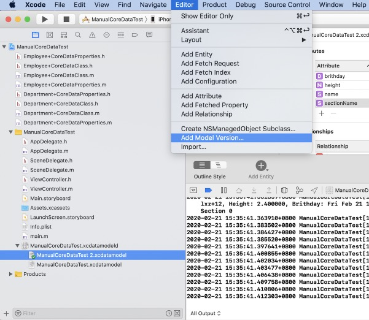
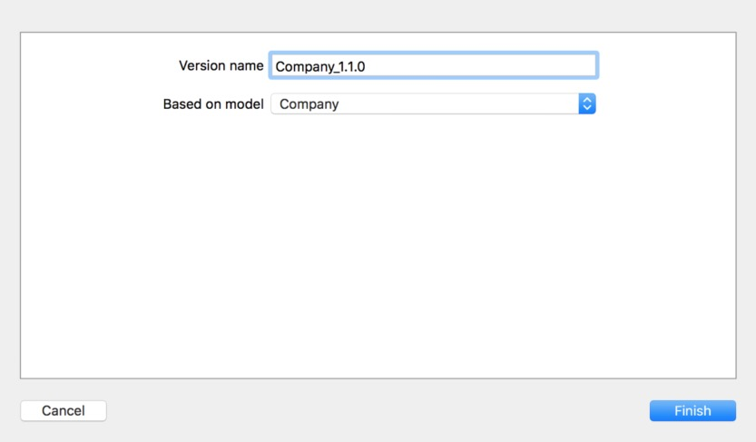
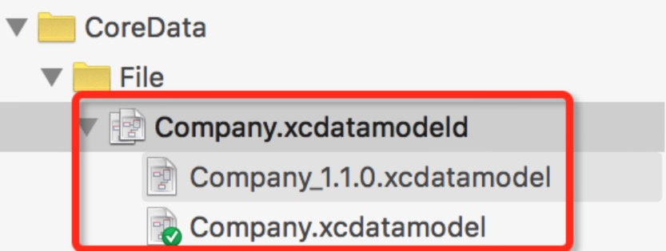
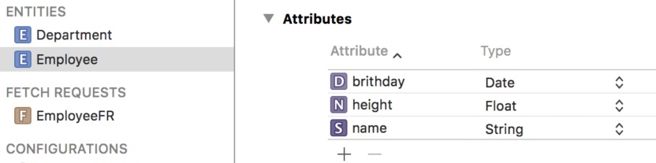
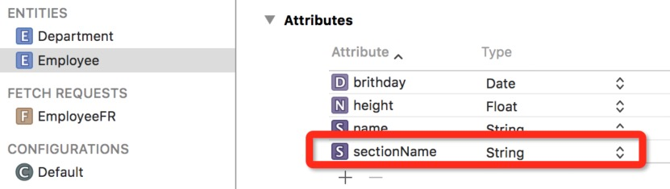
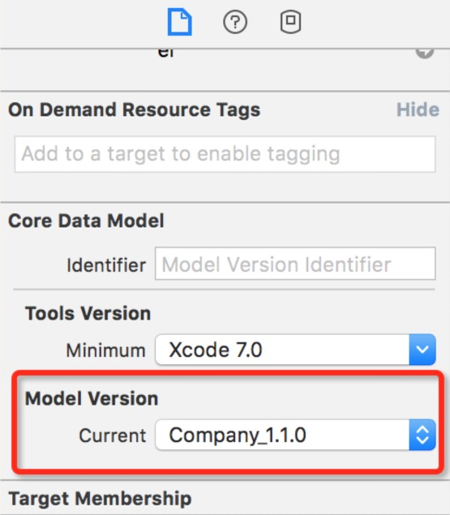
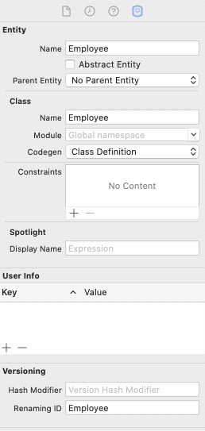
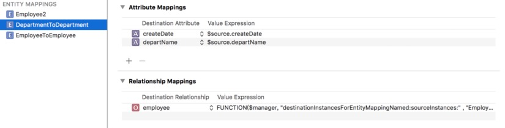
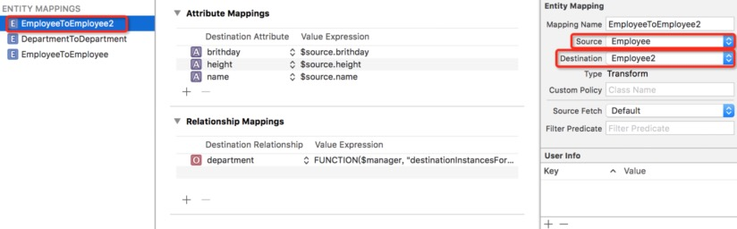
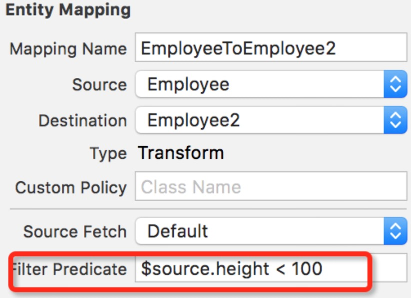

#版本迁移

##1. 创建新版本模型文件

本文中讲的几种版本迁移方案，在迁移之前都需要对原有的模型文件创建新版本。

`选中需要做迁移的模型文件 -> 点击菜单栏Editor -> Add Model Version -> 选择基于哪个版本的模型文件（一般都是选择目前最新的版本），新建模型文件完成。`



对于新版本模型文件的命名，我在创建新版本模型文件时，一般会拿**当前工程版本号当做后缀**，这样在模型文件版本比较多的时候，就可以很容易**将模型文件版本和工程版本对应起来**。



添加完成后，会发现之前的模型文件会变成一个文件夹，里面包含着多个模型文件。



在新建的模型文件中，里面的文件结构和之前的文件结构相同。后续的修改都应该在新的模型文件上，之前的模型文件不要再动了，在修改完模型文件后，记得更新对应的模型类文件。

基于新的模型文件，对 `Employee` 实体做如下修改，下面的版本迁移也以此为例。



添加一个 `String` 类型的属性，设置属性名为 `sectionName`。



此时还应该选中模型文件，设置当前模型文件的版本。这里选择最小版本设置为刚才新建的 `1.1.0版本`，模型文件设置工作完成。

`Show The File Inspector -> Model Version -> Current 设置为最新版本`



##2. 轻量级版本迁移

轻量级版本迁移方案非常简单，大多数迁移工作都是由系统完成的，只需要告诉系统迁移方式即可。在持久化存储协调器（`NSPersistentStoreCoordinator`）初始化对应的持久化存储（`NSPersistentStore`）对象时，设置 `options` 参数即可，参数是一个字典。 `NSPersistentStoreCoordinator` 会根据传入的字典，自动推断版本迁移的过程。

**字典中设置的Key：**

+ `NSMigratePersistentStoresAutomaticallyOption` 设置为`YES`，`CoreData`会试着把低版本的持久化存储区迁移到最新版本的模型文件。
+ `NSInferMappingModelAutomaticallyOption` 设置为 `YES`， `CoreData` 会试着以最为合理地方式自动推断出源模型文件的实体中，某个属性到底对应于模型文件实体中的哪一个属性。

版本迁移的设置是在创建 `NSManagedObjectContext` 时给 `NSPersistentStoreCoordinator`设置的。

```Objective-C
// 设置版本迁移方案
    NSDictionary *options = @{NSMigratePersistentStoresAutomaticallyOption: @YES, NSInferMappingModelAutomaticallyOption: @YES};
    
    // 创建持久化存储协调器，并将迁移方案的字典当做参数传入
    NSString *dataPath = NSSearchPathForDirectoriesInDomains(NSDocumentDirectory, NSUserDomainMask, YES).lastObject;
    dataPath = [dataPath stringByAppendingFormat:@"/%@.sqlite", @"Employee"];
    [coordinator addPersistentStoreWithType:NSSQLiteStoreType configuration:nil URL:[NSURL fileURLWithPath: dataPath] options:options error:nil];
```

**修改实体名**

假设需要对已存在实体进行改名操作，需要将重命名后的实体 `Renaming ID`，设置为之前的实体名。下面是 `Employee` 实体进行操作。



修改后再使用实体时， 应该将实体名设为最新的实体名，这里也就是 `Employee2`，而且数据库中的数据也会迁移到`Employee2`表中。

```Objective-C
Employee2 *emp = [NSEntityDescription insertNewObjectForEntityForName:@"Employee2" inManagedObjectContext:self.context];
emp.name = @"lxz";
emp.height = 1.9f;
emp.brithday = [NSDate date];
[context save:nil];
```

#2. Mapping Model 迁移方案

轻量级迁移方案只是针对增加和改变实体、属性这样的一些简单操作，假设有更复杂的迁移需求，就应该使用 `Xcode` 提供的迁移模板（`Mapping Model`）。通过 `Xcode` 创建一个后缀为 `.xcmappingmodel` 的文件，这个文件时专门用来进行数据迁移用的，一些变化关系也会体现在模板中，**看起来非常直观**。

这里还以上面更改实体名，并迁移实体数据为例子，将 `Employee` 实体迁移到 `Employee2` 中。首先将 `Employee` 实体改名为 `Employee2`，然后创建 `Mapping Model` 文件。

`Command + N 新建文件 -> 选择 Mapping Model -> 选择源文件 Source Model -> 选择目标文件 Target Model -> 命名 Mapping Model 文件名 -> Create 创建完成。`



现在就创建好一个 `Mapping Model` 文件，文件中显示了实体、属性、`Relationships`，源文件和目标文件之间的关系。实体命名是 `EntityToEntity` 的方式命名的，实体包含的属性和关联关系，都会被添加到迁移方案中（`Entity Mapping`，`Attribute Mapping`，`Relationship Mapping`）。

在迁移文件的下方是源文件和目标文件的关系。


在上面图中改名后的 `Employee2`实体并没有迁移关系，由于是改名后的实体，系统还不知道实体应该怎么做迁移。所以选中 `Mapping Model` 文件的 `Employee2 Mappings`， 可以看到右侧边栏的 `Source` 为 `invalid value`。因为要从 `Employee` 实体迁移数据过来，所以将其选择为 `Employee`，迁移关系就设置完成了。

设置完成后，还应该将之前 `EmployeeToEmployee` 的 `Mappings` 删除，因为这个实体已经被 `Employee2` 替代，它的 `Mappings` 也被 `Employee2 Mappings` 所替代，否则会报错。



在实体的迁移过程中，还可以通过设置 `Predicate` 的方式，来简单的控制迁移过程。例如只需要迁移一部分指定的数据，就可以通过 `Predicate` 来指定。可以直接在右侧 `Filter Predicate` 的位置设置过虑条件，格式是 `$source.height < 100`，`$source` 代表数据源的实体。



##3. 更复杂的迁移需求

在 `Mapping Model` 文件中选中实体，可以看到 `Custom Policy` 这个选项，选项对应的是 `NSEntityMigrationPolicy` 的子类， 可以创建并设置一个子类，并重写这个类的方法来控制迁移过程。

```Objective-C
- (BOOL)createDestinationInstancesForSourceInstance:(NSManagedObject *)sInstance entityMapping:(NSEntityMapping *)mapping manager:(NSMigrationManager *)manager error:(NSError **)error;
```

