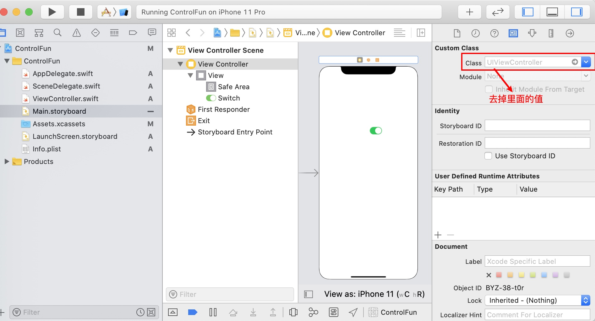

iOS13更新之后增加了SceneDelegate文件，AppDelegate不再负责UI的生命周期，交给了SceneDelegate来处理，因此，我们创建根控制器的时候，就要在SceneDelegate文件中创建了。

1. 去掉 Main.storyboard 关联的 ViewController 对象。



2. 修改 SceneDelegate.swift 代码如下：

```swift
import UIKit

@available(iOS 13.0, *)
class SceneDelegate: UIResponder, UIWindowSceneDelegate {

    var window: UIWindow?


    func scene(_ scene: UIScene, willConnectTo session: UISceneSession, options connectionOptions: UIScene.ConnectionOptions) {
        // Use this method to optionally configure and attach the UIWindow `window` to the provided UIWindowScene `scene`.
        // If using a storyboard, the `window` property will automatically be initialized and attached to the scene.
        // This delegate does not imply the connecting scene or session are new (see `application:configurationForConnectingSceneSession` instead).
        guard let windowScene = (scene as? UIWindowScene) else { return }
        window = UIWindow(windowScene: windowScene)
        window!.backgroundColor = UIColor.white
        window!.rootViewController = ViewController()
        window!.makeKeyAndVisible()
    }

    func sceneDidDisconnect(_ scene: UIScene) {
        // Called as the scene is being released by the system.
        // This occurs shortly after the scene enters the background, or when its session is discarded.
        // Release any resources associated with this scene that can be re-created the next time the scene connects.
        // The scene may re-connect later, as its session was not neccessarily discarded (see `application:didDiscardSceneSessions` instead).
    }

    func sceneDidBecomeActive(_ scene: UIScene) {
        // Called when the scene has moved from an inactive state to an active state.
        // Use this method to restart any tasks that were paused (or not yet started) when the scene was inactive.
    }

    func sceneWillResignActive(_ scene: UIScene) {
        // Called when the scene will move from an active state to an inactive state.
        // This may occur due to temporary interruptions (ex. an incoming phone call).
    }

    func sceneWillEnterForeground(_ scene: UIScene) {
        // Called as the scene transitions from the background to the foreground.
        // Use this method to undo the changes made on entering the background.
    }

    func sceneDidEnterBackground(_ scene: UIScene) {
        // Called as the scene transitions from the foreground to the background.
        // Use this method to save data, release shared resources, and store enough scene-specific state information
        // to restore the scene back to its current state.
    }


}
```

3. iOS 版本低于 iOS 13 使用 AppDelegate.swift 负责 UI 的生命周期，因此需要修改 AppDelegate.swift 文件使其支持低于 iOS 13 的设备，具体修改如下：

```swift
import UIKit

@UIApplicationMain
class AppDelegate: UIResponder, UIApplicationDelegate {

    var window: UIWindow?

    func application(_ application: UIApplication, didFinishLaunchingWithOptions launchOptions: [UIApplication.LaunchOptionsKey: Any]?) -> Bool {
        // Override point for customization after application launch.
        window = UIWindow(frame: UIScreen.main.bounds)
        window!.backgroundColor = UIColor.white
        window!.rootViewController = ViewController()
        window!.makeKeyAndVisible()
        return true
    }

    // MARK: UISceneSession Lifecycle

    @available(iOS 13.0, *)
    func application(_ application: UIApplication, configurationForConnecting connectingSceneSession: UISceneSession, options: UIScene.ConnectionOptions) -> UISceneConfiguration {
        // Called when a new scene session is being created.
        // Use this method to select a configuration to create the new scene with.
        return UISceneConfiguration(name: "Default Configuration", sessionRole: connectingSceneSession.role)
    }

    @available(iOS 13.0, *)
    func application(_ application: UIApplication, didDiscardSceneSessions sceneSessions: Set<UISceneSession>) {
        // Called when the user discards a scene session.
        // If any sessions were discarded while the application was not running, this will be called shortly after application:didFinishLaunchingWithOptions.
        // Use this method to release any resources that were specific to the discarded scenes, as they will not return.
    }


}
```


