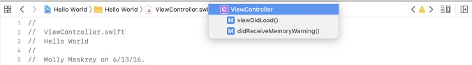

  
    <b>跳转栏</b>
  

在编辑器的顶部，可以找到一个叫作**跳转栏（jump bar）**的控件。只需要单击一下，就能跳转到当前导航层次结构中的特定元素。

跳转栏就在源代码的上面，有以下几个组成部分。

+ 最左侧有一个看起来很特别的图标，他实际上是一个弹出菜单，用来显示 Recent Files （最近的文件）、Unsaved Files（未保存的文件）、Counterparts（关联文件）、Superclasses（父类）、Subclasses（子类）、Siblings（兄弟类）、Categories（类别）、Includes（引用头文件）等子菜单，通过自菜单可以看到所有与编辑器当前文件相关的其他代码。
+ 弹出菜单图标的右边是一对左右箭头，分别可以跳转到上一个文件和下一个文件。
+ 跳转栏包含一组分段式的弹出菜单，显示了再项目中找到当前所选文件的层级路径。

>
Xcode快捷键

>
>一个非常好用的快捷键是<kbd>Shift</kbd>+<kbd>Command</kbd>+<kbd>O</kbd>，对应的是 **Xcode** 的快速打开（ Open Quickly ）功能。按下该快捷键后，渐入文件名、设置项名称或者符号名，Xcode就会显示一个选项列表。找到想要的文件后按下 <kbd>Return</kbd> 键就可以在编辑器面板中打开这个文件，这样只需要进行几次键盘操作就能够快速切换文件。

