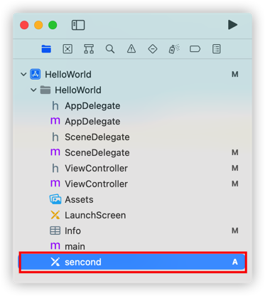
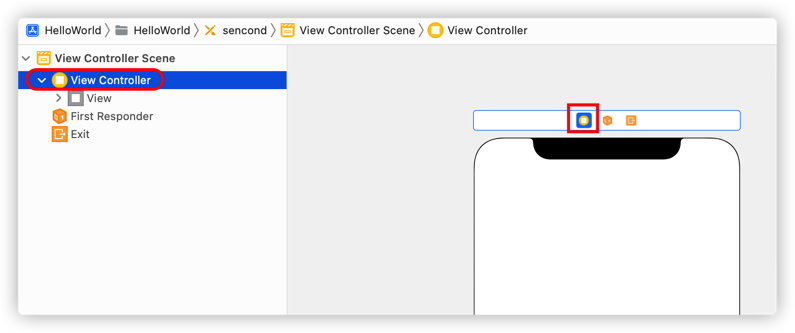
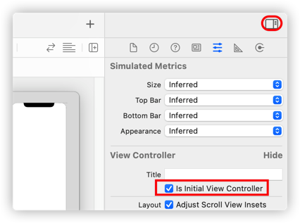
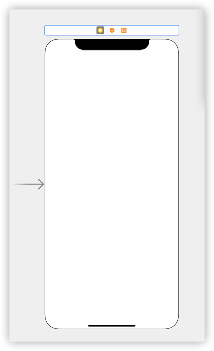

1.  选中要设置的 storyboard 文件

    

    2.  选中 storyboard 视图中的 `View Controller` 项

        

3.  在 `Inspectors` 栏中选中 `Attributes` 项，然后勾选下面的 `Is Initial View Controller`。

    

    4.  最后在该 `View Controller` 视图前面有一个向右箭头，如下图所示：

        

