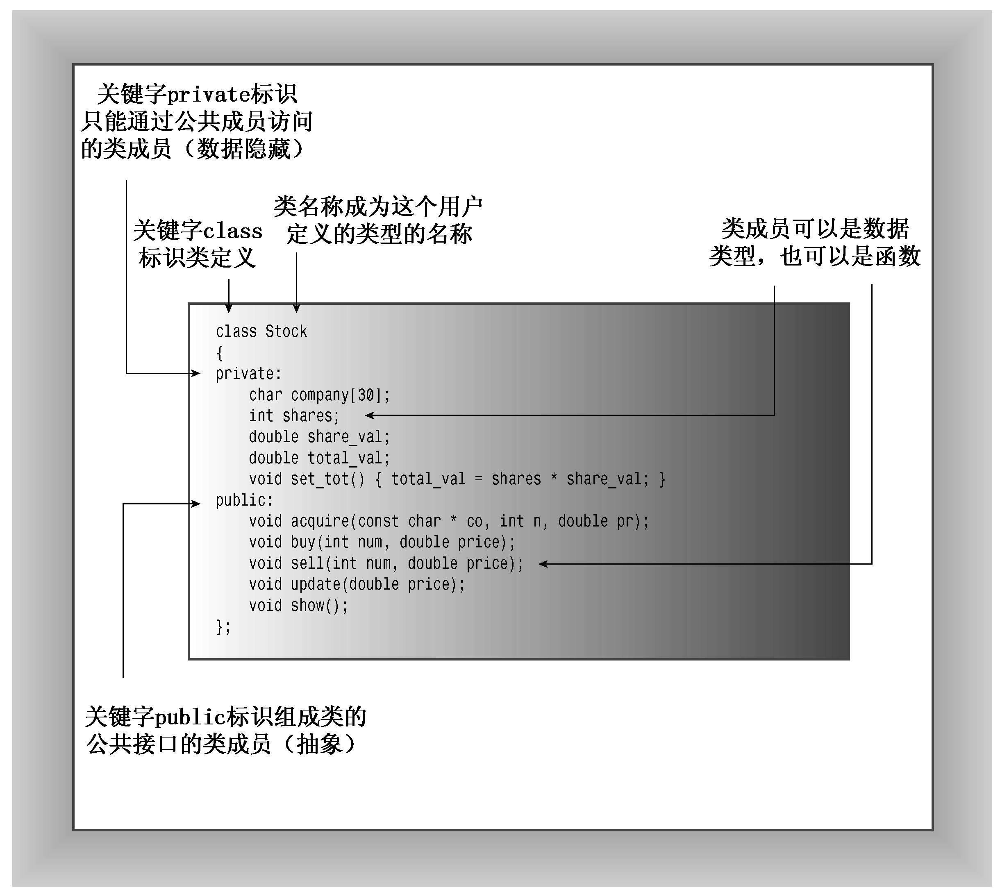

### 10.2.2　C++中的类

类是一种将抽象转换为用户定义类型的C++工具，它将数据表示和操纵数据的方法组合成一个整洁的包。下面来看一个表示股票的类。

首先，必须考虑如何表示股票。可以将一股作为基本单元，定义一个表示一股股票的类。然而，这意味着需要100个对象才能表示100股，这不现实。相反，可以将某人当前持有的某种股票作为一个基本单元，数据表示中包含他持有的股票数量。一种比较现实的方法是，必须记录最初购买价格和购买日期（用于计算纳税）等内容。另外，还必须管理诸如如拆股等事件。首次定义类就考虑这么多因素有些困难，因此我们对其进行简化。具体地说，应该将可执行的操作限制为：

+ 获得股票；
+ 增持；
+ 卖出股票；
+ 更新股票价格；
+ 显示关于所持股票的信息。

可以根据上述清单定义stock类的公有接口（如果您有兴趣，还可以添加其他特性）。为支持该接口，需要存储一些信息。我们再次进行简化。例如，不考虑标准的美式股票计价方式（八分之一美元的倍数。显然，纽约证券交易所一定看到过本书以前的版本中关于简化的论述，因为它已经决定将系统转换为书中采用的方式）。我们将存储下面的信息：

+ 公司名称；
+ 所持股票的数量；
+ 每股的价格；
+ 股票总值。

接下来定义类。一般来说，类规范由两个部分组成。

+ 类声明：以数据成员的方式描述数据部分，以成员函数（被称为方法）的方式描述公有接口。
+ 类方法定义：描述如何实现类成员函数。

简单地说，类声明提供了类的蓝图，而方法定义则提供了细节。


**什么是接口**

接口是一个共享框架，供两个系统（如在计算机和打印机之间或者用户或计算机程序之间）交互时使用；例如，用户可能是您，而程序可能是字处理器。使用字处理器时，您不能直接将脑子中想到的词传输到计算机内存中，而必须同程序提供的接口交互。您敲打键盘时，计算机将字符显示到屏幕上；您移动鼠标时，计算机移动屏幕上的光标；您无意间单击鼠标时，计算机对您输入的段落进行奇怪的处理。程序接口将您的意图转换为存储在计算机中的具体信息。

对于类，我们说公共接口。在这里，公众（public）是使用类的程序，交互系统由类对象组成，而接口由编写类的人提供的方法组成。接口让程序员能够编写与类对象交互的代码，从而让程序能够使用类对象。例如，要计算string对象中包含多少个字符，您无需打开对象，而只需使用string类提供的size()方法。类设计禁止公共用户直接访问类，但公众可以使用方法size()。方法size()是用户和string类对象之间的公共接口的组成部分。通常，方法getline()是istream类的公共接口的组成部分，使用cin的程序不是直接与cin对象内部交互来读取一行输入，而是使用getline()。

如果希望更人性化，不要将使用类的程序视为公共用户，而将编写程序的人视为公共用户。然而，要使用某个类，必须了解其公共接口；要编写类，必须创建其公共接口。


为开发一个类并编写一个使用它的程序，需要完成多个步骤。这里将开发过程分成多个阶段，而不是一次性完成。通常，C++程序员将接口（类定义）放在头文件中，并将实现（类方法的代码）放在源代码文件中。这里采用这种典型做法。程序清单10.1是第一个阶段的代码，它是Stock类的类声明。这个文件按第9章介绍的那样，使用了#ifndef等来访问多次包含同一个文件。

为帮助识别类，本书遵循一种常见但不通用的约定——将类名首字母大写。您将发现，程序清单10.1看起来就像一个结构声明，只是还包括成员函数、公有部分和私有部分等内容。稍后将对该声明进行改进（所以不要将它用作模型），但先来看一看该定义的工作方式。

程序清单10.1　stock00.h

```css
// stock00.h -- Stock class interface
// version 00
#ifndef STOCK00_H_
#define STOCK00_H_
#include <string>
class Stock // class declaration
{
private:
    std::string company;
    long shares;
    double share_val;
    double total_val;
    void set_tot() { total_val = shares * share_val; }
public:
    void acquire(const std::string & co, long n, double pr);
    void buy(long num, double price);
    void sell(long num, double price);
    void update(double price);
    void show();
};     // note semicolon at the end
#endif
```

稍后将详细介绍类的细节，但先看一下更通用的特性。首先，C++关键字class指出这些代码定义了一个类设计（不同于在模板参数中，在这里，关键字class和typename不是同义词，不能使用typename代替class）。这种语法指出，Stock是这个新类的类型名。该声明让我们能够声明Stock类型的变量——称为对象或实例。每个对象都表示一支股票。例如，下面的声明创建两个Stock对象，它们分别名为sally和solly：

```css
Stock sally;
Stock solly;
```

例如，sally对象可以表示Sally持有的某公司股票。

接下来，要存储的数据以类数据成员（如company和shares）的形式出现。例如，sally的company成员存储了公司名称，share成员存储了Sally持有的股票数量，share_val成员存储了每股的价格，total_val成员存储了股票总价格。同样，要执行的操作以类函数成员（方法，如sell()和update()）的形式出现。成员函数可以就地定义（如set_tot()），也可以用原型表示（如其他成员函数）。其他成员函数的完整定义稍后将介绍，它们包含在实现文件中；但对于描述函数接口而言，原型足够了。将数据和方法组合成一个单元是类最吸引人的特性。有了这种设计，创建Stock对象时，将自动制定使用对象的规则。

istream和ostream类有成员函数，如get()和getline()，而Stock类声明中的函数原型说明了成员函数是如何建立的。例如，头文件iostream将getline()的原型放在istream类的声明中。

#### 1．访问控制

关键字private和public也是新的，它们描述了对类成员的访问控制。使用类对象的程序都可以直接访问公有部分，但只能通过公有成员函数（或友元函数，参见第11章）来访问对象的私有成员。例如，要修改Stock类的shares成员，只能通过Stock的成员函数。因此，公有成员函数是程序和对象的私有成员之间的桥梁，提供了对象和程序之间的接口。防止程序直接访问数据被称为数据隐藏（参见图 10.1）。C++还提供了第三个访问控制关键字protected，第13章介绍类继承时将讨论该关键字。

类设计尽可能将公有接口与实现细节分开。公有接口表示设计的抽象组件。将实现细节放在一起并将它们与抽象分开被称为封装。数据隐藏（将数据放在类的私有部分中）是一种封装，将实现的细节隐藏在私有部分中，就像Stock类对set_tot()所做的那样，也是一种封装。封装的另一个例子是，将类函数定义和类声明放在不同的文件中。


<center class="my_markdown"><b class="my_markdown">图10.1　Stock类</b></center>


**OOP和C++**

OOP是一种编程风格，从某种程度说，它用于任何一种语言中。当然，可以将OOP思想融合到常规的C语言程序中。例如，在第9章的一个示例（程序清单9.1、程序清单9.2、程序清单9.3）中，头文件中包含结构原型和操纵该结构的函数的原型，便是这样的例子。因此，main()函数只需定义这个结构类型的变量，并使用相关函数处理这些变量即可；main()不直接访问结构成员。实际上，该示例定义了一种抽象类型，它将存储格式和函数原型置于头文件中，对main()隐藏了实际的数据表示。然而，C++中包括了许多专门用来实现OOP方法的特性，因此它使程序员更进一步。首先，将数据表示和函数原型放在一个类声明中（而不是放在一个文件中），通过将所有内容放在一个类声明中，来使描述成为一个整体。其次，让数据表示成为私有，使得数据只能被授权的函数访问。在C语言的例子中，如果main()直接访问了结构成员，则违反了OOP的精神，但没有违反C语言的规则。然而，试图直接访问Stock对象的shares成员便违反了C++语言的规则，编译器将捕获这种错误。


数据隐藏不仅可以防止直接访问数据，还让开发者（类的用户）无需了解数据是如何被表示的。例如，show()成员将显示某支股票的总价格（还有其他内容），这个值可以存储在对象中（上述代码正是这样做的），也可以在需要时通过计算得到。从使用类的角度看，使用哪种方法没有什么区别。所需要知道的只是各种成员函数的功能；也就是说，需要知道成员函数接受什么样的参数以及返回什么类型的值。原则是将实现细节从接口设计中分离出来。如果以后找到了更好的、实现数据表示或成员函数细节的方法，可以对这些细节进行修改，而无需修改程序接口，这使程序维护起来更容易。

#### 2．控制对成员的访问：公有还是私有

无论类成员是数据成员还是成员函数，都可以在类的公有部分或私有部分中声明它。但由于隐藏数据是OOP主要的目标之一，因此数据项通常放在私有部分，组成类接口的成员函数放在公有部分；否则，就无法从程序中调用这些函数。正如Stock声明所表明的，也可以把成员函数放在私有部分中。不能直接从程序中调用这种函数，但公有方法却可以使用它们。通常，程序员使用私有成员函数来处理不属于公有接口的实现细节。

不必在类声明中使用关键字private，因为这是类对象的默认访问控制：

```css
class World
{
    float mass;     // private by default
    char name[20]; // private by default
public:
    void tellall(void);
    ...
};
```

然而，为强调数据隐藏的概念，本书显式地使用了private。


**类和结构**

类描述看上去很像是包含成员函数以及public和private可见性标签的结构声明。实际上，C++对结构进行了扩展，使之具有与类相同的特性。它们之间唯一的区别是，结构的默认访问类型是public，而类为private。C++程序员通常使用类来实现类描述，而把结构限制为只表示纯粹的数据对象（常被称为普通老式数据（POD，Plain Old Data）结构）。


