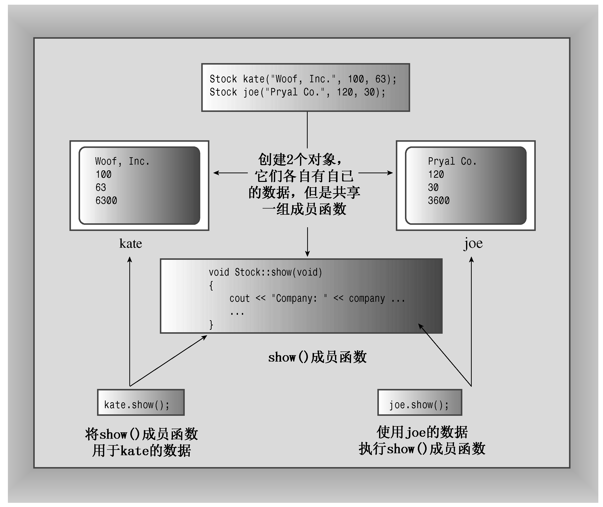

### 10.2.3　实现类成员函数

还需要创建类描述的第二部分：为那些由类声明中的原型表示的成员函数提供代码。成员函数定义与常规函数定义非常相似，它们有函数头和函数体，也可以有返回类型和参数。但是它们还有两个特殊的特征：

+ 定义成员函数时，使用作用域解析运算符（::）来标识函数所属的类；
+ 类方法可以访问类的private组件。

首先，成员函数的函数头使用作用域运算符解析（::）来指出函数所属的类。例如，update()成员函数的函数头如下：

```css
void Stock::update(double price)
```

这种表示法意味着我们定义的update()函数是Stock类的成员。这不仅将update()标识为成员函数，还意味着我们可以将另一个类的成员函数也命名为update()。例如，Buffoon()类的update()函数的函数头如下：

```css
void Buffoon::update()
```

因此，作用域解析运算符确定了方法定义对应的类的身份。我们说，标识符update()具有类作用域（class scope）。Stock类的其他成员函数不必使用作用域解析运算符，就可以使用update()方法，这是因为它们属于同一个类，因此update()是可见的。然而，在类声明和方法定义之外使用update()时，需要采取特殊的措施，稍后将作介绍。

类方法的完整名称中包括类名。我们说，Stock::update()是函数的限定名（qualified name）；而简单的update()是全名的缩写（非限定名，unqualified name），它只能在类作用域中使用。

方法的第二个特点是，方法可以访问类的私有成员。例如，show()方法可以使用这样的代码：

```css
std::cout << "Company: " << company
          << " Shares: " << shares << endl
          << " Share Price: $" << share_val
          << " Total Worth: $" << total_val << endl;
```

其中，company、shares等都是Stock类的私有数据成员。如果试图使用非成员函数访问这些数据成员，编译器禁止这样做（但第11章中将介绍的友元函数例外）。

了解这两点后，就可以实现类方法了，如程序清单10.2所示。这里将它们放在了一个独立的实现文件中，因此需要包含头文件stock00.h，让编译器能够访问类定义。为让您获得更多有关名称空间的经验，在有些方法中使用了限定符std::，在其他方法中则使用了using声明。

程序清单10.2　stock00.cpp

```css
// stock00.cpp -- implementing the Stock class
// version 00
#include <iostream>
#include "stock00.h"
void Stock::acquire(const std::string & co, long n, double pr)
{
    company = co;
    if (n < 0)
    {
        std::cout << "Number of shares can’t be negative; "
                  << company << " shares set to 0.\n";
        shares = 0;
    }
    else
        shares = n;
    share_val = pr;
    set_tot();
}
void Stock::buy(long num, double price)
{
     if (num < 0)
    {
        std::cout << "Number of shares purchased can’t be negative. "
             << "Transaction is aborted.\n";
    }
    else
    {
        shares += num;
        share_val = price;
        set_tot();
    }
}
void Stock::sell(long num, double price)
{
    using std::cout;
    if (num < 0)
    {
        cout << "Number of shares sold can’t be negative. "
             << "Transaction is aborted.\n";
    }
    else if (num > shares)
    {
        cout << "You can’t sell more than you have! "
             << "Transaction is aborted.\n";
    }
    else
    {
        shares -= num;
        share_val = price;
        set_tot();
    }
}
void Stock::update(double price)
{
    share_val = price;
    set_tot();
}
void Stock::show()
{
    std::cout << "Company: " << company
              << " Shares: " << shares << ‘\n’
              << " Share Price: $" << share_val
              << " Total Worth: $" << total_val << ‘\n’;
}
```

#### 1．成员函数说明

acquire()函数管理对某个公司股票的首次购买，而buy()和sell()管理增加或减少持有的股票。方法buy()和sell()确保买入或卖出的股数不为负。另外，如果用户试图卖出超过他持有的股票数量，则sell()函数将结束这次交易。这种使数据私有并限于对公有函数访问的技术允许我们能够控制数据如何被使用；在这个例子中，它允许我们加入这些安全防护措施，避免不适当的交易。

4个成员函数设置或重新设置了total_val成员值。这个类并非将计算代码编写4次，而是让每个函数都调用set_tot()函数。由于set_tot()只是实现代码的一种方式，而不是公有接口的组成部分，因此这个类将其声明为私有成员函数（即编写这个类的人可以使用它，但编写代码来使用这个类的人不能使用）。如果计算代码很长，则这种方法还可以省去许多输入代码的工作，并可节省空间。然而，这种方法的主要价值在于，通过使用函数调用，而不是每次重新输入计算代码，可以确保执行的计算完全相同。另外，如果必须修订计算代码（在这个例子中，这种可能性不大），则只需在一个地方进行修改即可。

#### 2．内联方法

其定义位于类声明中的函数都将自动成为内联函数，因此Stock::set_tot()是一个内联函数。类声明常将短小的成员函数作为内联函数，set_tot()符合这样的要求。

如果愿意，也可以在类声明之外定义成员函数，并使其成为内联函数。为此，只需在类实现部分中定义函数时使用inline限定符即可：

```css
class Stock
{
private:
    ...
    void set_tot(); // definition kept separate
public:
    ...
};
inline void Stock::set_tot() // use inline in definition
{
    total_val = shares * share_val;
}
```

内联函数的特殊规则要求在每个使用它们的文件中都对其进行定义。确保内联定义对多文件程序中的所有文件都可用的、最简便的方法是：将内联定义放在定义类的头文件中（有些开发系统包含智能链接程序，允许将内联定义放在一个独立的实现文件）。

顺便说一句，根据改写规则（rewrite rule），在类声明中定义方法等同于用原型替换方法定义，然后在类声明的后面将定义改写为内联函数。也就是说，程序清单10.1中set_tot()的内联定义与上述代码（定义紧跟在类声明之后）是等价的。

#### 3．方法使用哪个对象

下面介绍使用对象时最重要的一个方面：如何将类方法应用于对象。下面的代码使用了一个对象的shares成员：

```css
shares += num;
```

是哪个对象呢？问得好！要回答这个问题，首先来看看如何创建对象。最简单的方式是声明类变量：

```css
Stock kate, joe;
```

这将创建两个Stock类对象，一个为kate，另一个为joe。

接下来，看看如何使用对象的成员函数。和使用结构成员一样，通过成员运算符：

```css
kate.show(); // the kate object calls the member function
joe.show(); // the joe object calls the member function
```

第1条语句调用kate对象的show()成员。这意味着show()方法将把shares解释为kate.shares，将share_val解释为kate.share_val。同样，函数调用joe.show()使show()方法将shares和share_val分别解释为joe.shares和joe.share_val。

> **注意：**
> 调用成员函数时，它将使用被用来调用它的对象的数据成员。

同样，函数调用kate.sell()在调用set_tot()函数时，相当于调用kate.set_tot()，这样该函数将使用kate对象的数据。

所创建的每个新对象都有自己的存储空间，用于存储其内部变量和类成员；但同一个类的所有对象共享同一组类方法，即每种方法只有一个副本。例如，假设kate和joe都是Stock对象，则kate.shares将占据一个内存块，而joe.shares占用另一个内存块，但kate.show()和joe.show()都调用同一个方法，也就是说，它们将执行同一个代码块，只是将这些代码用于不同的数据。在OOP中，调用成员函数被称为发送消息，因此将同样的消息发送给两个不同的对象将调用同一个方法，但该方法被用于两个不同的对象（参见图10.2）。


<center class="my_markdown"><b class="my_markdown">图10.2　对象、数据和成员函数</b></center>

