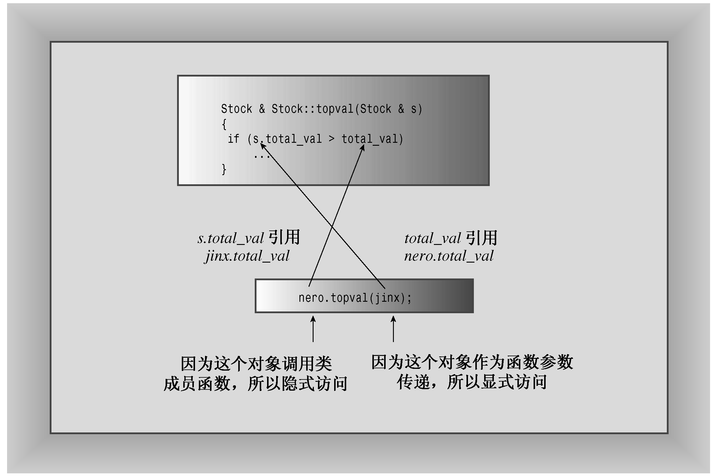
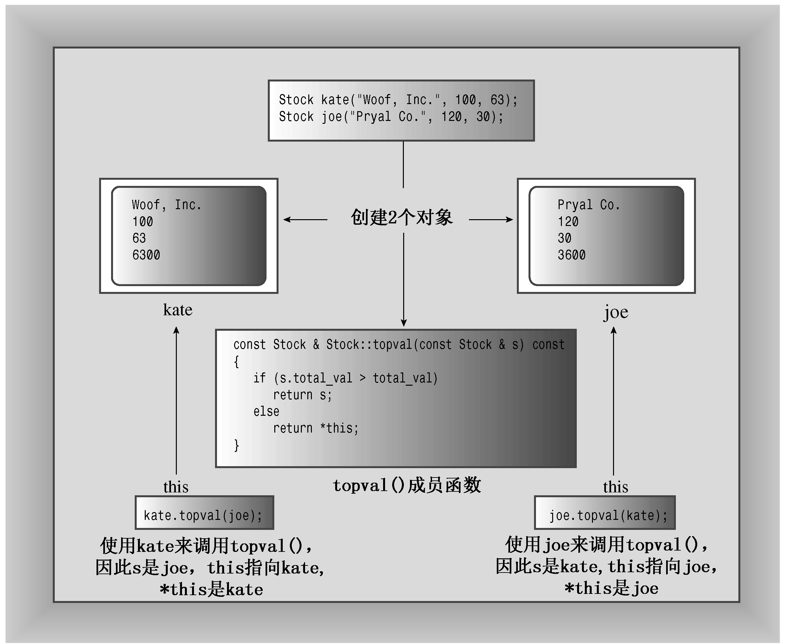

### 10.4　this指针

对于Stock类，还有很多工作要做。到目前为止，每个类成员函数都只涉及一个对象，即调用它的对象。但有时候方法可能涉及到两个对象，在这种情况下需要使用C++的this指针。

虽然Stock类声明可以显示数据，但它缺乏分析能力。例如，从show()的输出我们可以知道持有的哪一支股票价格最高，但由于程序无法直接访问total_val，因此无法作出判断。要让程序知道存储的数据，最直接的方式是让方法返回一个值。为此，通常使用内联代码，如下例所示：

```css
class Stock
{
private:
    ...
    double total_val;
    ...
public:
    double total() const { return total_val; }
    ...
};
```

就直接程序访问而言，上述定义实际上是使total_val为只读的。也就是说，可以使用方法total()来获得total_val的值，但这个类没有提供专门用于重新设置total_val的值的方法（作为一种副产品，其他方法，如buy()、sell()和update()确实在重新设置成员shares和share_val的值的同时修改了total_val的值）。

通过将该函数添加到类声明中，可以让程序查看一系列股票，找到价格最高的那一支。然而，可以采用另一种方法—— 一种帮助您了解this指针的方法。这种方法是，定义一个成员函数，它查看两个Stock对象，并返回股价较高的那个对象的引用。实现这种方法时，将出现一些有趣的问题，下面就来讨论这些问题。

首先，如何将两个要比较的对象提供给成员函数呢？例如，假设将该方法命名为topval()，则函数调用stock1.topval()将访问stock1对象的数据，而stock2.topval()将访问stock2对象的数据。如果希望该方法对两个对象进行比较，则必须将第二个对象作为参数传递给它。出于效率方面的考虑，可以按引用来传递参数，也就是说，topval()方法使用一个类型为const Stock &的参数。

其次，如何将方法的答案传回给调用程序呢？最直接的方法是让方法返回一个引用，该引用指向股价总值较高的对象。因此，用于比较的方法的原型如下：

```css
const Stock & topval(const Stock & s) const;
```

该函数隐式地访问一个对象，而显式地访问另一个对象，并返回其中一个对象的引用。括号中的const表明，该函数不会修改被显式地访问的对象；而括号后的const表明，该函数不会修改被隐式地访问的对象。由于该函数返回了两个const对象之一的引用，因此返回类型也应为const引用。

假设要对Stock对象stock1和stock2进行比较，并将其中股价总值较高的那一个赋给top对象，则可以使用下面两条语句之一：

```css
top = stock1.topval(stock2);
top = stock2.topval(stock1);
```

第一种格式隐式地访问stock1，而显式地访问stock2；第二种格式显式地访问stock1，而隐式地访问stock2（参见图10.3）。无论使用哪一种方式，都将对这两个对象进行比较，并返回股价总值较高的那一个对象。


<center class="my_markdown"><b class="my_markdown">图10.3　使用成员函数访问两个对象</b></center>

实际上，这种表示法有些混乱。如果可以使用关系运算符>来比较这两个对象，将更为清晰。可以使用运算符重载（参见第11章）完成这项工作。

同时，还要注意的是topval()的实现，它将引发一个小问题。下面的部分实现强调了这个问题：

```css
const Stock & Stock::topval(const Stock & s) const
{
    if (s.total_val > total_val)
        return s; // argument object
    else
        return ?????; // invoking object
}
```

其中，s.total_val是作为参数传递的对象的总值，total_val是用来调用该方法的对象的总值。如果s.total_val大于total_val，则函数将返回指向s的引用；否则，将返回用来调用该方法的对象（在OOP中，是topval消息要发送给的对象）。问题在于，如何称呼这个对象？如果调用stock1.topval(stock2)，则s是stock2的引用（即stock2的别名），但stock1没有别名。

C++解决这种问题的方法是：使用被称为this的特殊指针。this指针指向用来调用成员函数的对象（this被作为隐藏参数传递给方法）。这样，函数调用stock1.topval（stock2）将this设置为stock1对象的地址，使得这个指针可用于topval()方法。同样，函数调用stock2.topval（stock1）将this设置为stock2对象的地址。一般来说，所有的类方法都将this指针设置为调用它的对象的地址。确实，topval()中的total_val只不过是this->total_val的简写（第4章使用->运算符，通过指针来访问结构成员。这也适用于类成员）（参见图10.4）。


<center class="my_markdown"><b class="my_markdown">图10.4　this指向调用对象</b></center>

> **注意：**
> 每个成员函数（包括构造函数和析构函数）都有一个this指针。this指针指向调用对象。如果方法需要引用整个调用对象，则可以使用表达式*this。在函数的括号后面使用const限定符将this限定为const，这样将不能使用this来修改对象的值。
> 然而，要返回的并不是this，因为this是对象的地址，而不是对象本身，即*this（将解除引用运算符*用于指针，将得到指针指向的值）。现在，可以将*this作为调用对象的别名来完成前面的方法定义。

```css
const Stock & Stock::topval(const Stock & s) const
{
    if (s.total_val > total_val)
        return s;      // argument object
    else
        return *this; // invoking object
}
```

返回类型为引用意味着返回的是调用对象本身，而不是其副本。程序清单10.7列出了新的头文件。

程序清单10.7　stock20.h

```css
// stock20.h -- augmented version
#ifndef STOCK20_H_
#define STOCK20_H_
#include <string>
class Stock
{
private:
    std::string company;
    int shares;
    double share_val;
    double total_val;
    void set_tot() { total_val = shares * share_val; }
public:
    Stock();   // default constructor
    Stock(const std::string & co, long n = 0, double pr = 0.0);
    ~Stock(); // do-nothing destructor
    void buy(long num, double price);
    void sell(long num, double price);
    void update(double price);
    void show()const;
    const Stock & topval(const Stock & s) const;
};
#endif
```

程序清单10.8列出了修订后的类方法文件，其中包括新的topval()方法。另外，现在您已经了解了构造函数和析构函数的工作原理，因此这里没有显示消息。

程序清单10.8　stock20.cpp

```css
// stock20.cpp -- augmented version
#include <iostream>
#include "stock20.h"
// constructors
Stock::Stock() // default constructor
{
    company = "no name";
    shares = 0;
    share_val = 0.0;
    total_val = 0.0;
}
Stock::Stock(const std::string & co, long n, double pr)
{
    company = co;
    if (n < 0)
    {
        std::cout << "Number of shares can’t be negative; "
                    << company << " shares set to 0.\n";
        shares = 0;
    }
    else
        shares = n;
    share_val = pr;
    set_tot();
}
// class destructor
Stock::~Stock() // quiet class destructor
{
}
// other methods
void Stock::buy(long num, double price)
{
     if (num < 0)
    {
        std::cout << "Number of shares purchased can’t be negative. "
             << "Transaction is aborted.\n";
    }
    else
    {
        shares += num;
        share_val = price;
        set_tot();
    }
}
void Stock::sell(long num, double price)
{
    using std::cout;
    if (num < 0)
    {
        cout << "Number of shares sold can’t be negative. "
             << "Transaction is aborted.\n";
    }
    else if (num > shares)
    {
        cout << "You can’t sell more than you have! "
             << "Transaction is aborted.\n";
    }
    else
    {
        shares -= num;
        share_val = price;
        set_tot();
    }
}
void Stock::update(double price)
{
    share_val = price;
    set_tot();
}
void Stock::show() const
{
    using std::cout;
    using std::ios_base;
    // set format to #.###
    ios_base::fmtflags orig =
        cout.setf(ios_base::fixed, ios_base::floatfield);
    std::streamsize prec = cout.precision(3);
    cout << "Company: " << company
        << " Shares: " << shares << ‘\n’;
    cout << " Share Price: $" << share_val;
    // set format to #.##
    cout.precision(2);
    cout << " Total Worth: $" << total_val << ‘\n’;
    // restore original format
    cout.setf(orig, ios_base::floatfield);
    cout.precision(prec);
}
const Stock & Stock::topval(const Stock & s) const
{
    if (s.total_val > total_val)
        return s;
    else
        return *this;
}
```

当然，我们想知道this指针是否有用。显然，应在一个包含对象数组的程序中使用这种新方法。因此接下来介绍对象数组这一主题。

