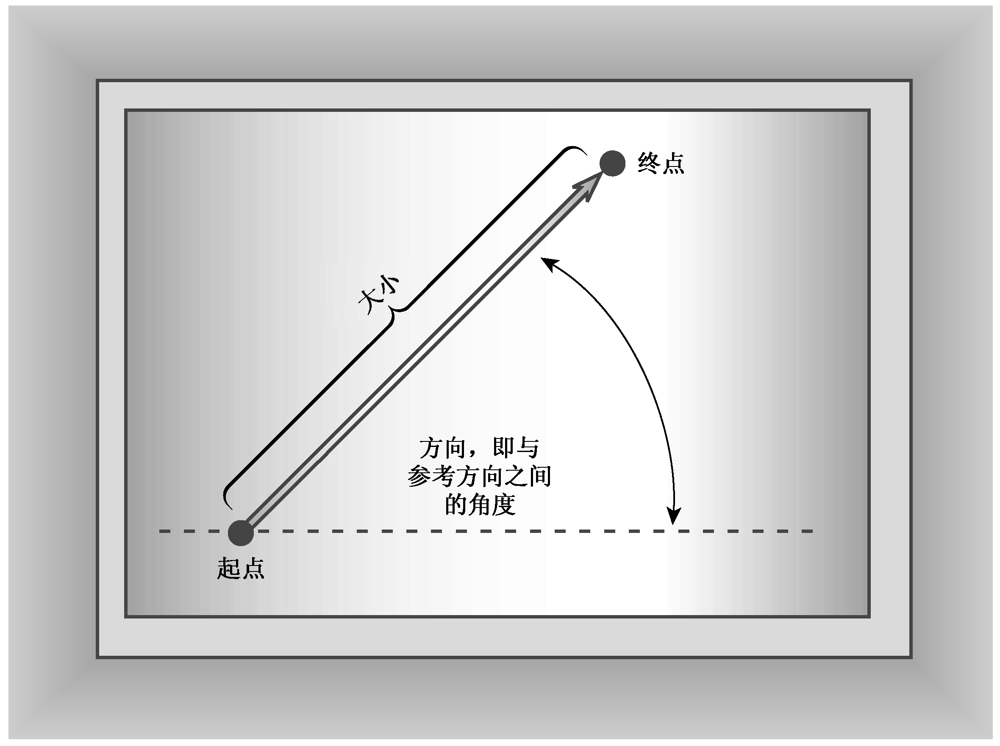
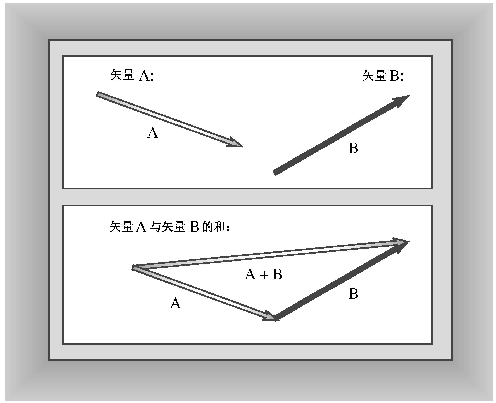
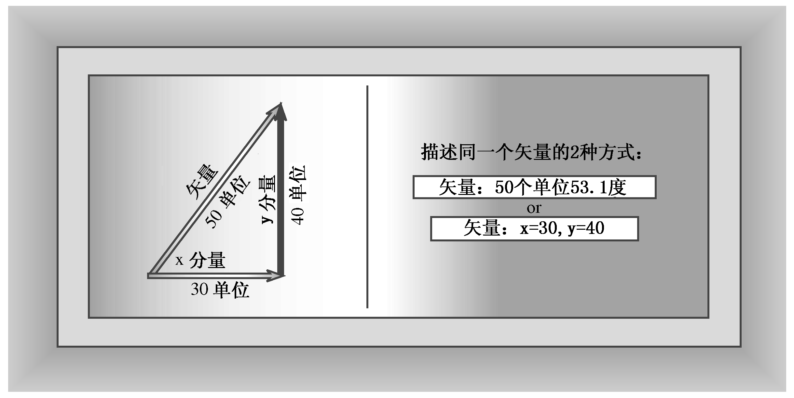

### 11.5　再谈重载：一个矢量类

下面介绍另一种使用了运算符重载和友元的类设计—— 一个表示矢量的类。这个类还说明了类设计的其他方面，例如，在同一个对象中包含两种描述同一样东西的不同方式等。即使并不关心矢量，也可以在其他情况下使用这里介绍的很多新技术。矢量（vector），是工程和物理中使用的一个术语，它是一个有大小和方向的量。例如，推东西时，推的效果将取决于推力的大小和推的方向。从某个方向推可能会省力，而从相反的方向推则要费很大的劲。为完整地描述汽车的运动情况，应指出其运动速度（大小）和运动方向；如果逆行，则向高速公路的巡警辩解没有超速、超载是徒劳的（免疫学家和计算机专家使用术语矢量的方式不同，请不要考虑这一点，至少在第16章介绍计算机科学版本——vector模板类之前应如此）。下面的旁注介绍了更多有关矢量的知识，但对于下面的C++示例来说，并不必完全理解这些知识。


**矢量**

假设工蜂发现了一个非凡的花蜜储藏处，它匆忙返回蜂巢，告知其他蜜蜂，该花蜜储藏处离蜂巢120码。“这种信息是不完整的”，其他蜜蜂感到很茫然——“还必须告知方向！”，该工蜂答道：“太阳方向偏北30度”。知道了距离（大小）和方向，其他的蜜蜂能很快找到蜜源。蜜蜂懂得矢量。

许多数量都有大小和方向。例如，推的效果取决于力气的大小和方向。在计算机屏幕上移动对象时也涉及到距离和方向。可以使用矢量来描述这类问题。例如，可以用矢量来描述如何在屏幕上移动（放置）对象，即用箭头从起始位置画到终止位置，来对它作形象化处理。矢量的长度是其大小——描述了移动的距离；箭头的指向描述了方向（参见图11.1）。表示这种位置变化的矢量称为位移矢量（displacement vector）。

现在，假设您是Lhanappa——伟大的毛象猎手。猎狗报告毛象群位于西北14.1公里处。但由于当时刮的是东南风，您不想从东南方向接近毛象群，因此先向西走了10公里，再向北走了10公里，最终从南面接近毛象群。您知道这两个位移矢量与指向西北的14.1公里的矢量的方向相同。伟大的毛象猎手Lhanappa也知道如何将两个矢量相加。

将两个矢量相加有一种简单的几何解释。首先，画一个矢量，然后从第一个矢量的尾部开始画第二个矢量。最后从第一个矢量的开始处向第二个矢量的结尾处画一个矢量。第三个矢量表示前两个矢量的和（参见图11.2）。注意，两个矢量之和的长度可能小于它们的长度之和。


<center class="my_markdown"><b class="my_markdown">图11.1　使用矢量描述位移</b></center>


<center class="my_markdown"><b class="my_markdown">图11.2　将两个矢量相加</b></center>


显然，应为矢量重载运算符。首先，无法用一个数来表示矢量，因此应创建一个类来表示矢量。其次，矢量与普通数学运算（如加法、减法）有相似之处。这种相似表明，应重载运算符，使之能用于矢量。

出于简化的目的，本节将实现一个二维矢量（如屏幕位移），而不是三维矢量（如表示直升机或体操运动员的运动情况）。描述二维矢量只需两个数，但可以选择到底使用哪两个数：

+ 可以用大小（长度）和方向（角度）描述矢量；
+ 可以用分量x和y表示矢量。

两个分量分别是水平矢量（x分量）和垂直矢量（y分量），将其相加可以得到最终的矢量。例如，可以这样描述点的运动：向右移动30个单位，再向上移动40个单位（参见图11.3）。这将把该点沿与水平方向呈53.1度的方向移动50个单位，因此，水平分量为30个单位、垂直分量为40个单位的矢量，与长度为50个单位、方向为53.1度的矢量相同。位移矢量指的是从何处开始、到何处结束，而不是经过的路线。这种表示基本上和第7章在直角坐标与极坐标之间转换的程序中介绍的相同。


<center class="my_markdown"><b class="my_markdown">图11.3　矢量的x和y分量</b></center>

有时一种表示形式更方便，而有时另一种更方便，因此类描述中将包含这两种表示形式（参见本章后面的旁注“多种表示方式和类”）。另外，设计这个类时，将使得用户修改了矢量的一种表示后，对象将自动更新另一种表示。使对象有这种智能，是C++类的另一个优点。程序清单11.13列出了这个类的声明。为复习名称空间，该清单将类声明放在VECTOR名称空间中。另外，该程序使用枚举创建了两个常量（RECT和POL），用于标识两种表示法（枚举在第10章介绍过，因此这里直接使用它）。

程序清单11.13　vector.h

```css
// vect.h -- Vector class with <<, mode state
#ifndef VECTOR_H_
#define VECTOR_H_
#include <iostream>
namespace VECTOR
{
    class Vector
    {
    public:
        enum Mode {RECT, POL};
    // RECT for rectangular, POL for Polar modes
    private:
        double x;      // horizontal value
        double y;      // vertical value
        double mag;    // length of vector
        double ang;    // direction of vector in degrees
        Mode mode;     // RECT or POL
    // private methods for setting values
        void set_mag();
        void set_ang();
        void set_x();
        void set_y();
    public:
        Vector();
         Vector(double n1, double n2, Mode form = RECT);
         void reset(double n1, double n2, Mode form = RECT);
         ~Vector();
         double xval() const {return x;}      // report x value
         double yval() const {return y;}      // report y value
         double magval() const {return mag;} // report magnitude
         double angval() const {return ang;} // report angle
         void polar_mode();                      // set mode to POL
         void rect_mode();                       // set mode to RECT
    // operator overloading
        Vector operator+(const Vector & b) const;
        Vector operator-(const Vector & b) const;
        Vector operator-() const;
        Vector operator*(double n) const;
    // friends
        friend Vector operator*(double n, const Vector & a);
        friend std::ostream &
               operator<<(std::ostream & os, const Vector & v);
    };
} // end namespace VECTOR
#endif
```

注意，程序清单11.13中4个报告分量值的函数是在类声明中定义的，因此将自动成为内联函数。这些函数非常短，因此适于声明为内联函数。因为它们都不会修改对象数据，所以声明时使用了const限定符。第10章介绍过，这种句法用于声明那些不会对其显式访问的对象进行修改的函数。

程序清单11.14列出了程序清单11.13中声明的方法和友元函数的定义，该清单利用了名称空间的开放性，将方法定义添加到VECTOR名称空间中。请注意，构造函数和reset()函数都设置了矢量的直角坐标和极坐标表示，因此需要这些值时，可直接使用而无需进行计算。另外，正如第4章和第7章指出的，C++的内置数学函数在使用角度时以弧度为单位，所以函数在度和弧度之间进行转换。该Vector类实现对用户隐藏了极坐标和直角坐标之间的转换以及弧度和度之间的转换等内容。用户只需知道：类在使用角度时以度为单位，可以使用两种等价的形式来表示矢量。

程序清单11.14　vector.cpp

```css
// vect.cpp -- methods for the Vector class
#include <cmath>
#include "vect.h" // includes <iostream>
using std::sqrt;
using std::sin;
using std::cos;
using std::atan;
using std::atan2;
using std::cout;
namespace VECTOR
{
    // compute degrees in one radian
    const double Rad_to_deg = 45.0 / atan(1.0);
    // should be about 57.2957795130823
    // private methods
    // calculates magnitude from x and y
    void Vector::set_mag()
    {
        mag = sqrt(x * x + y * y);
    }
    void Vector::set_ang()
    {
        if (x == 0.0 && y == 0.0)
            ang = 0.0;
        else
            ang = atan2(y, x);
    }
    // set x from polar coordinate
    void Vector::set_x()
    {
        x = mag * cos(ang);
    }
    // set y from polar coordinate
    void Vector::set_y()
    {
        y = mag * sin(ang);
    }
// public methods
Vector::Vector() // default constructor
{
    x = y = mag = ang = 0.0;
    mode = RECT;
}
// construct vector from rectangular coordinates if form is r
// (the default) or else from polar coordinates if form is p
Vector::Vector(double n1, double n2, Mode form)
{
    mode = form;
    if (form == RECT)
     {
        x = n1;
        y = n2;
        set_mag();
        set_ang();
    }
    else if (form == POL)
    {
        mag = n1;
        ang = n2 / Rad_to_deg;
        set_x();
        set_y();
    }
    else
    {
        cout << "Incorrect 3rd argument to Vector() -- ";
        cout << "vector set to 0\n";
        x = y = mag = ang = 0.0;
        mode = RECT;
    }
}
// reset vector from rectangular coordinates if form is
// RECT (the default) or else from polar coordinates if
// form is POL
void Vector:: reset(double n1, double n2, Mode form)
{
    mode = form;
    if (form == RECT)
     {
        x = n1;
        y = n2;
        set_mag();
        set_ang();
    }
    else if (form == POL)
    {
        mag = n1;
        ang = n2 / Rad_to_deg;
        set_x();
        set_y();
    }
    else
    {
        cout << "Incorrect 3rd argument to Vector() -- ";
        cout << "vector set to 0\n";
        x = y = mag = ang = 0.0;
        mode = RECT;
    }
}
Vector::~Vector() // destructor
{
}
void Vector::polar_mode() // set to polar mode
{
    mode = POL;
}
void Vector::rect_mode() // set to rectangular mode
{
    mode = RECT;
}
// operator overloading
// add two Vectors
Vector Vector::operator+(const Vector & b) const
{
    return Vector(x + b.x, y + b.y);
}
// subtract Vector b from a
Vector Vector::operator-(const Vector & b) const
{
    return Vector(x - b.x, y - b.y);
}
// reverse sign of Vector
    Vector Vector::operator-() const
    {
        return Vector(-x, -y);
    }
    // multiply vector by n
    Vector Vector::operator*(double n) const
    {
        return Vector(n * x, n * y);
    }
    // friend methods
    // multiply n by Vector a
    Vector operator*(double n, const Vector & a)
    {
        return a * n;
    }
    // display rectangular coordinates if mode is RECT,
    // else display polar coordinates if mode is POL
    std::ostream & operator<<(std::ostream & os, const Vector & v)
    {
        if (v.mode == Vector::RECT)
            os << "(x,y) = (" << v.x << ", " << v.y << ")";
        else if (v.mode == Vector::POL)
        {
            os << "(m,a) = (" << v.mag << ", "
                << v.ang * Rad_to_deg << ")";
        }
        else
            os << "Vector object mode is invalid";
        return os;
    }
} // end namespace VECTOR
```

也可以以另一种方式来设计这个类。例如，在对象中存储直角坐标而不是极坐标，并使用方法magval()和angval()来计算极坐标。对于很好进行坐标转换的应用来说，这将是一种效率更高的设计。另外，方法reset()并非必不可少的。假设shove是一个Vector对象，而您编写了如下代码：

```css
shove.reset(100,300);
```

可以使用构造函数来得到相同的结果：

```css
shove = Vector(100,300); // create and assign a temporary object
```

然而，方法reset()直接修改shove的内容，而使用构造函数将增加额外的步骤：创建一个临时对象，然后将其赋给shove。

这些设计决策遵守了OOP传统，即将类接口的重点放在其本质上（抽象模型），而隐藏细节。这样，当用户使用Vector类时，只需考虑矢量的通用特性，例如，矢量可以表示位移，可以将两个矢量相加等。使用分量还是大小和方向来表示矢量已无关紧要，因为程序员可以设置矢量的值，并选择最方便的格式来显示它们。

下面更详细地介绍Vector类的一些特性。

