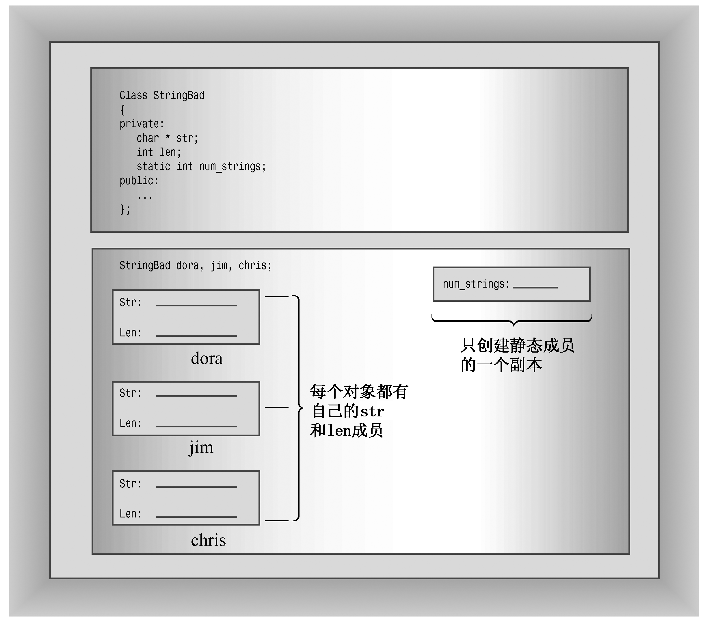

### 12.1.1　复习示例和静态类成员

我们已经有一段时间没有使用new和delete了，所以这里使用一个小程序来复习它们。这个程序使用了一个新的存储类型：静态类成员。首先设计一个StringBad类，然后设计一个功能稍强的String类（本书前面介绍过C++标准string类，第16章将更深入地讨论它；而本章的StringBad和String类将介绍这个类的底层结构，提供这种友好的接口涉及大量的编程技术）。

StringBad和String类对象将包含一个字符串指针和一个表示字符串长度的值。这里使用StringBad和String类，主要是为了深入了解new、delete和静态类成员的工作原理。因此，构造函数和析构函数调用时将显示一些消息，以便您能够按照提示来完成操作。另外，将省略一些有用的成员和友元函数，如重载的++和>>运算符以及转换函数，以简化类接口（但本章的复习题将要求您添加这些函数）。程序清单12.1列出了这个类的声明。

为什么将它命名为StringBad呢？这是为了表示提醒，StringBad是一个还没有开发好的示例。这是使用动态内存分配来开发类的第一步，它正确地完成了一些显而易见的工作，例如，它在构造函数和析构函数中正确地使用了new和delete。它其实不会执行有害的操作，但省略了一些有益的功能，这些功能是必需的，但却不是显而易见的。通过说明这个类存在的问题，有助于在稍后将它转换为一个功能更强的String类时，理解和牢记所做的一些并不明显的修改。

程序清单12.1　strngbad.h

```css
// strngbad.h -- flawed string class definition
#include <iostream>
#ifndef STRNGBAD_H_
#define STRNGBAD_H_
class StringBad
{
private:
    char * str;                // pointer to string
    int len;                   // length of string
    static int num_strings;    // number of objects
public:
    StringBad(const char * s); // constructor
    StringBad();               // default constructor
    ~StringBad();              // destructor
// friend function
    friend std::ostream & operator<<(std::ostream & os,
                        const StringBad & st);
};
#endif
```

为何将这个类命名为StringBad呢？这旨在告诉您，这是一个不太完整的类。它是使用动态内存分配来开发类的第一个阶段，正确地完成了一些显而易见的工作，例如，在构造函数和析构函数中正确地使用了new和delete。这个类并没有什么错误，但忽略了一些不明显却必不可少的东西。通过了解这个类存在的问题，将有助于您理解并记住后面将其转换为功能更强大的String类时，所做的不明显的修改。

对这个声明，需要注意的有两点。首先，它使用char指针（而不是char数组）来表示姓名。这意味着类声明没有为字符串本身分配存储空间，而是在构造函数中使用new来为字符串分配空间。这避免了在类声明中预先定义字符串的长度。

其次，将num_strings成员声明为静态存储类。静态类成员有一个特点：无论创建了多少对象，程序都只创建一个静态类变量副本。也就是说，类的所有对象共享同一个静态成员，就像家中的电话可供全体家庭成员共享一样。假设创建了10个StringBad对象，将有10个str成员和10个len成员，但只有一个共享的num_strings成员（参见图12.1）。这对于所有类对象都具有相同值的类私有数据是非常方便的。例如，num_strings成员可以记录所创建的对象数目。

随便说一句，程序清单12.1使用num_strings成员，只是为了方便说明静态数据成员，并指出潜在的编程问题，字符串类通常并不需要这样的成员。

来看一看程序清单12.2中的类方法实现，它演示了如何使用指针和静态成员。


<center class="my_markdown"><b class="my_markdown">图12.1　静态数据成员</b></center>

程序清单12.2　strngbad.cpp

```css
// strngbad.cpp -- StringBad class methods
#include <cstring>               // string.h for some
#include "strngbad.h"
using std::cout;
// initializing static class member
int StringBad::num_strings = 0;
// class methods
// construct StringBad from C string
StringBad::StringBad(const char * s)
{
    len = std::strlen(s);          // set size
    str = new char[len + 1];       // allot storage
    std::strcpy(str, s);           // initialize pointer
    num_strings++;                 // set object count
    cout << num_strings << ": \"" << str
         << "\" object created\n"; // For Your Information
}
StringBad::StringBad()             // default constructor
{
    len = 4;
    str = new char[4];
    std::strcpy(str, "C++");       // default string
    num_strings++;
    cout << num_strings << ": \"" << str
         << "\" default object created\n";         // FYI
}
StringBad::~StringBad()                            // necessary destructor
{
    cout << "\"" << str << "\" object deleted, ";  // FYI
    --num_strings;                                 // required
    cout << num_strings << " left\n";              // FYI
    delete [] str;                                 // required
}
std::ostream & operator<<(std::ostream & os, const StringBad & st)
{
    os << st.str;
    return os;
}
```

首先，请注意程序清单12.2中的下面一条语句：

```css
int StringBad::num_strings = 0;
```

这条语句将静态成员num_strings的值初始化为零。请注意，不能在类声明中初始化静态成员变量，这是因为声明描述了如何分配内存，但并不分配内存。您可以使用这种格式来创建对象，从而分配和初始化内存。对于静态类成员，可以在类声明之外使用单独的语句来进行初始化，这是因为静态类成员是单独存储的，而不是对象的组成部分。请注意，初始化语句指出了类型，并使用了作用域运算符，但没有使用关键字static。

初始化是在方法文件中，而不是在类声明文件中进行的，这是因为类声明位于头文件中，程序可能将头文件包括在其他几个文件中。如果在头文件中进行初始化，将出现多个初始化语句副本，从而引发错误。

对于不能在类声明中初始化静态数据成员的一种例外情况（见第10章）是，静态数据成员为const整数类型或枚举型。

> **注意：**
> 静态数据成员在类声明中声明，在包含类方法的文件中初始化。初始化时使用作用域运算符来指出静态成员所属的类。但如果静态成员是const整数类型或枚举型，则可以在类声明中初始化。

接下来，注意到每个构造函数都包含表达式num_strings++，这确保程序每创建一个新对象，共享变量num_strings的值都将增加1，从而记录String对象的总数。另外，析构函数包含表达式--num_strings，因此String类也将跟踪对象被删除的情况，从而使num_string成员的值是最新的。

现在来看程序清单12.2中的第一个构造函数，它使用一个常规C字符串来初始化String对象：

```css
StringBad::StringBad(const char * s)
{
    len = std::strlen(s);     // set size
    str = new char[len + 1];  // allot storage
    std::strcpy(str, s);      // initialize pointer
    num_strings++;            // set object count
    cout << num_strings << ": \"" << str
    << "\" object created\n"; // For Your Information
}
```

类成员str是一个指针，因此构造函数必须提供内存来存储字符串。初始化对象时，可以给构造函数传递一个字符串指针：

```css
String boston("Boston");
```

构造函数必须分配足够的内存来存储字符串，然后将字符串复制到内存中。下面介绍其中的每一个步骤。

首先，使用strlen()函数计算字符串的长度，并对len成员进行初始化。接着，使用new分配足够的空间来保存字符串，然后将新内存的地址赋给str成员。（strlen()返回字符串长度，但不包括末尾的空字符，因此构造函数将len加1，使分配的内存能够存储包含空字符的字符串。）

接着，构造函数使用strcpy()将传递的字符串复制到新的内存中，并更新对象计数。最后，构造函数显示当前的对象数目和当前对象中存储的字符串，以助于掌握程序运行情况。稍后故意使Stringbad出错时，该特性将派上用场。

要理解这种方法，必须知道字符串并不保存在对象中。字符串单独保存在堆内存中，对象仅保存了指出到哪里去查找字符串的信息。

不能这样做：

```css
str = s; // not the way to go
```

这只保存了地址，而没有创建字符串副本。

默认构造函数与此相似，但它提供了一个默认字符串：“C++”。

析构函数中包含了示例中对处理类来说最重要的东西：

```css
StringBad::~StringBad()                             // necessary destructor
{
    cout << "\"" << str << "\" object deleted, ";   // FYI
    --num_strings;                                  // required
    cout << num_strings << " left\n";               // FYI
    delete [] str;                                  // required
}
```

该析构函数首先指出自己何时被调用。这部分包含了丰富的信息，但并不是必不可少的。然而，delete语句却是至关重要的。str成员指向new分配的内存。当StringBad对象过期时，str指针也将过期。但str指向的内存仍被分配，除非使用delete将其释放。删除对象可以释放对象本身占用的内存，但并不能自动释放属于对象成员的指针指向的内存。因此，必须使用析构函数。在析构函数中使用delete语句可确保对象过期时，由构造函数使用new分配的内存被释放。

> **警告：**
> 在构造函数中使用new来分配内存时，必须在相应的析构函数中使用delete来释放内存。如果使用new[]（包括中括号）来分配内存，则应使用delete[]（包括中括号）来释放内存。

程序清单12.3是从处于开发阶段的Daily Vegetable程序中摘录出来的，演示了StringBad的构造函数和析构函数何时运行及如何运行。该程序将对象声明放在一个内部代码块中，因为析构函数将在定义对象的代码块执行完毕时调用。如果不这样做，析构函数将在main()函数执行完毕时调用，导致您无法在执行窗口关闭前看到析构函数显示的消息。请务必将程序清单12.2和程序清单12.3一起编译。

程序清单12.3　vegnews.cpp

```css
// vegnews.cpp -- using new and delete with classes
// compile with strngbad.cpp
#include <iostream>
using std::cout;
#include "strngbad.h"
void callme1(StringBad &); // pass by reference
void callme2(StringBad); // pass by value
int main()
{
    using std::endl;
    {
        cout << "Starting an inner block.\n";
        StringBad headline1("Celery Stalks at Midnight");
        StringBad headline2("Lettuce Prey");
        StringBad sports("Spinach Leaves Bowl for Dollars");
        cout << "headline1: " << headline1 << endl;
        cout << "headline2: " << headline2 << endl;
        cout << "sports: " << sports << endl;
        callme1(headline1);
        cout << "headline1: " << headline1 << endl;
        callme2(headline2);
        cout << "headline2: " << headline2 << endl;
        cout << "Initialize one object to another:\n";
        StringBad sailor = sports;
        cout << "sailor: " << sailor << endl;
        cout << "Assign one object to another:\n";
        StringBad knot;
        knot = headline1;
        cout << "knot: " << knot << endl;
        cout << "Exiting the block.\n";
    }
    cout << "End of main()\n";
    return 0;
}
void callme1(StringBad & rsb)
{
    cout << "String passed by reference:\n";
    cout << " \"" << rsb << "\"\n";
}
void callme2(StringBad sb)
{
    cout << "String passed by value:\n";
    cout << " \"" << sb << "\"\n";
}
```

> **注意：**
> StringBad的第一个版本有许多故意留下的缺陷，这些缺陷使得输出是不确定的。例如，有些编译器无法编译它。虽然输出的具体内容有所差别，但基本问题和解决方法（稍后将介绍）是相同的。

下面是使用Borland C++5.5命令行编译器进行编译时，该程序的输出：

```css
Starting an inner block.
1: "Celery Stalks at Midnight" object created
2: "Lettuce Prey" object created
3: "Spinach Leaves Bowl for Dollars" object created
headline1: Celery Stalks at Midnight
headline2: Lettuce Prey
sports: Spinach Leaves Bowl for Dollars
String passed by reference:
    "Celery Stalks at Midnight"
headline1: Celery Stalks at Midnight
String passed by value:
    "Lettuce Prey"
"Lettuce Prey" object deleted, 2 left
headline2: Dû°
Initialize one object to another:
sailor: Spinach Leaves Bowl for Dollars
Assign one object to another:
3: "C++" default object created
knot: Celery Stalks at Midnight
Exiting the block.
"Celery Stalks at Midnight" object deleted, 2 left
"Spinach Leaves Bowl for Dollars" object deleted, 1 left
"Spinach Leaves Bowl for Doll8" object deleted, 0 left
"@g" object deleted, -1 left
"-|" object deleted, -2 left
End of main()
```

输出中出现的各种非标准字符随系统而异，这些字符表明，StringBad类名副其实（是一个糟糕的类）。另一种迹象是对象计数为负。在使用较新的编译器和操作系统的机器上运行时，该程序通常会在显示有关还有−1个对象的信息之前中断，而有些这样的机器将报告通用保护错误（GPF）。GPF表明程序试图访问禁止它访问的内存单元，这是另一种糟糕的信号。

**程序说明**

程序清单12.3中的程序开始时还是正常的，但逐渐变得异常，最终导致了灾难性结果。首先来看正常的部分。构造函数指出自己创建了3个StringBad对象，并为这些对象进行了编号，然后程序使用重载运算符>>列出了这些对象：

```css
1: "Celery Stalks at Midnight" object created
2: "Lettuce Prey" object created
3: "Spinach Leaves Bowl for Dollars" object created
headline1: Celery Stalks at Midnight
headline2: Lettuce Prey
sports: Spinach Leaves Bowl for Dollars
```

然后，程序将headline1传递给callme1()函数，并在调用后重新显示headline1。代码如下：

```css
callme1(headline1);
cout << "headline1: " << headline1 << endl;
```

下面是运行结果：

```css
String passed by reference:
    "Celery Stalks at Midnight"
headline1: Celery Stalks at Midnight
```

这部分代码看起来也正常。

但随后程序执行了如下代码：

```css
callme2(headline2);
cout << "headline2: " << headline2 << endl;
```

这里，callme2()按值（而不是按引用）传递headline2，结果表明这是一个严重的问题！

```css
String passed by value:
    "Lettuce Prey"
"Lettuce Prey" object deleted, 2 left
headline2: Dû°
```

首先，将headline2作为函数参数来传递从而导致析构函数被调用。其次，虽然按值传递可以防止原始参数被修改，但实际上函数已使原始字符串无法识别，导致显示一些非标准字符（显示的文本取决于内存中包含的内容）。

请看输出结果，在为每一个创建的对象自动调用析构函数时，情况更糟糕：

```css
"Celery Stalks at Midnight" object deleted, 2 left
"Spinach Leaves Bowl for Dollars" object deleted, 1 left
"Spinach Leaves Bowl for Doll8" object deleted, 0 left
"@g" object deleted, -1 left
"-|" object deleted, -2 left
End of main()
```

因为自动存储对象被删除的顺序与创建顺序相反，所以最先删除的3个对象是knots、sailor和sport。删除knots和sailor时是正常的，但在删除sport时，Dollars变成了Doll8。对于sport，程序只使用它来初始化sailor，但这种操作修改了sport。最后被删除的两个对象（headline2和headline1）已经无法识别。这些字符串在被删除之前，有些操作将它们搞乱了。另外，计数也很奇怪，如何会余下−2个对象呢？

实际上，计数异常是一条线索。因为每个对象被构造和析构一次，因此调用构造函数的次数应当与析构函数的调用次数相同。对象计数（num_strings）递减的次数比递增次数多2，这表明使用了不将num_string递增的构造函数创建了两个对象。类定义声明并定义了两个构造函数（这两个构造函数都使num_string递增），但结果表明程序使用了3个构造函数。例如，请看下面的代码：

```css
StringBad sailor = sports;
```

这使用的是哪个构造函数呢？不是默认构造函数，也不是参数为const char *的构造函数。记住，这种形式的初始化等效于下面的语句：

```css
StringBad sailor = StringBad(sports); //constructor using sports
```

因为sports的类型为StringBad，因此相应的构造函数原型应该如下：

```css
StringBad(const StringBad &);
```

当您使用一个对象来初始化另一个对象时，编译器将自动生成上述构造函数（称为复制构造函数，因为它创建对象的一个副本）。自动生成的构造函数不知道需要更新静态变量num_string，因此会将计数方案搞乱。实际上，这个例子说明的所有问题都是由编译器自动生成的成员函数引起的，下面介绍这个主题。

