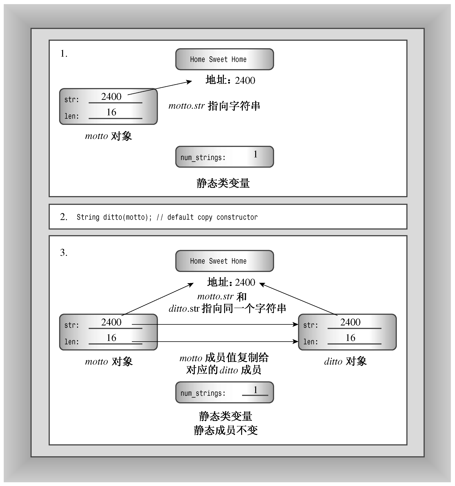

### 12.1.2　特殊成员函数

StringBad类的问题是由特殊成员函数引起的。这些成员函数是自动定义的，就StringBad而言，这些函数的行为与类设计不符。具体地说，C++自动提供了下面这些成员函数：

+ 默认构造函数，如果没有定义构造函数；
+ 默认析构函数，如果没有定义；
+ 复制构造函数，如果没有定义；
+ 赋值运算符，如果没有定义；
+ 地址运算符，如果没有定义。

更准确地说，编译器将生成上述最后三个函数的定义——如果程序使用对象的方式要求这样做。例如，如果您将一个对象赋给另一个对象，编译器将提供赋值运算符的定义。

结果表明，StringBad类中的问题是由隐式复制构造函数和隐式赋值运算符引起的。

隐式地址运算符返回调用对象的地址（即this指针的值）。这与我们的初衷是一致的，在此不详细讨论该成员函数。默认析构函数不执行任何操作，因此这里也不讨论，但需要指出的是，这个类已经提供默认构造函数。至于其他成员函数还需要进一步讨论。

C++11提供了另外两个特殊成员函数：移动构造函数（move constructor）和移动赋值运算符（move assignment operator），这将在第18章讨论。

#### 1．默认构造函数

如果没有提供任何构造函数，C++将创建默认构造函数。例如，假如定义了一个Klunk类，但没有提供任何构造函数，则编译器将提供下述默认构造函数：

```css
Klunk::Klunk() { } // implicit default constructor
```

也就是说，编译器将提供一个不接受任何参数，也不执行任何操作的构造函数（默认的默认构造函数），这是因为创建对象时总是会调用构造函数：

```css
Klunk lunk; // invokes default constructor
```

默认构造函数使lunk类似于一个常规的自动变量，也就是说，它的值在初始化时是未知的。

如果定义了构造函数，C++将不会定义默认构造函数。如果希望在创建对象时不显式地对它进行初始化，则必须显式地定义默认构造函数。这种构造函数没有任何参数，但可以使用它来设置特定的值：

```css
Klunk::Klunk() // explicit default constructor
{
    klunk_ct = 0;
    ...
}
```

带参数的构造函数也可以是默认构造函数，只要所有参数都有默认值。例如，Klunk类可以包含下述内联构造函数：

```css
Klunk(int n = 0) { klunk_ct = n; }
```

但只能有一个默认构造函数。也就是说，不能这样做：

```css
Klunk() { klunk_ct = 0 }           // constructor #1
Klunk(int n = 0) { klunk_ct = n; } // ambiguous constructor #2
```

这为何有二义性呢？请看下面两个声明：

```css
Klunk kar(10); // clearly matches Klunt(int n)
Klunk bus;     // could match either constructor
```

第二个声明既与构造函数#1（没有参数）匹配，也与构造函数#2（使用默认参数0）匹配。这将导致编译器发出一条错误消息。

#### 2．复制构造函数

复制构造函数用于将一个对象复制到新创建的对象中。也就是说，它用于初始化过程中（包括按值传递参数），而不是常规的赋值过程中。类的复制构造函数原型通常如下：

```css
Class_name(const Class_name &);
```

它接受一个指向类对象的常量引用作为参数。例如，String类的复制构造函数的原型如下：

```css
StringBad(const StringBad &);
```

对于复制构造函数，需要知道两点：何时调用和有何功能。

#### 3．何时调用复制构造函数

新建一个对象并将其初始化为同类现有对象时，复制构造函数都将被调用。这在很多情况下都可能发生，最常见的情况是将新对象显式地初始化为现有的对象。例如，假设motto是一个StringBad对象，则下面4种声明都将调用复制构造函数：

```css
StringBad ditto(motto);  // calls StringBad(const StringBad &)
StringBad metoo = motto; // calls StringBad(const StringBad &)
StringBad also = StringBad(motto);
                         // calls StringBad(const StringBad &)
StringBad * pStringBad = new StringBad(motto);
                         // calls StringBad(const StringBad &)
```

其中中间的2种声明可能会使用复制构造函数直接创建metoo和also，也可能使用复制构造函数生成一个临时对象，然后将临时对象的内容赋给metoo和also，这取决于具体的实现。最后一种声明使用motto初始化一个匿名对象，并将新对象的地址赋给pstring指针。

每当程序生成了对象副本时，编译器都将使用复制构造函数。具体地说，当函数按值传递对象（如程序清单12.3中的callme2()）或函数返回对象时，都将使用复制构造函数。记住，按值传递意味着创建原始变量的一个副本。编译器生成临时对象时，也将使用复制构造函数。例如，将3个Vector对象相加时，编译器可能生成临时的Vector对象来保存中间结果。何时生成临时对象随编译器而异，但无论是哪种编译器，当按值传递和返回对象时，都将调用复制构造函数。具体地说，程序清单12.3中的函数调用将调用下面的复制构造函数：

```css
callme2(headline2);
```

程序使用复制构造函数初始化sb——callme2()函数的StringBad型形参。

由于按值传递对象将调用复制构造函数，因此应该按引用传递对象。这样可以节省调用构造函数的时间以及存储新对象的空间。

#### 4．默认的复制构造函数的功能

默认的复制构造函数逐个复制非静态成员（成员复制也称为浅复制），复制的是成员的值。在程序清单12.3中，下述语句：

```css
StringBad sailor = sports;
```

与下面的代码等效（只是由于私有成员是无法访问的，因此这些代码不能通过编译）：

```css
StringBad sailor;
sailor.str = sports.str;
sailor.len = sports.len;
```

如果成员本身就是类对象，则将使用这个类的复制构造函数来复制成员对象。静态成员（如num_strings）不受影响，因为它们属于整个类，而不是各个对象。图12.2说明了隐式复制构造函数执行的操作。


<center class="my_markdown"><b class="my_markdown">图12.2　逐个复制成员</b></center>

