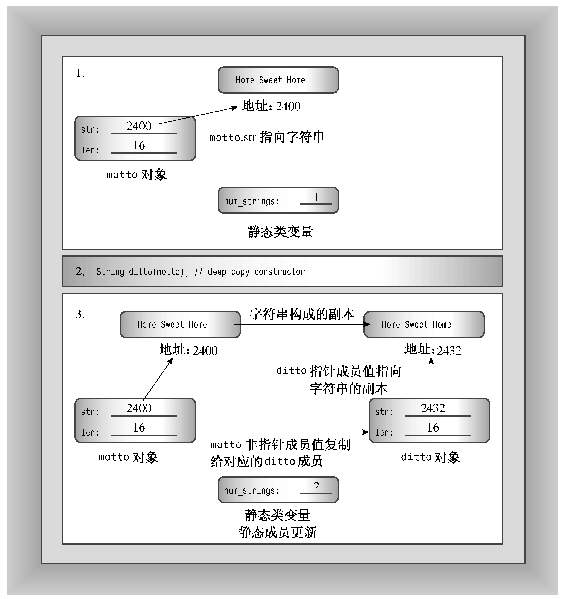

### 12.1.3　回到Stringbad：复制构造函数的哪里出了问题

现在介绍程序清单12.3的两个异常之处（假设输出为该程序清单后面列出的）。首先，程序的输出表明，析构函数的调用次数比构造函数的调用次数多2，原因可能是程序确实使用默认的复制构造函数另外创建了两个对象。当callme2()被调用时，复制构造函数被用来初始化callme2()的形参，还被用来将对象sailor初始化为对象sports。默认的复制构造函数不说明其行为，因此它不指出创建过程，也不增加计数器num_strings的值。但析构函数更新了计数，并且在任何对象过期时都将被调用，而不管对象是如何被创建的。这是一个问题，因为这意味着程序无法准确地记录对象计数。解决办法是提供一个对计数进行更新的显式复制构造函数：

```css
StringBad::StringBad(const String & s)
{
    num_strings++;
    ...// important stuff to go here
}
```

> **提示：**
> 如果类中包含这样的静态数据成员，即其值将在新对象被创建时发生变化，则应该提供一个显式复制构造函数来处理计数问题。

第二个异常之处更微妙，也更危险，其症状之一是字符串内容出现乱码：

```css
headline2: Dû°
```

原因在于隐式复制构造函数是按值进行复制的。例如，对于程序清单12.3，隐式复制构造函数的功能相当于：

```css
sailor.str = sport.str;
```

这里复制的并不是字符串，而是一个指向字符串的指针。也就是说，将sailor初始化为sports后，得到的是两个指向同一个字符串的指针。当operator <<()函数使用指针来显示字符串时，这并不会出现问题。但当析构函数被调用时，这将引发问题。析构函数StringBad释放str指针指向的内存，因此释放sailor的效果如下：

```css
delete [] sailor.str; // delete the string that ditto.str points to
```

sailor.str指针指向“Spinach Leaves Bowl for Dollars”，因为它被赋值为sports.str，而sports.str指向的正是上述字符串。所以delete语句将释放字符串“Spinach Leaves Bowl for Dollars”占用的内存。

然后，释放sports的效果如下：

```css
delete [] sports.str; // effect is undefined
```

sports.str指向的内存已经被sailor的析构函数释放，这将导致不确定的、可能有害的后果。程序清单12.3中的程序生成受损的字符串，这通常是内存管理不善的表现。

另一个症状是，试图释放内存两次可能导致程序异常终止。例如，Microsoft Visual C++ 2010（调试模式）显示一个错误消息窗口，指出“Debug Assertion Failed!”；而在Linux中，g++ 4.4.1显示消息“double free or corruption”并终止程序运行。其他系统可能提供不同的消息，甚至不提供任何消息，但程序中的错误是相同的。

#### 1．定义一个显式复制构造函数以解决问题

解决类设计中这种问题的方法是进行深度复制（deep copy）。也就是说，复制构造函数应当复制字符串并将副本的地址赋给str成员，而不仅仅是复制字符串地址。这样每个对象都有自己的字符串，而不是引用另一个对象的字符串。调用析构函数时都将释放不同的字符串，而不会试图去释放已经被释放的字符串。可以这样编写String的复制构造函数：

```css
StringBad::StringBad(const StringBad & st)
{
    num_strings++;                 // handle static member update
    len = st.len;                  // same length
    str = new char [len + 1];      // allot space
    std::strcpy(str, st.str);      // copy string to new location
    cout << num_strings << ": \"" << str
         << "\" object created\n"; // For Your Information
}
```

必须定义复制构造函数的原因在于，一些类成员是使用new初始化的、指向数据的指针，而不是数据本身。图12.3说明了深度复制。

> **警告：**
> 如果类中包含了使用new初始化的指针成员，应当定义一个复制构造函数，以复制指向的数据，而不是指针，这被称为深度复制。复制的另一种形式（成员复制或浅复制）只是复制指针值。浅复制仅浅浅地复制指针信息，而不会深入“挖掘”以复制指针引用的结构。


<center class="my_markdown"><b class="my_markdown">图12.3　深度复制</b></center>

