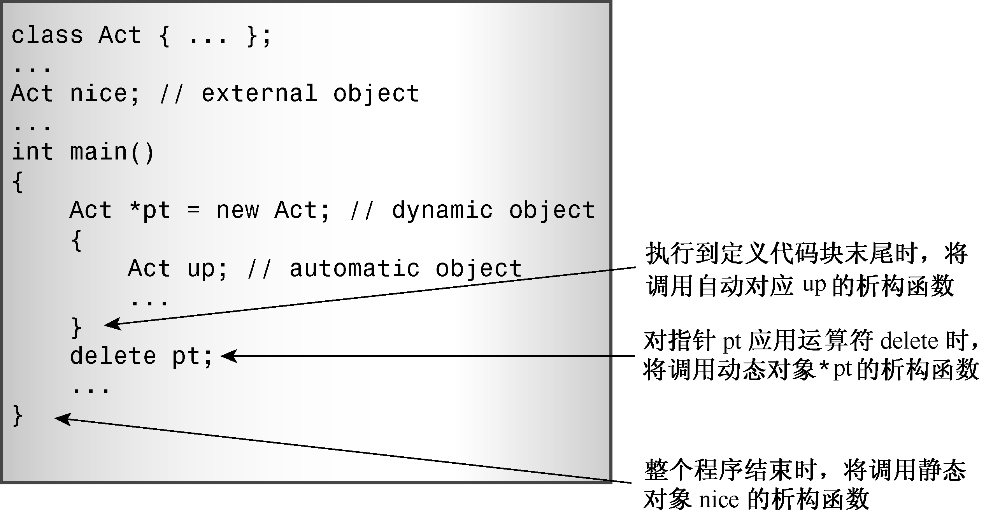

### 12.5.1　再谈new和delete

程序清单12.4、程序清单12.5和程序清单12.7组成的程序在两个层次上使用了new和delete。首先，它使用new为创建的每一个对象的名称字符串分配存储空间，这是在构造函数中进行的，因此析构函数使用delete来释放这些内存。因为字符串是一个字符数组，所以析构函数使用的是带中括号的delete。这样，当对象被释放时，用于存储字符串内容的内存将被自动释放。其次，程序清单12.7中的代码使用new来为整个对象分配内存：

```css
String * favorite = new String(sayings[choice]);
```

这不是为要存储的字符串分配内存，而是为对象分配内存；也就是说，为保存字符串地址的str指针和len成员分配内存（程序并没有给num_string成员分配内存，这是因为num_string成员是静态成员，它独立于对象被保存）。创建对象将调用构造函数，后者分配用于保存字符串的内存，并将字符串的地址赋给str。然后，当程序不再需要该对象时，使用delete删除它。对象是单个的，因此，程序使用不带中括号的delete。与前面介绍的相同，这将只释放用于保存str指针和len成员的空间，并不释放str指向的内存，而该任务将由析构函数来完成（参见图12.4）。


<center class="my_markdown"><b class="my_markdown">图12.4　调用析构函数</b></center>

在下述情况下析构函数将被调用（参见图12.4）。

+ 如果对象是动态变量，则当执行完定义该对象的程序块时，将调用该对象的析构函数。因此，在程序清单12.3中，执行完main()时，将调用headline[0]和headline[1]的析构函数；执行完callme1()时，将调用grub的析构函数。
+ 如果对象是静态变量（外部、静态、静态外部或来自名称空间），则在程序结束时将调用对象的析构函数。这就是程序清单12.3中sports对象所发生的情况。
+ 如果对象是用new创建的，则仅当您显式使用delete删除对象时，其析构函数才会被调用。

