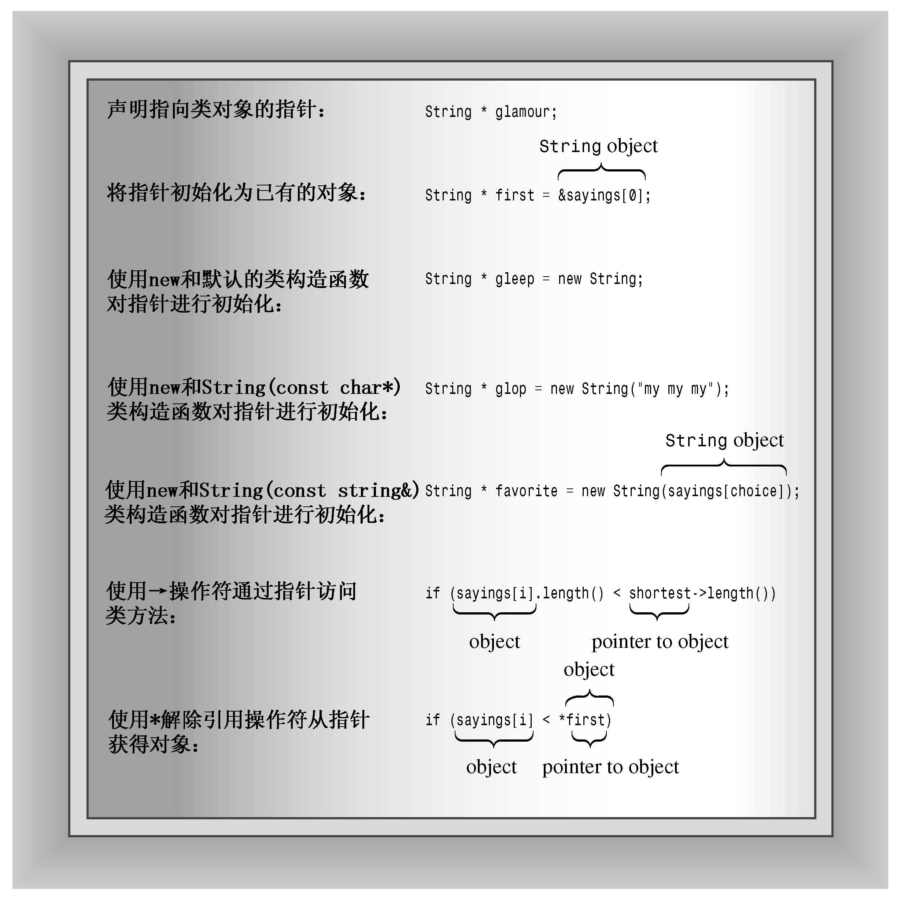
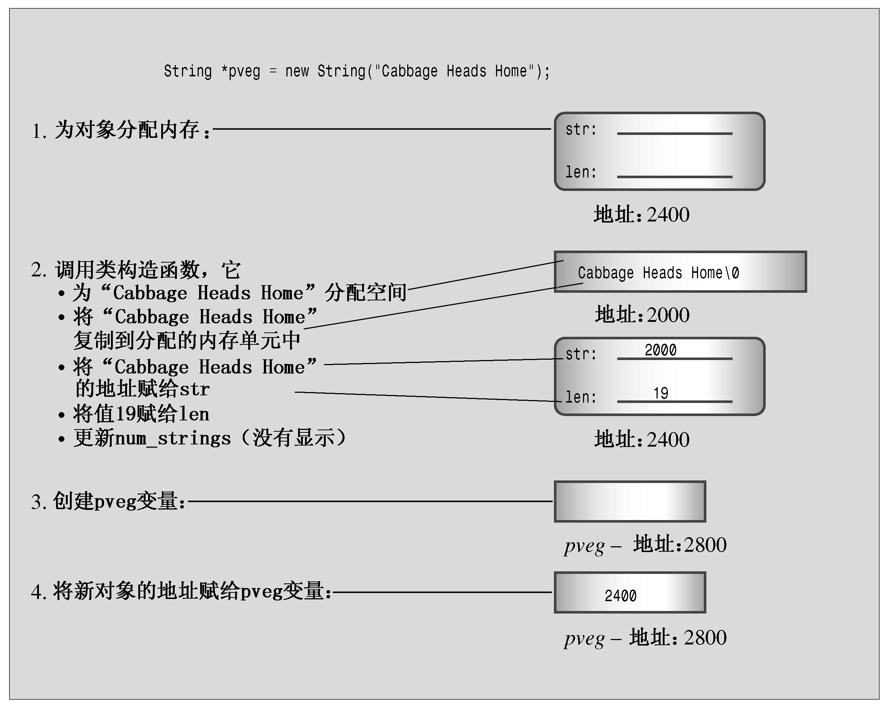

### 12.5.2　指针和对象小结

使用对象指针时，需要注意几点（参见图12.5）：

+ 使用常规表示法来声明指向对象的指针：

```css
String * glamour;
```

+ 可以将指针初始化为指向已有的对象：

```css
String * first = &sayings[0];
```

+ 可以使用new来初始化指针，这将创建一个新的对象（有关使用new初始化指针的细节，请参见图12.6）：

```css
String * favorite = new String(sayings[choice]);
```

+ 对类使用new将调用相应的类构造函数来初始化新创建的对象：

```css
// invokes default constructor
String * gleep = new String;
// invokes the String(const char *) constructor
String * glop = new String("my my my");
// invokes the String(const String &) constructor
String * favorite = new String(sayings[choice]);
```

+ 可以使用->运算符通过指针访问类方法：

```css
if (sayings[i].length() < shortest->length())
```

+ 可以对对象指针应用解除引用运算符（*）来获得对象：

```css
if (sayings[i] < *first) // compare object values
    first = &sayings[i]; // assign object address
```


<center class="my_markdown"><b class="my_markdown">图12.5　指针和对象</b></center>


<center class="my_markdown"><b class="my_markdown">图12.6　使用new创建对象</b></center>

