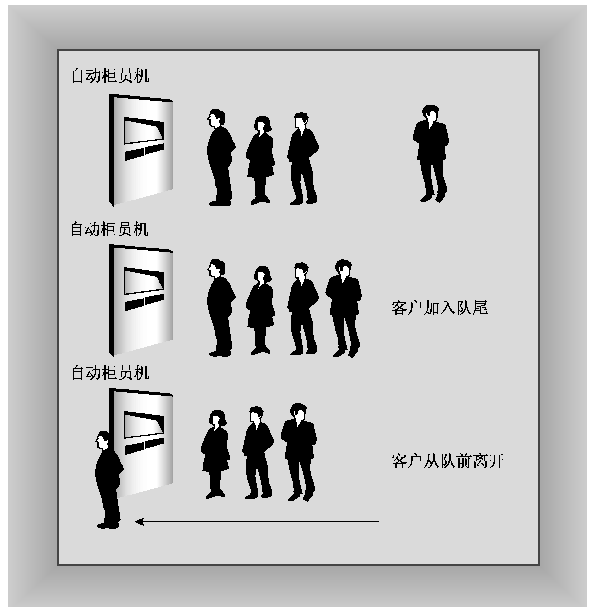

### 12.7　队列模拟

进一步了解类后，可将这方面的知识用于解决编程问题。Heather银行打算在Food Heap超市开设一个自动柜员机（ATM）。Food Heap超市的管理者担心排队等待使用ATM的人流会干扰超市的交通，希望限制排队等待的人数。Heather银行希望对顾客排队等待的时间进行估测。要编写一个程序来模拟这种情况，让超市的管理者可以了解ATM可能造成的影响。

对于这种问题，最自然的方法是使用顾客队列。队列是一种抽象的数据类型（Abstract Data Type，ADT），可以存储有序的项目序列。新项目被添加在队尾，并可以删除队首的项目。队列有点像栈，但栈在同一端进行添加和删除。这使得栈是一种后进先出（LIFO，last-in，first-out）的结构，而队列是先进先出（FIFO，first-in，first-out）的。从概念上说，队列就好比是收款台或ATM前面排的队，所以对于上述问题，队列非常合适。因此，工程的任务之一是定义一个Queue类（第16章将介绍标准模板库类queue，也将介绍如何开发自己的类）。

队列中的项目是顾客。Heather银行的代表介绍：通常，1/3的顾客只需要1分钟便可获得服务，1/3的顾客需要2分钟，另外1/3的顾客需要3分钟。另外，顾客到达的时间是随机的，但每个小时使用自动柜员机的顾客数量相当稳定。工程的另外两项任务是：设计一个表示顾客的类；编写一个程序来模拟顾客和队列之间的交互（参见图12.7）。

<b class="my_markdown">图12.7　队列</b>

