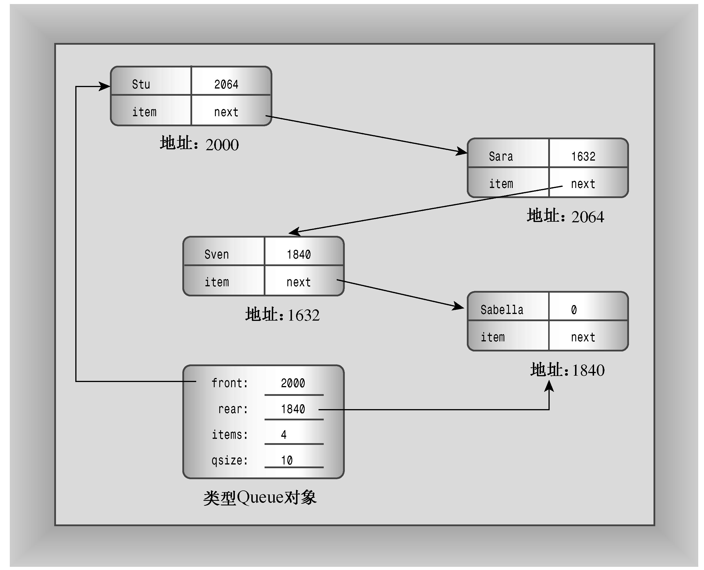
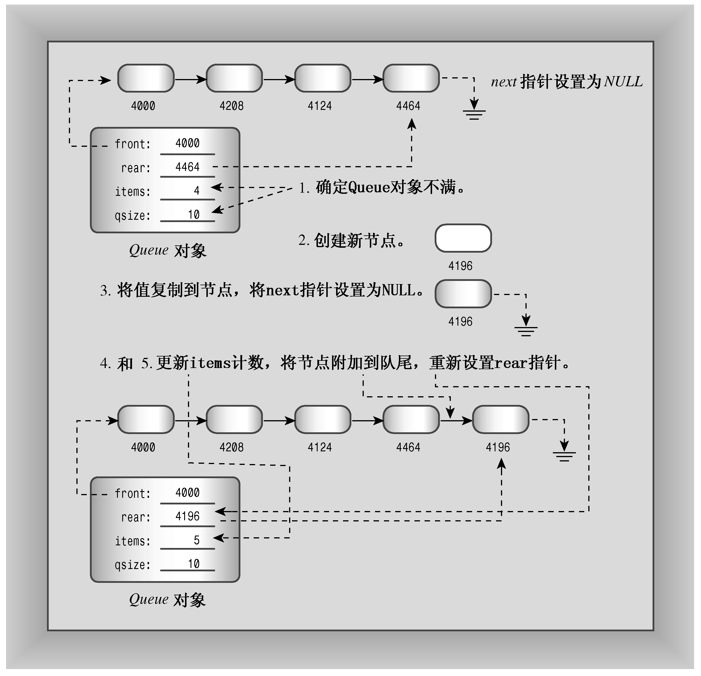
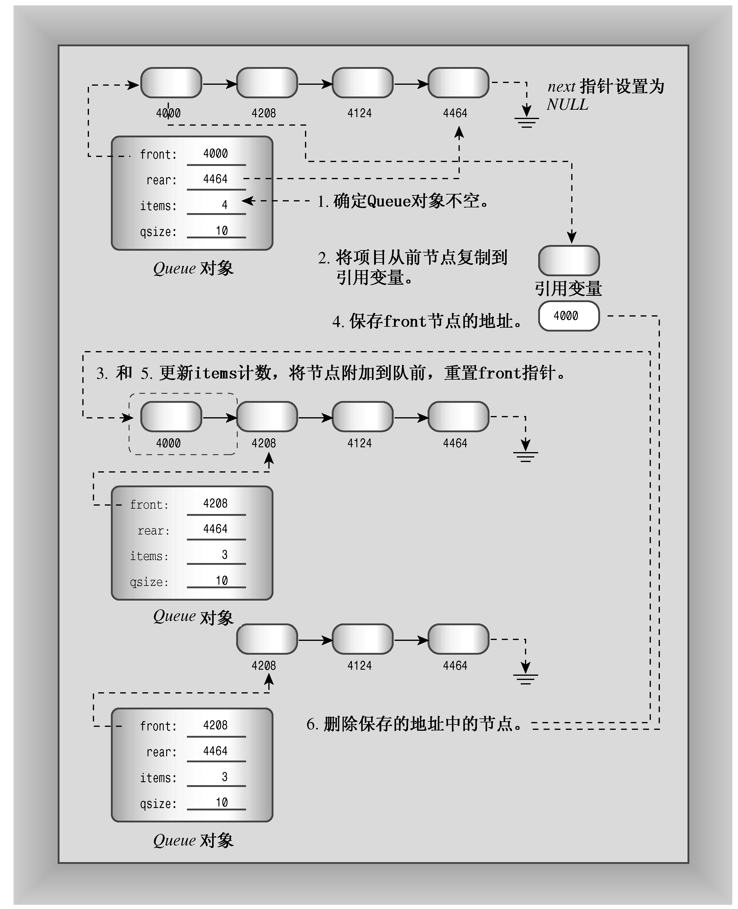

### 12.7.1　队列类


首先需要设计一个Queue类。这里先列出队列的特征：

+ 队列存储有序的项目序列；
+ 队列所能容纳的项目数有一定的限制；
+ 应当能够创建空队列；
+ 应当能够检查队列是否为空；
+ 应当能够检查队列是否是满的；
+ 应当能够在队尾添加项目；
+ 应当能够从队首删除项目；
+ 应当能够确定队列中项目数。

设计类时，需要开发公有接口和私有实现。

#### 1．Queue类的接口

从队列的特征可知，Queue类的公有接口应该如下：

```css
class Queue
{
    enum {Q_SIZE = 10};
private:
// private representation to be developed later
public:
    Queue(int qs = Q_SIZE); // create queue with a qs limit
    ~Queue();
    bool isempty() const;
    bool isfull() const;
    int queuecount() const;
    bool enqueue(const Item &item); // add item to end
    bool dequeue(Item &item); // remove item from front
};
```

构造函数创建一个空队列。默认情况下，队列最多可存储10个项目，但是可以用显式初始化参数覆盖该默认值：

```css
Queue line1;     // queue with 10-item limit
Queue line2(20); // queue with 20-item limit
```

使用队列时，可以使用typedef来定义Item（第14章将介绍如何使用类模板）。

#### 2．Queue类的实现

确定接口后，便可以实现它。首先，需要确定如何表示队列数据。一种方法是使用new动态分配一个数组，它包含所需的元素数。然而，对于队列操作而言，数组并不太合适。例如，删除数组的第一个元素后，需要将余下的所有元素向前移动一位；否则需要作一些更费力的工作，如将数组视为是循环的。然而，链表能够很好地满足队列的要求。链表由节点序列构成。每一个节点中都包含要保存到链表中的信息以及一个指向下一个节点的指针。对于这里的队列来说，数据部分都是一个Item类型的值，因此可以使用下面的结构来表示节点：

```css
struct Node
{
    Item item;             // data stored in the node
    struct Node * next;  // pointer to next node
};
```

图12.8说明了链表。

如图12.8所示是一个单向链表，因为每个节点都只包含一个指向其他节点的指针。知道第一个节点的地址后，就可以沿指针找到后面的每一个节点。通常，链表最后一个节点中的指针被设置为NULL（或0），以指出后面没有节点了。在C++11中，应使用新增的关键字nullptr。要跟踪链表，必须知道第一个节点的地址。可以让Queue类的一个数据成员指向链表的起始位置。具体地说，这是所需要的全部信息，有了这种信息后，就可以沿节点链找到任何节点。然而，由于队列总是将新项目添加到队尾，因此包含一个指向最后一个节点的数据成员将非常方便（参见图12.9）。此外，还可以使用数据成员来跟踪队列可存储的最大项目数以及当前的项目数。所以，类声明的私有部分与下面类似：

```css
class Queue
{
private:
// class scope definitions
    // Node is a nested structure definition local to this class
    struct Node { Item item; struct Node * next;};
    enum {Q_SIZE = 10};
// private class members
    Node * front;      // pointer to front of Queue
    Node * rear;       // pointer to rear of Queue
    int items;          // current number of items in Queue
    const int qsize;  // maximum number of items in Queue
    ...
public:
//...
};
```


<center class="my_markdown"><b class="my_markdown">图12.8　链表</b></center>


<center class="my_markdown"><b class="my_markdown">图12.9　Queue对象</b></center>

上述声明使用了C++的一项特性：在类中嵌套结构或类声明。通过将Node声明放在Queue类中，可以使其作用域为整个类。也就是说，Node是这样一种类型：可以使用它来声明类成员，也可以将它作为类方法中的类型名称，但只能在类中使用。这样，就不必担心该Node声明与某些全局声明或其他类中声明的Node发生冲突。有些较老的编译器不支持嵌套的结构和类，如果您的编译器是这样的，则必须将Node结构定义为全局的，将其作用域设置为整个文件。


**嵌套结构和类**

在类声明中声明的结构、类或枚举被称为是被嵌套在类中，其作用域为整个类。这种声明不会创建数据对象，而只是指定了可以在类中使用的类型。如果声明是在类的私有部分进行的，则只能在这个类使用被声明的类型；如果声明是在公有部分进行的，则可以从类的外部通过作用域解析运算符使用被声明的类型。例如，如果Node是在Queue类的公有部分声明的，则可以在类的外面声明Queue::Node类型的变量。

设计好数据的表示方式后，接下来需要编写类方法。

#### 3．类方法

类构造函数应提供类成员的值。由于在这个例子中，队列最初是空的，因此队首和队尾指针都设置为NULL（0或nullptr），并将items设置为0。另外，还应将队列的最大长度qsize设置为构造函数参数qs的值。下面的实现方法无法正常运行：

```css
Queue::Queue(int qs)
{
    front = rear = NULL;
    items = 0;
    qsize = qs;     // not acceptable!
}
```

问题在于qsize是常量，所以可以对它进行初始化，但不能给它赋值。从概念上说，调用构造函数时，对象将在括号中的代码执行之前被创建。因此，调用Queue（int qs）构造函数将导致程序首先给4个成员变量分配内存。然后，程序流程进入到括号中，使用常规的赋值方式将值存储到内存中。因此，对于const数据成员，必须在执行到构造函数体之前，即创建对象时进行初始化。C++提供了一种特殊的语法来完成上述工作，它叫作成员初始化列表（member initializer list）。成员初始化列表由逗号分隔的初始化列表组成（前面带冒号）。它位于参数列表的右括号之后、函数体左括号之前。如果数据成员的名称为mdata，并需要将它初始化为val，则初始化器为mdata（val）。使用这种表示法，可以这样编写Queue的构造函数：

```css
Queue::Queue(int qs) : qsize(qs) // initialize qsize to qs
{
    front = rear = NULL;
    items = 0;
}
```

通常，初值可以是常量或构造函数的参数列表中的参数。这种方法并不限于初始化常量，可以将Queue构造函数写成如下所示：

```css
Queue::Queue(int qs) : qsize(qs), front(NULL), rear(NULL), items(0)
{
}
```

只有构造函数可以使用这种初始化列表语法。如上所示，对于const类成员，必须使用这种语法。另外，对于被声明为引用的类成员，也必须使用这种语法：

```css
class Agency {...};
class Agent
{
private:
    Agency & belong;   // must use initializer list to initialize
    ...
};
Agent::Agent(Agency & a) : belong(a) {...}
```

这是因为引用与const数据类似，只能在被创建时进行初始化。对于简单数据成员（例如front和items），使用成员初始化列表和在函数体中使用赋值没有什么区别。然而，正如第14章将介绍的，对于本身就是类对象的成员来说，使用成员初始化列表的效率更高。


**成员初始化列表的语法**

如果Classy是一个类，而mem1、mem2和mem3都是这个类的数据成员，则类构造函数可以使用如下的语法来初始化数据成员：

```css
Classy::Classy(int n, int m) :mem1(n), mem2(0), mem3(n*m + 2)
{
//...
}
```

上述代码将mem1初始化为n，将mem2初始化为0，将mem3初始化为n*m + 2。从概念上说，这些初始化工作是在对象创建时完成的，此时还未执行括号中的任何代码。请注意以下几点：

+ 这种格式只能用于构造函数；
+ 必须用这种格式来初始化非静态const数据成员（至少在C++11之前是这样的）；
+ 必须用这种格式来初始化引用数据成员。

数据成员被初始化的顺序与它们出现在类声明中的顺序相同，与初始化器中的排列顺序无关。


> **警告：**
> 不能将成员初始化列表语法用于构造函数之外的其他类方法。

成员初始化列表使用的括号方式也可用于常规初始化。也就是说，如果愿意，可以将下述代码：

```css
int games = 162;
double talk = 2.71828;
```

替换为：

```css
int games(162);
double talk(2.71828);
```

这使得初始化内置类型就像初始化类对象一样。


**C++11的类内初始化**

C++11允许您以更直观的方式进行初始化：

```css
class Classy
{
    int mem1 = 10;       // in-class initialization
    const int mem2 = 20; // in-class initialization
//...
};
```

这与在构造函数中使用成员初始化列表等价：

```css
Classy::Classy() : mem1(10), mem2(20) {...}
```

成员mem1和mem2将分别被初始化为10和20，除非调用了使用成员初始化列表的构造函数，在这种情况下，实际列表将覆盖这些默认初始值：

```css
Classy::Classy(int n) : mem1(n) {...}
```

在这里，构造函数将使用n来初始化mem1，但mem2仍被设置为20。


isempty()、isfull()和queuecount()的代码都非常简单。如果items为0，则队列是空的；如果items等于qsize，则队列是满的。要知道队列中的项目数，只需返回items的值。后面的程序清单12.11列出了这些代码。

将项目添加到队尾（入队）比较麻烦。下面是一种方法：

```css
bool Queue::enqueue(const Item & item)
{
    if (isfull())
        return false;
    Node * add = new Node;  // create node
// on failure, new throws std::bad_alloc exception
    add->item = item;       // set node pointers
    add->next = NULL;       // or nullptr;
    items++;
    if (front == NULL)      // if queue is empty,
        front = add;        // place item at front
    else
        rear->next = add;   // else place at rear
    rear = add;             // have rear point to new node
    return true;
}
```

总之，方法需要经过下面几个阶段（见图12.10）。

1．如果队列已满，则结束（在这里的实现中，队列的最大长度由用户通过构造函数指定）。

2．创建一个新节点。如果new无法创建新节点，它将引发异常，这个主题将在第15章介绍。最终的结果是，除非提供了处理异常的代码，否则程序将终止。

3．在节点中放入正确的值。在这个例子中，代码将Item值复制到节点的数据部分，并将节点的next指针设置为NULL（0或C++11新增的nullptr）。这样就为将节点作为队列中的最后一个项目做好了准备。

4．将项目计数（items）加1。

5．将节点附加到队尾。这包括两个部分。首先，将节点与列表中的另一个节点连接起来。这是通过将当前队尾节点的next指针指向新的队尾节点来完成的。第二部分是将Queue的成员指针rear设置为指向新节点，使队列可以直接访问最后一个节点。如果队列为空，则还必须将front指针设置成指向新节点（如果只有一个节点，则它既是队首节点，也是队尾节点）。


<center class="my_markdown"><b class="my_markdown">图12.10　将项目入队</b></center>

删除队首项目（出队）也需要多个步骤才能完成。下面是一种方式：

```css
bool Queue::dequeue(Item & item)
{
    if (front == NULL)
        return false;
    item = front->item; // set item to first item in queue
    items--;
    Node * temp = front; // save location of first item
    front = front->next; // reset front to next item
    delete temp; // delete former first item
    if (items == 0)
        rear = NULL;
    return true;
}
```

总之，需要经过下面几个阶段（参见图12.11）：

1．如果队列为空，则结束。

2．将队列的第一个项目提供给调用函数，这是通过将当前front节点中的数据部分复制到传递给方法的引用变量中来实现。

3．将项目计数（items）减1。

4．保存front节点的位置，供以后删除。

5．让节点出队。这是通过将Queue成员指针front设置成指向下一个节点来完成的，该节点的位置由front->next提供。

6．为节省内存，删除以前的第一个节点。

7．如果链表为空，则将rear设置为NULL（在这个例子中，将front指针设置成front->next后，它已经是NULL了）。同样，可使用0而不是NULL，也可使用C++11新增的nullptr。

第4步是必不可少的，这是因为第5步将删除关于先前第一个节点位置的信息。


<center class="my_markdown"><b class="my_markdown">图12.11　将项目出队</b></center>

#### 4．是否需要其他类方法

是否需要其他方法呢？类构造函数没有使用new，所以乍一看，好像不用理会由于在构造函数中使用new给类带来的特殊要求。当然，这种印象是错误的，因为向队列中添加对象将调用new来创建新的节点。通过删除节点的方式，dequeue()方法确实可以清除节点，但这并不能保证队列在到期时为空。因此，类需要一个显式析构函数—— 该函数删除剩余的所有节点。下面是一种实现，它从链表头开始，依次删除其中的每个节点：

```css
Queue::~Queue()
{
    Node * temp;
    while (front != NULL)    // while queue is not yet empty
    {
        temp = front;        // save address of front item
        front = front->next; // reset pointer to next item
        delete temp;         // delete former front
    }
}
```

您知道，使用new的类通常需要包含显式复制构造函数和执行深度复制的赋值运算符，这个例子也是如此吗？首先要回答的问题是，默认的成员复制是否合适？答案是否定的。复制Queue对象的成员将生成一个新的对象，该对象指向链表原来的头和尾。因此，将项目添加到复制的Queue对象中，将修改共享的链表。这样做将造成非常严重的后果。更糟的是，只有副本的尾指针得到了更新，从原始对象的角度看，这将损坏链表。显然，要克隆或复制队列，必须提供复制构造函数和执行深度复制的赋值构造函数。

当然，这提出了这样一个问题：为什么要复制队列呢？也许是希望在模拟的不同阶段保存队列的瞬像，也可能是希望为两个不同的策略提供相同的输入。实际上，拥有拆分队列的操作是非常有用的，超市在开设额外的收款台时经常这样做。同样，也可能希望将两个队列结合成一个或者截短一个队列。

但假设这里的模拟不实现上述功能。难道不能忽略这些问题，而使用已有的方法吗？当然可以。然而，在将来的某个时候，可能需要再次使用队列且需要复制。另外，您可能会忘记没有为复制提供适当的代码。在这种情况下，程序将能编译和运行，但结果却是混乱的，甚至会崩溃。因此，最好还是提供复制构造函数和赋值运算符，尽管目前并不需要它们。

幸运的是，有一种小小的技巧可以避免这些额外的工作，并确保程序不会崩溃。这就是将所需的方法定义为伪私有方法：

```css
class Queue
{
private:
    Queue(const Queue & q) : qsize(0) { } // preemptive definition
    Queue & operator=(const Queue & q) { return *this;}
//...
};
```

这样做有两个作用：第一，它避免了本来将自动生成的默认方法定义。第二，因为这些方法是私有的，所以不能被广泛使用。也就是说，如果nip和tuck是Queue对象，则编译器就不允许这样做：

```css
Queue snick(nip); // not allowed
tuck = nip;       // not allowed
```

所以，与其将来面对无法预料的运行故障，不如得到一个易于跟踪的编译错误，指出这些方法是不可访问的。另外，在定义其对象不允许被复制的类时，这种方法也很有用。

C++11提供了另一种禁用方法的方式——使用关键字delete，这将在第18章介绍。

还有没有其他影响需要注意呢？当然有。当对象被按值传递（或返回）时，复制构造函数将被调用。然而，如果遵循优先采用按引用传递对象的惯例，将不会有任何问题。另外，复制构造函数还被用于创建其他的临时对象，但Queue定义中并没有导致创建临时对象的操作，例如重载加法运算符。

