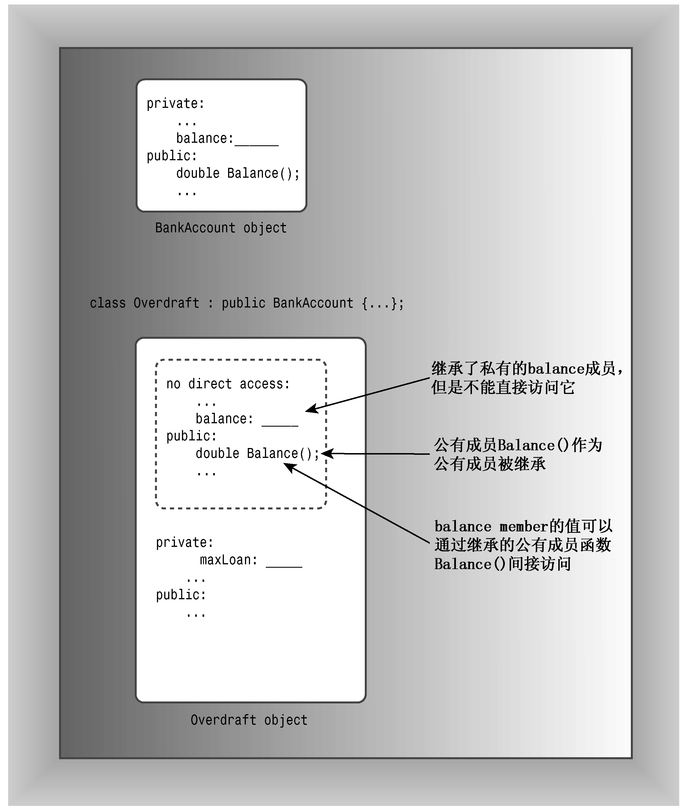

### 13.1.1　派生一个类

Webtown俱乐部的一些成员曾经参加过当地的乒乓球锦标赛，需要这样一个类，它能包括成员在比赛中的比分。与其从零开始，不如从TableTennisClass类派生出一个类。首先将RatedPlayer类声明为从TableTennisClass类派生而来：

```css
// RatedPlayer derives from the TableTennisPlayer base class
class RatedPlayer : public TableTennisPlayer
{
...
};
```

冒号指出RatedPlayer类的基类是TableTennisplayer类。上述特殊的声明头表明TableTennisPlayer是一个公有基类，这被称为公有派生。派生类对象包含基类对象。使用公有派生，基类的公有成员将成为派生类的公有成员；基类的私有部分也将成为派生类的一部分，但只能通过基类的公有和保护方法访问（稍后将介绍保护成员）。

上述代码完成了哪些工作呢？Ratedplayer对象将具有以下特征：

+ 派生类对象存储了基类的数据成员（派生类继承了基类的实现）；
+ 派生类对象可以使用基类的方法（派生类继承了基类的接口）。

因此，RatedPlayer对象可以存储运动员的姓名及其是否有球桌。另外，RatedPlayer对象还可以使用TableTennisPlayer类的Name()、hasTable()和ResetTable()方法（参见图13.1）。

需要在继承特性中添加什么呢？

+ 派生类需要自己的构造函数。
+ 派生类可以根据需要添加额外的数据成员和成员函数。

在这个例子中，派生类需要另一个数据成员来存储比分，还应包含检索比分的方法和重置比分的方法。因此，类声明与下面类似：

```css
// simple derived class
class RatedPlayer : public TableTennisPlayer
{
private:
    unsigned int rating; // add a data member
public:
    RatedPlayer (unsigned int r = 0, const string & fn = "none",
                 const string & ln = "none", bool ht = false);
    RatedPlayer(unsigned int r, const TableTennisPlayer & tp);
    unsigned int Rating() const { return rating; }  // add a method
    void ResetRating (unsigned int r) {rating = r;} // add a method
};
```

构造函数必须给新成员（如果有的话）和继承的成员提供数据。在第一个RatedPlayer构造函数中，每个成员对应一个形参；而第二个Ratedplayer构造函数使用一个TableTennisPlayer参数，该参数包括firstname、lastname和hasTable。


<center class="my_markdown"><b class="my_markdown">图13.1　基类对象和派生类对象</b></center>

