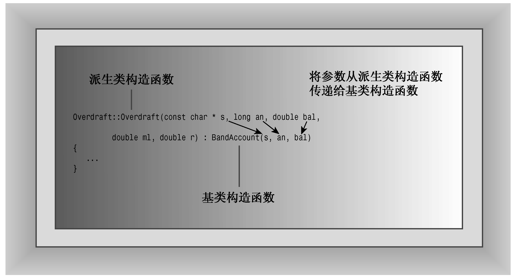

### 13.1.2　构造函数：访问权限的考虑

派生类不能直接访问基类的私有成员，而必须通过基类方法进行访问。例如，RatedPlayer构造函数不能直接设置继承的成员（firstname、lastname和hasTable），而必须使用基类的公有方法来访问私有的基类成员。具体地说，派生类构造函数必须使用基类构造函数。

创建派生类对象时，程序首先创建基类对象。从概念上说，这意味着基类对象应当在程序进入派生类构造函数之前被创建。C++使用成员初始化列表语法来完成这种工作。例如，下面是第一个RatedPlayer构造函数的代码：

```css
RatedPlayer::RatedPlayer(unsigned int r, const string & fn,
     const string & ln, bool ht) : TableTennisPlayer(fn, ln, ht)
{
    rating = r;
}
```

其中:TableTennisPlayer(fn,ln,ht)是成员初始化列表。它是可执行的代码，调用TableTennisPlayer构造函数。例如，假设程序包含如下声明：

```css
: TableTennisPlayer(fn, ln, ht)
```

则RealPlayer构造函数将把实参“Mallory”“Duck”和true赋给形参fn、In和ht，然后将这些参数作为实参传递给TableTennisPlayer构造函数，后者将创建一个嵌套TableTennisPlayer对象，并将数据“Mallory”、“Duck”和true存储在该对象中。然后，程序进入RealPlayer构造函数体，完成RealPlayer对象的创建，并将参数r的值（即1140）赋给rating成员（参见图13.2）。


<center class="my_markdown"><b class="my_markdown">图13.2　将参数传递给基类构造函数</b></center>

如果省略成员初始化列表，情况将如何呢？

```css
RatedPlayer::RatedPlayer(unsigned int r, const string & fn,
     const string & ln, bool ht) // what if no initializer list?
{
    rating = r;
}
```

必须首先创建基类对象，如果不调用基类构造函数，程序将使用默认的基类构造函数，因此上述代码与下面等效：

```css
RatedPlayer::RatedPlayer(unsigned int r, const string & fn,
     const string & ln, bool ht) : TableTennisPlayer()
{
    rating = r;
}
```

除非要使用默认构造函数，否则应显式调用正确的基类构造函数。

下面来看第二个构造函数的代码：

```css
RatedPlayer::RatedPlayer(unsigned int r, const TableTennisPlayer & tp)
    : TableTennisPlayer(tp)
{
    rating = r;
}
```

这里也将TableTennisPlayer的信息传递给了TableTennisPlayer构造函数：

```css
TableTennisPlayer(tp)
```

由于tp的类型为TableTennisPlayer &，因此将调用基类的复制构造函数。基类没有定义复制构造函数，但第12章介绍过，如果需要使用复制构造函数但又没有定义，编译器将自动生成一个。在这种情况下，执行成员复制的隐式复制构造函数是合适的，因为这个类没有使用动态内存分配（string成员确实使用了动态内存分配，但本书前面说过，成员复制将使用string类的复制构造函数来复制string成员）。

如果愿意，也可以对派生类成员使用成员初始化列表语法。在这种情况下，应在列表中使用成员名，而不是类名。所以，第二个构造函数可以按照下述方式编写：

```css
// alternative version
RatedPlayer::RatedPlayer(unsigned int r, const TableTennisPlayer & tp)
    : TableTennisPlayer(tp), rating(r)
{
}
```

有关派生类构造函数的要点如下：

+ 首先创建基类对象；
+ 派生类构造函数应通过成员初始化列表将基类信息传递给基类构造函数；
+ 派生类构造函数应初始化派生类新增的数据成员。

这个例子没有提供显式构造函数，因此将使用隐式构造函数。释放对象的顺序与创建对象的顺序相反，即首先执行派生类的析构函数，然后自动调用基类的析构函数。

注意：创建派生类对象时，程序首先调用基类构造函数，然后再调用派生类构造函数。基类构造函数负责初始化继承的数据成员；派生类构造函数主要用于初始化新增的数据成员。派生类的构造函数总是调用一个基类构造函数。可以使用初始化器列表语法指明要使用的基类构造函数，否则将使用默认的基类构造函数。

派生类对象过期时，程序将首先调用派生类析构函数，然后再调用基类析构函数。


**成员初始化列表**

派生类构造函数可以使用初始化器列表机制将值传递给基类构造函数。请看下面的例子：

```css
derived::derived(type1 x, type2 y) : base(x,y) // initializer list
{
    ...
}
```

其中derived是派生类，base是基类，x和y是基类构造函数使用的变量。例如，如果派生类构造函数接收到参数10和12，则这种机制将把10和12传递给被定义为接受这些类型的参数的基类构造函数。除虚基类外（参见第14章），类只能将值传递回相邻的基类，但后者可以使用相同的机制将信息传递给相邻的基类，依此类推。如果没有在成员初始化列表中提供基类构造函数，程序将使用默认的基类构造函数。成员初始化列表只能用于构造函数。


