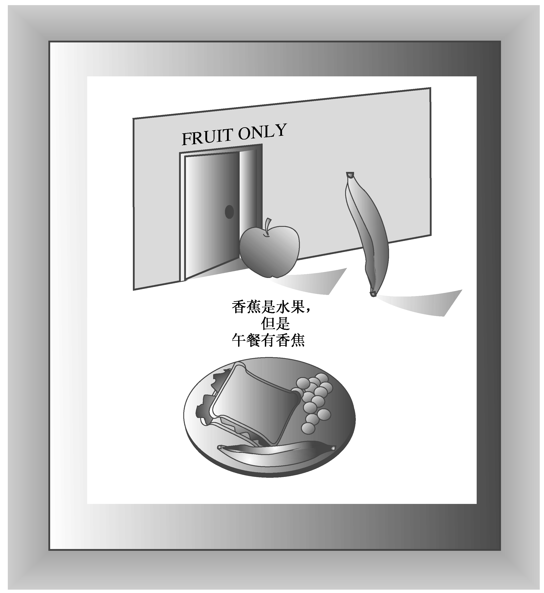

### 13.2　继承：is-a关系

派生类和基类之间的特殊关系是基于C++继承的底层模型的。实际上，C++有3种继承方式：公有继承、保护继承和私有继承。公有继承是最常用的方式，它建立一种is-a关系，即派生类对象也是一个基类对象，可以对基类对象执行的任何操作，也可以对派生类对象执行。例如，假设有一个Fruit类，可以保存水果的重量和热量。因为香蕉是一种特殊的水果，所以可以从Fruit类派生出Banana类。新类将继承原始类的所有数据成员，因此，Banana对象将包含表示香蕉重量和热量的成员。新的Banana类还添加了专门用于香蕉的成员，这些成员通常不用于水果，例如Banana Institute Peel Index（香蕉机构果皮索引）。因为派生类可以添加特性，所以，将这种关系称为is-a-kind-of（是一种）关系可能更准确，但是通常使用术语is-a。

为阐明is-a关系，来看一些与该模型不符的例子。公有继承不建立has-a关系。例如，午餐可能包括水果，但通常午餐并不是水果。所以，不能通过从Fruit类派生出Lunch类来在午餐中添加水果。在午餐中加入水果的正确方法是将其作为一种has-a关系：午餐有水果。正如将在第14章介绍的，最容易的建模方式是，将Fruit对象作为Lunch类的数据成员（参见图13.3）。

<b class="my_markdown">图13.3　is-a关系和has-a关系</b>

公有继承不能建立is-like-a关系，也就是说，它不采用明喻。人们通常说律师就像鲨鱼，但律师并不是鲨鱼。例如，鲨鱼可以在水下生活。所以，不应从Shark类派生出Lawyer类。继承可以在基类的基础上添加属性，但不能删除基类的属性。在有些情况下，可以设计一个包含共有特征的类，然后以is-a或has-a关系，在这个类的基础上定义相关的类。

公有继承不建立is-implemented-as-a（作为……来实现）关系。例如，可以使用数组来实现栈，但从Array类派生出Stack类是不合适的，因为栈不是数组。例如，数组索引不是栈的属性。另外，可以以其他方式实现栈，如链表。正确的方法是，通过让栈包含一个私有Array对象成员来隐藏数组实现。

公有继承不建立uses-a关系。例如，计算机可以使用激光打印机，但从Computer类派生出Printer类（或反过来）是没有意义的。然而，可以使用友元函数或类来处理Printer对象和Computer对象之间的通信。

在C++中，完全可以使用公有继承来建立has-a、is-implemented-as-a或uses-a关系；然而，这样做通常会导致编程方面的问题。因此，还是坚持使用is-a关系吧。

