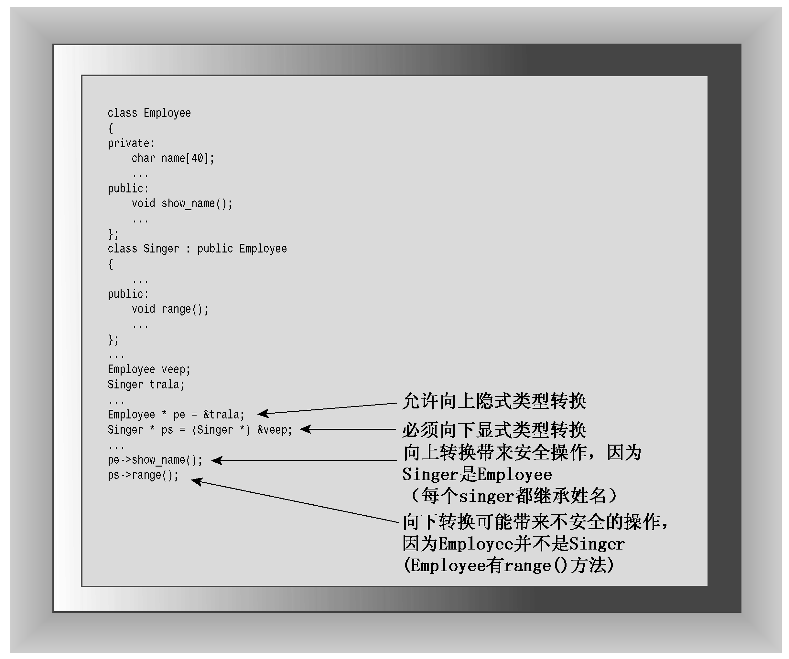

### 13.4.1　指针和引用类型的兼容性

在C++中，动态联编与通过指针和引用调用方法相关，从某种程度上说，这是由继承控制的。公有继承建立is-a关系的一种方法是如何处理指向对象的指针和引用。通常，C++不允许将一种类型的地址赋给另一种类型的指针，也不允许一种类型的引用指向另一种类型：

```css
double x = 2.5;
int * pi = &x;  // invalid assignment, mismatched pointer types
long & rl = x;  // invalid assignment, mismatched reference type
```

然而，正如您看到的，指向基类的引用或指针可以引用派生类对象，而不必进行显式类型转换。例如，下面的初始化是允许的：

```css
BrassPlus dilly ("Annie Dill", 493222, 2000);
Brass * pb = &dilly; // ok
Brass & rb = dilly;  // ok
```

将派生类引用或指针转换为基类引用或指针被称为向上强制转换（upcasting），这使公有继承不需要进行显式类型转换。该规则是is-a关系的一部分。BrassPlus对象都是Brass对象，因为它继承了Brass对象所有的数据成员和成员函数。所以，可以对Brass对象执行的任何操作，都适用于BrassPlus对象。因此，为处理Brass引用而设计的函数可以对BrassPlus对象执行同样的操作，而不必担心会导致任何问题。将指向对象的指针作为函数参数时，也是如此。向上强制转换是可传递的，也就是说，如果从BrassPlus派生出BrassPlusPlus类，则Brass指针或引用可以引用Brass对象、BrassPlus对象或BrassPlusPlus对象。

相反的过程——将基类指针或引用转换为派生类指针或引用——称为向下强制转换（downcasting）。如果不使用显式类型转换，则向下强制转换是不允许的。原因是is-a关系通常是不可逆的。派生类可以新增数据成员，因此使用这些数据成员的类成员函数不能应用于基类。例如，假设从Employee类派生出Singer类，并添加了表示歌手音域的数据成员和用于报告音域的值的成员函数range()，则将range()方法应用于Employee对象是没有意义的。但如果允许隐式向下强制转换，则可能无意间将指向Singer的指针设置为一个Employee对象的地址，并使用该指针来调用range()方法（参见图13.4）。


<center class="my_markdown"><b class="my_markdown">图13.4　向上强制转换和向下强制转换</b></center>

对于使用基类引用或指针作为参数的函数调用，将进行向上转换。请看下面的代码段，这里假定每个函数都调用虚方法ViewAcct()：

```css
void fr(Brass & rb); // uses rb.ViewAcct()
void fp(Brass * pb); // uses pb->ViewAcct()
void fv(Brass b);    // uses b.ViewAcct()
int main()
{
    Brass b("Billy Bee", 123432, 10000.0);
    BrassPlus bp("Betty Beep", 232313, 12345.0);
    fr(b);  // uses Brass::ViewAcct()
    fr(bp); // uses BrassPlus::ViewAcct()
    fp(b);  // uses Brass::ViewAcct()
    fp(bp); // uses BrassPlus::ViewAcct()
    fv(b);  // uses Brass::ViewAcct()
    fv(bp); // uses Brass::ViewAcct()
...
}
```

按值传递导致只将BrassPlus对象的Brass部分传递给函数fv()。但随引用和指针发生的隐式向上转换导致函数fr()和fp()分别为Brass对象和BrassPlus对象使用Brass::ViewAcct()和BrassPlus::ViewAcct()。

隐式向上强制转换使基类指针或引用可以指向基类对象或派生类对象，因此需要动态联编。C++使用虚成员函数来满足这种需求。

