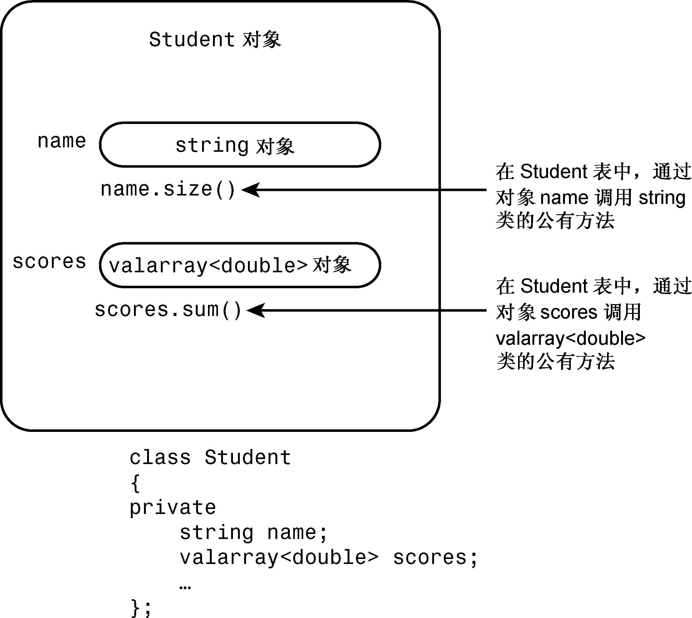

### 14.1.2　Student类的设计

至此，已经确定了Student类的设计计划：使用一个string对象来表示姓名，使用一个valarray<double>来表示考试分数。那么如何设计呢？您可能想以公有的方式从这两个类派生出Student类，这将是多重公有继承，C++允许这样做，但在这里并不合适，因为学生与这些类之间的关系不是is-a模型。学生不是姓名，也不是一组考试成绩。这里的关系是has-a，学生有姓名，也有一组考试分数。通常，用于建立has-a关系的C++技术是组合（包含），即创建一个包含其他类对象的类。例如，可以将Student类声明为如下所示：

```css
class Student
{
private:
    string name;             // use a string object for name
    valarray<double> scores; // use a valarray<double> object for scores
    ...
};
```

同样，上述类将数据成员声明为私有的。这意味着Student类的成员函数可以使用string和valarray<double>类的公有接口来访问和修改name和scores对象，但在类的外面不能这样做，而只能通过Student类的公有接口访问name和score（请参见图14.1）。对于这种情况，通常被描述为Student类获得了其成员对象的实现，但没有继承接口。例如，Student对象使用string的实现，而不是char * name或char name [26]实现来保存姓名。但Student对象并不是天生就有使用函数string operator+=()的能力。


<center class="my_markdown"><b class="my_markdown">图14.1　对象中的对象：包含</b></center>


**接口和实现**

使用公有继承时，类可以继承接口，可能还有实现（基类的纯虚函数提供接口，但不提供实现）。获得接口是is-a关系的组成部分。而使用组合，类可以获得实现，但不能获得接口。不继承接口是has-a关系的组成部分。


对于has-a关系来说，类对象不能自动获得被包含对象的接口是一件好事。例如，string类将+运算符重载为将两个字符串连接起来；但从概念上说，将两个Student对象串接起来是没有意义的。这也是这里不使用公有继承的原因之一。另一方面，被包含的类的接口部分对新类来说可能是有意义的。例如，可能希望使用string接口中的operator<()方法将Student对象按姓名进行排序，为此可以定义Student::operator<()成员函数，它在内部使用函数string::operator<()。下面介绍一些细节。

