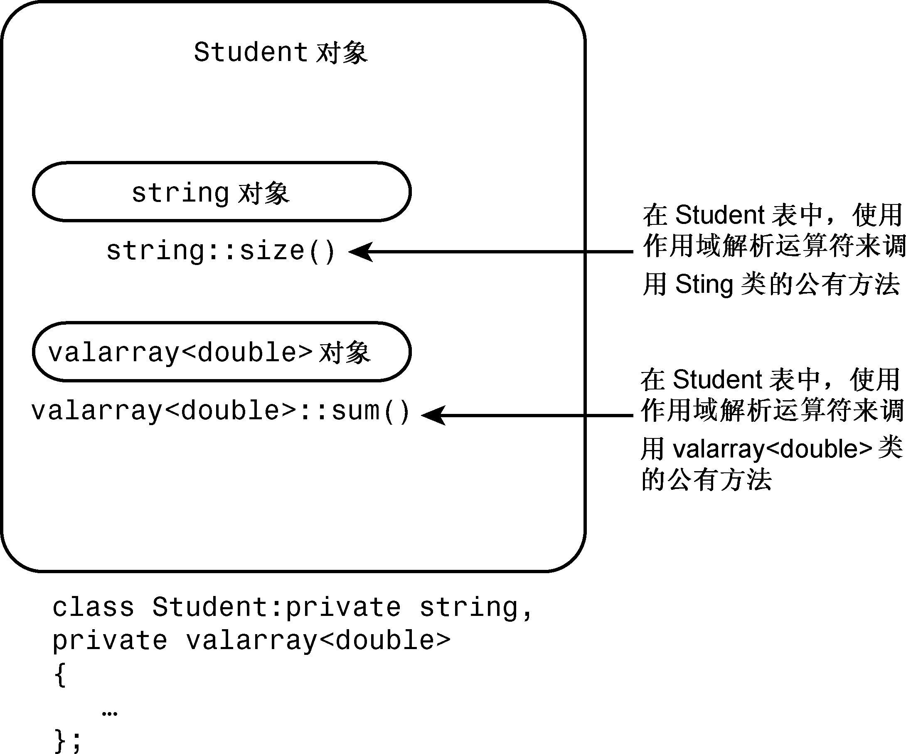

### 14.2.1　Student类示例（新版本）

要进行私有继承，请使用关键字private而不是public来定义类（实际上，private是默认值，因此省略访问限定符也将导致私有继承）。Student类应从两个类派生而来，因此声明将列出这两个类：

```css
class Student : private std::string, private std::valarray<double>
{
public:
    ...
};
```

使用多个基类的继承被称为多重继承（multiple inheritance，MI）。通常，MI尤其是公有MI将导致一些问题，必须使用额外的语法规则来解决它们，这将在本章后面介绍。但在这个示例中，MI不会导致问题。

新的Student类不需要私有数据，因为两个基类已经提供了所需的所有数据成员。包含版本提供了两个被显式命名的对象成员，而私有继承提供了两个无名称的子对象成员。这是这两种方法的第一个主要区别。

#### 1．初始化基类组件

隐式地继承组件而不是成员对象将影响代码的编写，因为再也不能使用name和scores来描述对象了，而必须使用用于公有继承的技术。例如，对于构造函数，包含将使这样的构造函数：

```css
Student(const char * str, const double * pd, int n)
   : name(str), scores(pd, n) {} // use object names for containment
```

对于继承类，新版本的构造函数将使用成员初始化列表语法，它使用类名而不是成员名来标识构造函数：

```css
Student(const char * str, const double * pd, int n)
   : std::string(str), ArrayDb(pd, n) {} // use class names for inheritance
```

在这里，ArrayDb是std::valarray<double>的别名。成员初始化列表使用std::string(str)，而不是name(str)。这是包含和私有继承之间的第二个主要区别。

程序清单14.4列出了新的类定义。唯一不同的地方是，省略了显式对象名称，并在内联构造函数中使用了类名，而不是成员名。

程序清单14.4　studenti.h

```css
// studenti.h -- defining a Student class using private inheritance
#ifndef STUDENTC_H_
#define STUDENTC_H_
#include <iostream>
#include <valarray>
#include <string>
class Student : private std::string, private std::valarray<double>
{
private:
    typedef std::valarray<double> ArrayDb;
    // private method for scores output
    std::ostream & arr_out(std::ostream & os) const;
public:
    Student() : std::string("Null Student"), ArrayDb() {}
    explicit Student(const std::string & s)
            : std::string(s), ArrayDb() {}
    explicit Student(int n) : std::string("Nully"), ArrayDb(n) {}
    Student(const std::string & s, int n)
            : std::string(s), ArrayDb(n) {}
    Student(const std::string & s, const ArrayDb & a)
            : std::string(s), ArrayDb(a) {}
    Student(const char * str, const double * pd, int n)
            : std::string(str), ArrayDb(pd, n) {}
    ~Student() {}
    double Average() const;
    double & operator[](int i);
    double operator[](int i) const;
    const std::string & Name() const;
// friends
    // input
    friend std::istream & operator>>(std::istream & is,
                                     Student & stu); // 1 word
    friend std::istream & getline(std::istream & is,
                                  Student & stu); // 1 line
    // output
    friend std::ostream & operator<<(std::ostream & os,
                                     const Student & stu);
};
#endif
```

#### 2．访问基类的方法

使用私有继承时，只能在派生类的方法中使用基类的方法。但有时候可能希望基类工具是公有的。例如，在类声明中提出可以使用average()函数。和包含一样，要实现这样的目的，可以在公有Student::average()函数中使用私有Student::Average()函数（参见图14.2）。包含使用对象来调用方法：


<center class="my_markdown"><b class="my_markdown">图14.2　对象中的对象：私有继承</b></center>

```css
double Student::Average() const
{
    if (scores.size() > 0)
        return scores.sum()/scores.size();
    else
        return 0;
}
```

然而，私有继承使得能够使用类名和作用域解析运算符来调用基类的方法：

```css
double Student::Average() const
{
    if (ArrayDb::size() > 0)
        return ArrayDb::sum()/ArrayDb::size();
    else
        return 0;
}
```

总之，使用包含时将使用对象名来调用方法，而使用私有继承时将使用类名和作用域解析运算符来调用方法。

#### 3．访问基类对象

使用作用域解析运算符可以访问基类的方法，但如果要使用基类对象本身，该如何做呢？例如，Student类的包含版本实现了Name()方法，它返回string对象成员name；但使用私有继承时，该string对象没有名称。那么，Student类的代码如何访问内部的string对象呢？

答案是使用强制类型转换。由于Student类是从string类派生而来的，因此可以通过强制类型转换，将Student对象转换为string对象；结果为继承而来的string对象。本书前面介绍过，指针this指向用来调用方法的对象，因此*this为用来调用方法的对象，在这个例子中，为类型为Student的对象。为避免调用构造函数创建新的对象，可使用强制类型转换来创建一个引用：

```css
const string & Student::Name() const
{
    return (const string &) *this;
}
```

上述方法返回一个引用，该引用指向用于调用该方法的Student对象中的继承而来的string对象。

#### 4．访问基类的友元函数

用类名显式地限定函数名不适合于友元函数，这是因为友元不属于类。然而，可以通过显式地转换为基类来调用正确的函数。例如，对于下面的友元函数定义：

```css
ostream & operator<<(ostream & os, const Student & stu)
{
      os << "Scores for " << (const string &) stu << ":\n";
...
}
```

如果plato是一个Student对象，则下面的语句将调用上述函数，stu将是指向plato的引用，而os将是指向cout的引用：

```css
cout << plato;
```

下面的代码：

```css
os << "Scores for " << (const string &) stu << ":\n";
```

显式地将stu转换为string对象引用，进而调用函数operator<<(ostream &, const string &)。

引用stu不会自动转换为string引用。根本原因在于，在私有继承中，未进行显式类型转换的派生类引用或指针，无法赋值给基类的引用或指针。

然而，即使这个例子使用的是公有继承，也必须使用显式类型转换。原因之一是，如果不使用类型转换，下述代码将与友元函数原型匹配，从而导致递归调用：

```css
os << stu;
```

另一个原因是，由于这个类使用的是多重继承，编译器将无法确定应转换成哪个基类，如果两个基类都提供了函数operator<<()。程序清单14.5列出了除内联函数之外的所有Student类方法。

程序清单14.5　studenti.cpp

```css
// studenti.cpp -- Student class using private inheritance
#include "studenti.h"
using std::ostream;
using std::endl;
using std::istream;
using std::string;
// public methods
double Student::Average() const
{
    if (ArrayDb::size() > 0)
        return ArrayDb::sum()/ArrayDb::size();
    else
        return 0;
}
const string & Student::Name() const
{
    return (const string &) *this;
}
double & Student::operator[](int i)
{
    return ArrayDb::operator[](i); // use ArrayDb::operator[]()
}
double Student::operator[](int i) const
{
    return ArrayDb::operator[](i);
}
// private method
ostream & Student::arr_out(ostream & os) const
{
    int i;
    int lim = ArrayDb::size();
    if (lim > 0)
    {
        for (i = 0; i < lim; i++)
        {
            os << ArrayDb::operator[](i) << " ";
            if (i % 5 == 4)
                os << endl;
        }
        if (i % 5 != 0)
            os << endl;
    }
    else
        os << " empty array ";
    return os;
}
// friends
// use String version of operator>>()
istream & operator>>(istream & is, Student & stu)
{
    is >> (string &)stu;
    return is;
}
// use string friend getline(ostream &, const string &)
istream & getline(istream & is, Student & stu)
{
    getline(is, (string &)stu);
    return is;
}
// use string version of operator<<()
ostream & operator<<(ostream & os, const Student & stu)
{
    os << "Scores for " << (const string &) stu << ":\n";
    stu.arr_out(os); // use private method for scores
    return os;
}
```

同样，由于这个示例也重用了string和valarray类的代码，因此除私有辅助方法外，它包含的新代码很少。

#### 5．使用修改后的Student类

接下来也需要测试这个新类。注意到两个版本的Student类的公有接口完全相同，因此可以使用同一个程序测试它们。唯一不同的是，应包含studenti.h而不是studentc.h，应使用studenti.cpp而不是studentc.cpp来链接程序。程序清单14.6列出列该程序，请将其与studenti.cpp一起编译。

程序清单14.6　use_stui.cpp

```css
// use_stui.cpp -- using a class with private inheritance
// compile with studenti.cpp
#include <iostream>
#include "studenti.h"
using std::cin;
using std::cout;
using std::endl;
void set(Student & sa, int n);
const int pupils = 3;
const int quizzes = 5;
int main()
{
    Student ada[pupils] =
        {Student(quizzes), Student(quizzes), Student(quizzes)};
    int i;
    for (i = 0; i < pupils; i++)
        set(ada[i], quizzes);
    cout << "\nStudent List:\n";
    for (i = 0; i < pupils; ++i)
        cout << ada[i].Name() << endl;
    cout << "\nResults:";
    for (i = 0; i < pupils; i++)
    {
        cout << endl << ada[i];
        cout << "average: " << ada[i].Average() << endl;
    }
    cout << "Done.\n";
    return 0;
}
void set(Student & sa, int n)
{
    cout << "Please enter the student's name: ";
    getline(cin, sa);
    cout << "Please enter " << n << " quiz scores:\n";
    for (int i = 0; i < n; i++)
        cin >> sa[i];
    while (cin.get() != '\n')
        continue;
}
```

下面是该程序的运行情况：

```css
Please enter the student's name: Gil Bayts
Please enter 5 quiz scores:
92 94 96 93 95
Please enter the student's name: Pat Roone
Please enter 5 quiz scores:
83 89 72 78 95
Please enter the student's name: Fleur O’Day
Please enter 5 quiz scores:
92 89 96 74 64
Student List:
Gil Bayts
Pat Roone
Fleur O'Day
Results:
Scores for Gil Bayts:
92 94 96 93 95
average: 94
Scores for Pat Roone:
83 89 72 78 95
average: 83.4
Scores for Fleur O'Day:
92 89 96 74 64
average: 83
Done.
```

输入与前一个测试程序相同，输出也相同。

