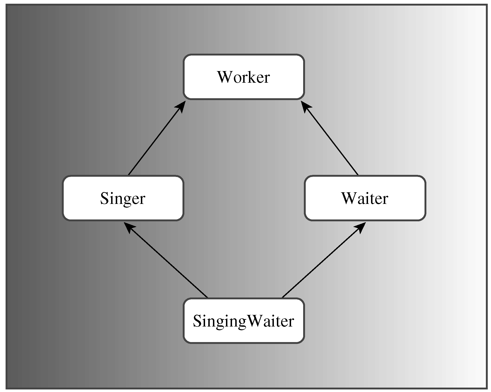

### 14.3　多重继承

MI描述的是有多个直接基类的类。与单继承一样，公有MI表示的也是is-a关系。例如，可以从Waiter类和Singer类派生出SingingWaiter类：

```css
class SingingWaiter : public Waiter, public Singer {...};
```

请注意，必须使用关键字public来限定每一个基类。这是因为，除非特别指出，否则编译器将认为是私有派生：

```css
class SingingWaiter : public Waiter, Singer {...}; // Singer is a private base
```

正如本章前面讨论的，私有MI和保护MI可以表示has-a关系。Student类的studenti.h实现就是一个这样的示例。下面将重点介绍公有MI。

MI可能会给程序员带来很多新问题。其中两个主要的问题是：从两个不同的基类继承同名方法；从两个或更多相关基类那里继承同一个类的多个实例。为解决这些问题，需要使用一些新规则和不同的语法。因此，与使用单继承相比，使用MI更困难，也更容易出现问题。由于这个原因，很多C++用户强烈反对使用MI，一些人甚至希望删除MI；而喜欢MI的人则认为，对一些特殊的工程来说，MI很有用，甚至是必不可少的；也有一些人建议谨慎、适度地使用MI。

下面来看一个例子，并介绍有哪些问题以及如何解决它们。要使用MI，需要几个类。我们将定义一个抽象基类Worker，并使用它派生出Waiter类和Singer类。然后，便可以使用MI从Waiter类和Singer类派生出SingingWaiter类（参见图 14.3）。这里使用两个独立的派生来使基类（Worker）被继承，这将导致MI的大多数麻烦。首先声明Worker、Waiter和Singer类，如程序清单14.7所示。


<center class="my_markdown"><b class="my_markdown">图14.3　祖先相同的MI</b></center>

程序清单14.7　Worker0.h

```css
// worker0.h -- working classes
#ifndef WORKER0_H_
#define WORKER0_H_
#include <string>
class Worker // an abstract base class
{
private:
    std::string fullname;
    long id;
public:
    Worker() : fullname("no one"), id(0L) {}
    Worker(const std::string & s, long n)
            : fullname(s), id(n) {}
    virtual ~Worker() = 0; // pure virtual destructor
    virtual void Set();
    virtual void Show() const;
};
class Waiter : public Worker
{
private:
    int panache;
public:
    Waiter() : Worker(), panache(0) {}
    Waiter(const std::string & s, long n, int p = 0)
            : Worker(s, n), panache(p) {}
    Waiter(const Worker & wk, int p = 0)
            : Worker(wk), panache(p) {}
    void Set();
    void Show() const;
};
class Singer : public Worker
{
protected:
    enum {other, alto, contralto, soprano,
                    bass, baritone, tenor};
    enum {Vtypes = 7};
private:
    static char *pv[Vtypes]; // string equivs of voice types
    int voice;
public:
    Singer() : Worker(), voice(other) {}
    Singer(const std::string & s, long n, int v = other)
            : Worker(s, n), voice(v) {}
    Singer(const Worker & wk, int v = other)
            : Worker(wk), voice(v) {}
    void Set();
    void Show() const;
};
#endif
```

程序清单14.7的类声明中包含一些表示声音类型的内部常量。一个枚举用符号常量alto、contralto等表示声音类型，静态数组pv存储了指向相应C-风格字符串的指针，程序清单14.8初始化了该数组，并提供了方法的定义。

程序清单14.8　worker0.cpp

```css
// worker0.cpp -- working class methods
#include "worker0.h"
#include <iostream>
using std::cout;
using std::cin;
using std::endl;
// Worker methods
// must implement virtual destructor, even if pure
Worker::~Worker() {}
void Worker::Set()
{
    cout << "Enter worker's name: ";
    getline(cin, fullname);
    cout << "Enter worker's ID: ";
    cin >> id;
    while (cin.get() != '\n')
        continue;
}
void Worker::Show() const
{
    cout << "Name: " << fullname << "\n";
    cout << "Employee ID: " << id << "\n";
}
// Waiter methods
void Waiter::Set()
{
    Worker::Set();
    cout << "Enter waiter's panache rating: ";
    cin >> panache;
    while (cin.get() != '\n')
        continue;
}
void Waiter::Show() const
{
    cout << "Category: waiter\n";
    Worker::Show();
    cout << "Panache rating: " << panache << "\n";
}
// Singer methods
char * Singer::pv[] = {"other", "alto", "contralto",
            "soprano", "bass", "baritone", "tenor"};
void Singer::Set()
{
    Worker::Set();
    cout << "Enter number for singer's vocal range:\n";
    int i;
    for (i = 0; i < Vtypes; i++)
    {
        cout << i << ": " << pv[i] << " ";
        if ( i % 4 == 3)
            cout << endl;
    }
    if (i % 4 != 0)
        cout << endl;
    while (cin >> voice && (voice < 0 || voice >= Vtypes) )
        cout << "Please enter a value >= 0 and < " << Vtypes << endl;
    while (cin.get() != '\n')
        continue;
}
void Singer::Show() const
{
    cout << "Category: singer\n";
    Worker::Show();
    cout << "Vocal range: " << pv[voice] << endl;
}
```

程序清单14.9是一个简短的程序，它使用一个多态指针数组对这些类进行了测试。

程序清单14.9　worktest.cpp

```css
// worktest.cpp -- test worker class hierarchy
#include <iostream>
#include "worker0.h"
const int LIM = 4;
int main()
{
    Waiter bob("Bob Apple", 314L, 5);
    Singer bev("Beverly Hills", 522L, 3);
    Waiter w_temp;
    Singer s_temp;
    Worker * pw[LIM] = {&bob, &bev, &w_temp, &s_temp};
    int i;
    for (i = 2; i < LIM; i++)
        pw[i]->Set();
    for (i = 0; i < LIM; i++)
    {
        pw[i]->Show();
        std::cout << std::endl;
    }
    return 0;
}
```

下面是程序清单14.7～程序清单14.9组成的程序的输出：

```css
Enter waiter's name: Waldo Dropmaster
Enter worker's ID: 442
Enter waiter's panache rating: 3
Enter singer's name: Sylvie Sirenne
Enter worker's ID: 555
Enter number for singer's vocal range:
0: other 1: alto 2: contralto 3: soprano
4: bass 5: baritone 6: tenor
3
Category: waiter
Name: Bob Apple
Employee ID: 314
Panache rating: 5
Category: singer
Name: Beverly Hills
Employee ID: 522
Vocal range: soprano
Category: waiter
Name: Waldo Dropmaster
Employee ID: 442
Panache rating: 3
Category: singer
Name: Sylvie Sirenne
Employee ID: 555
Vocal range: soprano
```

这种设计看起来是可行的：使用Waiter指针来调用Waiter::Show()和Waiter::Set()；使用Singer指针来调用Singer::Show()和Singer::Set()。然后，如果添加一个从Singer和Waiter类派生出的SingingWaiter类后，将带来一些问题。具体地说，将出现以下问题。

+ 有多少Worker？
+ 哪个方法？

