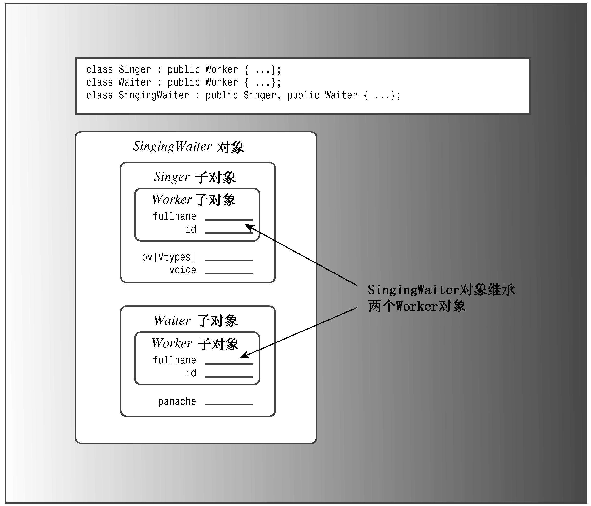
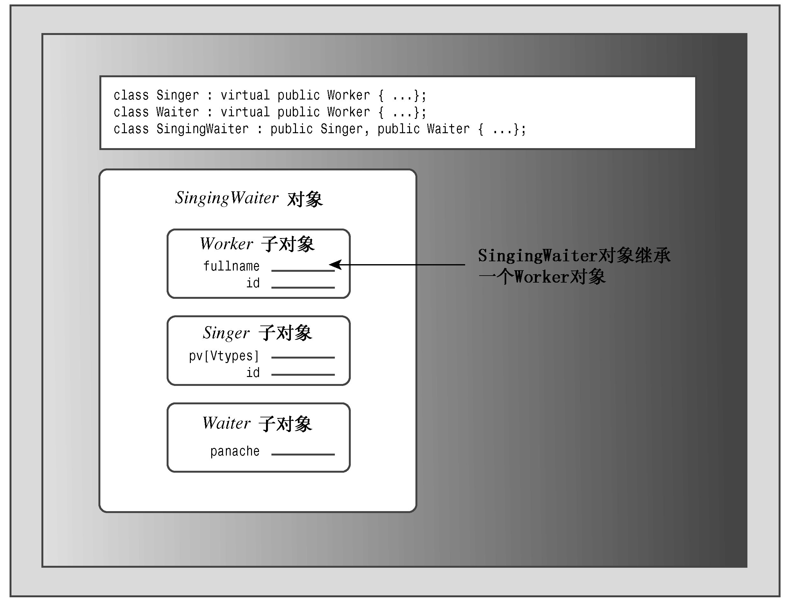

### 14.3.1　有多少Worker

假设首先从Singer和Waiter公有派生出SingingWaiter：

```css
class SingingWaiter: public Singer, public Waiter {...};
```

因为Singer和Waiter都继承了一个Worker组件，因此SingingWaiter将包含两个Worker组件（参见图14.4）。

正如预期的，这将引起问题。例如，通常可以将派生类对象的地址赋给基类指针，但现在将出现二义性：

```css
SingingWaiter ed;
Worker * pw = &ed; // ambiguous
```

通常，这种赋值将把基类指针设置为派生对象中的基类对象的地址。但ed中包含两个Worker对象，有两个地址可供选择，所以应使用类型转换来指定对象：

```css
Worker * pw1 = (Waiter *) &ed; // the Worker in Waiter
Worker * pw2 = (Singer *) &ed; // the Worker in Singer
```

这将使得使用基类指针来引用不同的对象（多态性）复杂化。

包含两个Worker对象拷贝还会导致其他的问题。然而，真正的问题是：为什么需要Worker对象的两个拷贝？唱歌的侍者和其他Worker对象一样，也应只包含一个姓名和一个ID。C++引入多重继承的同时，引入了一种新技术——虚基类（virtual base class），使MI成为可能。


<center class="my_markdown"><b class="my_markdown">图14.4　继承两个基类对象</b></center>

#### 1．虚基类

虚基类使得从多个类（它们的基类相同）派生出的对象只继承一个基类对象。例如，通过在类声明中使用关键字virtual，可以使Worker被用作Singer和Waiter的虚基类（virtual和public的次序无关紧要）：

```css
class Singer : virtual public Worker {...};
class Waiter : public virtual Worker {...};
```

然后，可以将SingingWaiter类定义为：

```css
class SingingWaiter: public Singer, public Waiter {...};
```

现在，SingingWaiter对象将只包含Worker对象的一个副本。从本质上说，继承的Singer和Waiter对象共享一个Worker对象，而不是各自引入自己的Worker对象副本（参见图14.5）。因为SingingWaiter现在只包含了一个Worker子对象，所以可以使用多态。


<center class="my_markdown"><b class="my_markdown">图14.5　虚基类继承</b></center>

您可能会有这样的疑问：

+ 为什么使用术语“虚”？
+ 为什么不抛弃将基类声明为虚的这种方式，而使虚行为成为多MI的准则呢？
+ 是否存在麻烦呢？

首先，为什么使用术语虚？毕竟，在虚函数和虚基类之间并不存在明显的联系。C++用户强烈反对引入新的关键字，因为这将给他们带来很大的压力。例如，如果新关键字与重要程序中的重要函数或变量的名称相同，这将非常麻烦。因此，C++对这种新特性也使用关键字virtual——有点像关键字重载。

其次，为什么不抛弃将基类声明为虚的这种方式，而使虚行为成为MI的准则呢？第一，在一些情况下，可能需要基类的多个拷贝；第二，将基类作为虚的要求程序完成额外的计算，为不需要的工具付出代价是不应当的；第三，这样做有其缺点，将在下一段介绍。

最后，是否存在麻烦？是的。为使虚基类能够工作，需要对C++规则进行调整，必须以不同的方式编写一些代码。另外，使用虚基类还可能需要修改已有的代码。例如，将SingingWaiter类添加到Worker集成层次中时，需要在Singer和Waiter类中添加关键字virtual。

#### 2．新的构造函数规则

使用虚基类时，需要对类构造函数采用一种新的方法。对于非虚基类，唯一可以出现在初始化列表中的构造函数即是基类构造函数。但这些构造函数可能需要将信息传递给其基类。例如，可能有下面一组构造函数：

```css
class A
{
    int a;
public:
    A(int n = 0) : a(n) {}
    ...
};
class B: public A
{
    int b;
public:
    B(int m = 0, int n = 0) : A(n), b(m) {}
    ...
};
class C : public B
{
    int c;
public:
    C(int q = 0, int m = 0, int n = 0) : B(m, n), c(q) {}
    ...
};
```

C类的构造函数只能调用B类的构造函数，而B类的构造函数只能调用A类的构造函数。这里，C类的构造函数使用值q，并将值m和n传递给B类的构造函数；而B类的构造函数使用值m，并将值n传递给A类的构造函数。

如果Worker是虚基类，则这种信息自动传递将不起作用。例如，对于下面的MI构造函数：

```css
SingingWaiter(const Worker & wk, int p = 0, int v = Singer::other)
                  : Waiter(wk,p), Singer(wk,v) {} // flawed
```

存在的问题是，自动传递信息时，将通过2条不同的途径（Waiter和Singer）将wk传递给Worker对象。为避免这种冲突，C++在基类是虚的时，禁止信息通过中间类自动传递给基类。因此，上述构造函数将初始化成员panache和voice，但wk参数中的信息将不会传递给子对象Waiter。然而，编译器必须在构造派生对象之前构造基类对象组件；在上述情况下，编译器将使用Worker的默认构造函数。

如果不希望默认构造函数来构造虚基类对象，则需要显式地调用所需的基类构造函数。因此，构造函数应该是这样：

```css
SingingWaiter(const Worker & wk, int p = 0, int v = Singer::other)
                  : Worker(wk), Waiter(wk,p), Singer(wk,v) {}
```

上述代码将显式地调用构造函数worker（const Worker &）。请注意，这种用法是合法的，对于虚基类，必须这样做；但对于非虚基类，则是非法的。

> **警告：**
> 如果类有间接虚基类，则除非只需使用该虚基类的默认构造函数，否则必须显式地调用该虚基类的某个构造函数。

