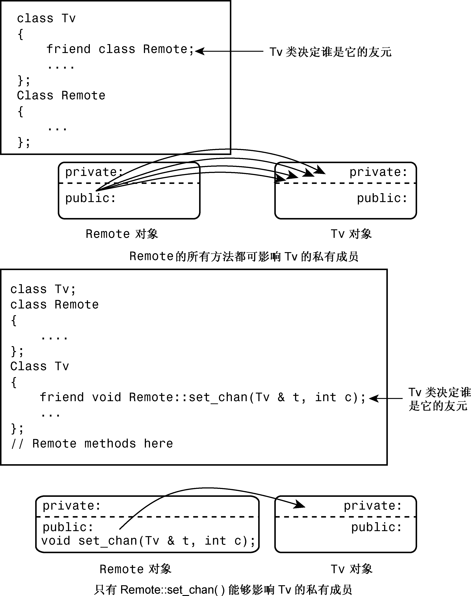

### 15.1.2　友元成员函数

从上一个例子中的代码可知，大多数Remote方法都是用Tv类的公有接口实现的。这意味着这些方法不是真正需要作为友元。事实上，唯一直接访问Tv成员的Remote方法是Remote::set_chan()，因此它是唯一需要作为友元的方法。确实可以选择仅让特定的类成员成为另一个类的友元，而不必让整个类成为友元，但这样做稍微有点麻烦，必须小心排列各种声明和定义的顺序。下面介绍其中的原因。

让Remote::set_chan()成为Tv类的友元的方法是，在Tv类声明中将其声明为友元：

```css
class Tv
{
    friend void Remote::set_chan(Tv & t, int c);
    ...
};
```

然而，要使编译器能够处理这条语句，它必须知道Remote的定义。否则，它无法知道Remote是一个类，而set_chan是这个类的方法。这意味着应将Remote的定义放到Tv的定义前面。Remote的方法提到了Tv对象，而这意味着Tv定义应当位于Remote定义之前。避开这种循环依赖的方法是，使用前向声明（forward declaration）。为此，需要在Remote定义的前面插入下面的语句：

```css
class Tv; // forward declaration
```

这样，排列次序应如下：

```css
class Tv; // forward declaration
class Remote { ... };
class Tv { ... };
```

能否像下面这样排列呢？

```css
class Remote; // forward declaration
class Tv { ... };
class Remote { ... };
```

答案是不能。原因在于，在编译器在Tv类的声明中看到Remote的一个方法被声明为Tv类的友元之前，应该先看到Remote类的声明和set_chan()方法的声明。

还有一个麻烦。程序清单15.1的Remote声明包含了内联代码，例如：

```css
void onoff(Tv & t) { t.onoff(); }
```

由于这将调用Tv的一个方法，所以编译器此时必须已经看到了Tv类的声明，这样才能知道Tv有哪些方法，但正如看到的，该声明位于Remote声明的后面。这种问题的解决方法是，使Remote声明中只包含方法声明，并将实际的定义放在Tv类之后。这样，排列顺序将如下：

```css
class Tv;             // forward declaration
class Remote { ... }; // Tv-using methods as prototypes only
class Tv { ... };
// put Remote method definitions here
```

Remote方法的原型与下面类似：

```css
void onoff(Tv & t);
```

检查该原型时，所有的编译器都需要知道Tv是一个类，而前向声明提供了这样的信息。当编译器到达真正的方法定义时，它已经读取了Tv类的声明，并拥有了编译这些方法所需的信息。通过在方法定义中使用inline关键字，仍然可以使其成为内联方法。程序清单15.4列出了修订后的头文件。

程序清单15.4　tvfm.h

```css
// tvfm.h -- Tv and Remote classes using a friend member
#ifndef TVFM_H_
#define TVFM_H_
class Tv; // forward declaration
class Remote
{
public:
    enum State{Off, On};
    enum {MinVal,MaxVal = 20};
    enum {Antenna, Cable};
    enum {TV, DVD};
private:
    int mode;
public:
    Remote(int m = TV) : mode(m) {}
    bool volup(Tv & t); // prototype only
    bool voldown(Tv & t);
    void onoff(Tv & t) ;
    void chanup(Tv & t) ;
    void chandown(Tv & t) ;
    void set_mode(Tv & t) ;
    void set_input(Tv & t);
    void set_chan(Tv & t, int c);
};
class Tv
{
public:
    friend void Remote::set_chan(Tv & t, int c);
    enum State{Off, On};
    enum {MinVal,MaxVal = 20};
    enum {Antenna, Cable};
    enum {TV, DVD};
    Tv(int s = Off, int mc = 125) : state(s), volume(5),
        maxchannel(mc), channel(2), mode(Cable), input(TV) {}
    void onoff() {state = (state == On)? Off : On;}
    bool ison() const {return state == On;}
    bool volup();
    bool voldown();
    void chanup();
    void chandown();
    void set_mode() {mode = (mode == Antenna)? Cable : Antenna;}
    void set_input() {input = (input == TV)? DVD : TV;}
    void settings() const;
private:
    int state;
    int volume;
    int maxchannel;
    int channel;
    int mode;
    int input;
};
// Remote methods as inline functions
inline bool Remote::volup(Tv & t) { return t.volup();}
inline bool Remote::voldown(Tv & t) { return t.voldown();}
inline void Remote::onoff(Tv & t) { t.onoff(); }
inline void Remote::chanup(Tv & t) {t.chanup();}
inline void Remote::chandown(Tv & t) {t.chandown();}
inline void Remote::set_mode(Tv & t) {t.set_mode();}
inline void Remote::set_input(Tv & t) {t.set_input();}
inline void Remote::set_chan(Tv & t, int c) {t.channel = c;}
 #endif
```

如果在tv.cpp和use_tv.cpp中包含tvfm.h而不是tv.h，程序的行为与前一个程序相同，区别在于，只有一个Remote方法是Tv类的友元，而在原来的版本中，所有的Remote方法都是Tv类的友元。图15.1说明了这种区别。

本书前面介绍过，内联函数的链接性是内部的，这意味着函数定义必须在使用函数的文件中。在这个例子中，内联定义位于头文件中，因此在使用函数的文件中包含头文件可确保将定义放在正确的地方。也可以将定义放在实现文件中，但必须删除关键字inline，这样函数的链接性将是外部的。

顺便说一句，让整个Remote类成为友元并不需要前向声明，因为友元语句本身已经指出Remote是一个类：

```css
friend class Remote;
```


<center class="my_markdown"><b class="my_markdown">图15.1　类友元与类成员友元</b></center>

