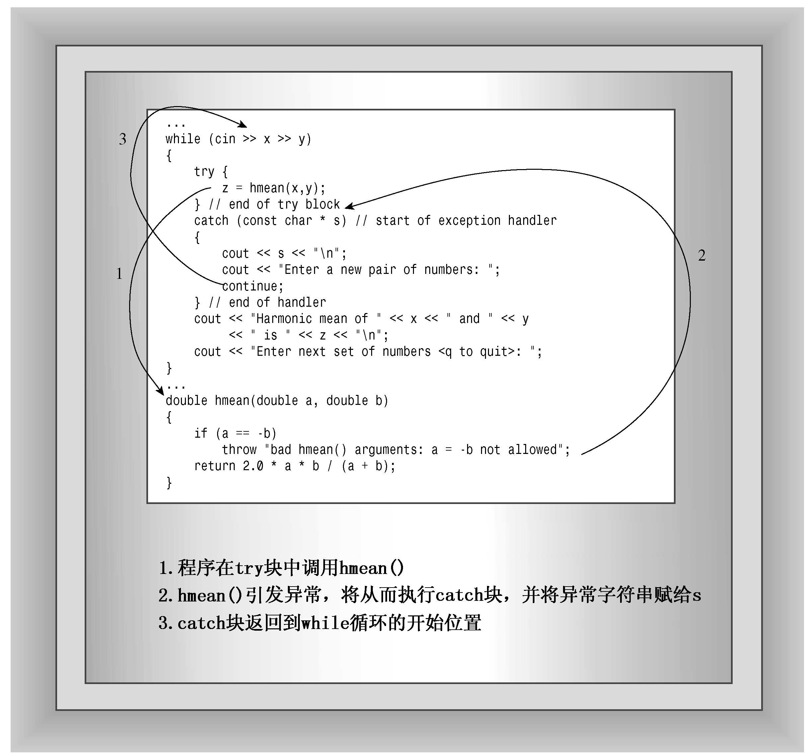

### 15.3.3　异常机制

下面介绍如何使用异常机制来处理错误。C++异常是对程序运行过程中发生的异常情况（例如被0除）的一种响应。异常提供了将控制权从程序的一个部分传递到另一部分的途径。对异常的处理有3个组成部分：

+ 引发异常；
+ 使用处理程序捕获异常；
+ 使用try块。

程序在出现问题时将引发异常。例如，可以修改程序清单15.7中的hmean()，使之引发异常，而不是调用abort()函数。throw语句实际上是跳转，即命令程序跳到另一条语句。throw关键字表示引发异常，紧随其后的值（例如字符串或对象）指出了异常的特征。

程序使用异常处理程序（exception handler）来捕获异常，异常处理程序位于要处理问题的程序中。catch关键字表示捕获异常。处理程序以关键字catch开头，随后是位于括号中的类型声明，它指出了异常处理程序要响应的异常类型；然后是一个用花括号括起的代码块，指出要采取的措施。catch关键字和异常类型用作标签，指出当异常被引发时，程序应跳到这个位置执行。异常处理程序也被称为catch块。

try块标识其中特定的异常可能被激活的代码块，它后面跟一个或多个catch块。try块是由关键字try指示的，关键字try的后面是一个由花括号括起的代码块，表明需要注意这些代码引发的异常。

要了解这3个元素是如何协同工作的，最简单的方法是看一个简短的例子，如程序清单15.9所示。

程序清单15.9　error3.cpp

```css
// error3.cpp -- using an exception
#include <iostream>
double hmean(double a, double b);
int main()
{
    double x, y, z;
    std::cout << "Enter two numbers: ";
    while (std::cin >> x >> y)
    {
        try { // start of try block
            z = hmean(x,y);
        } // end of try block
        catch (const char * s) // start of exception handler
        {
            std::cout << s << std::endl;
            std::cout << "Enter a new pair of numbers: ";
            continue;
        } // end of handler
        std::cout << "Harmonic mean of " << x << " and " << y
            << " is " << z << std::endl;
        std::cout << "Enter next set of numbers <q to quit>: ";
    }
    std::cout << "Bye!\n";
    return 0;
}
double hmean(double a, double b)
{
    if (a == -b)
        throw "bad hmean() arguments: a = -b not allowed";
    return 2.0 * a * b / (a + b);
}
```

程序清单15.9中程序的运行情况如下：

```css
Enter two numbers: 3 6
Harmonic mean of 3 and 6 is 4
Enter next set of numbers <q to quit>: 10 -10
bad hmean() arguments: a = -b not allowed
Enter a new pair of numbers: 1 19
Harmonic mean of 1 and 19 is 1.9
Enter next set of numbers <q to quit>: q
Bye!
```

**程序说明**

在程序清单15.9中，try块与下面类似：

```css
try {        // start of try block
    z = hmean(x,y);
}            // end of try block
```

如果其中的某条语句导致异常被引发，则后面的catch块将对异常进行处理。如果程序在try块的外面调用hmean()，将无法处理异常。

引发异常的代码与下面类似：

```css
if (a == -b)
    throw "bad hmean() arguments: a = -b not allowed";
```

其中被引发的异常是字符串“bad hmean()arguments: a = -b not allowed”。异常类型可以是字符串（就像这个例子中那样）或其他C++类型；通常为类类型，本章后面的示例将说明这一点。

执行throw语句类似于执行返回语句，因为它也将终止函数的执行；但throw不是将控制权返回给调用程序，而是导致程序沿函数调用序列后退，直到找到包含try块的函数。在程序清单15.9中，该函数是调用函数。稍后将有一个沿函数调用序列后退多步的例子。另外，在这个例子中，throw将程序控制权返回给main()。程序将在main()中寻找与引发的异常类型匹配的异常处理程序（位于try块的后面）。

处理程序（或catch块）与下面类似：

```css
catch (char * s) // start of exception handler
{
    std::cout << s << std::endl;
    sdt::cout << "Enter a new pair of numbers: ";
    continue;
}               // end of handler
```

catch块点类似于函数定义，但并不是函数定义。关键字catch表明这是一个处理程序，而char*s则表明该处理程序与字符串异常匹配。s与函数参数定义极其类似，因为匹配的引发将被赋给s。另外，当异常与该处理程序匹配时，程序将执行括号中的代码。

执行完try块中的语句后，如果没有引发任何异常，则程序跳过try块后面的catch块，直接执行处理程序后面的第一条语句。因此处理值3和6时，程序清单15.9中程序执行报告结果的输出语句。

接下来看将10和−10传递给hmean()函数后发生的情况。If语句导致hmean()引发异常。这将终止hmean()的执行。程序向后搜索时发现，hmean()函数是从main()中的try块中调用的，因此程序查找与异常类型匹配的catch块。程序中唯一的一个catch块的参数为char*，因此它与引发异常匹配。程序将字符串“bad hmean()arguments: a = -b not allowed”赋给变量s，然后执行处理程序中的代码。处理程序首先打印s——捕获的异常，然后打印要求用户输入新数据的指示，最后执行continue语句，命令程序跳过while循环的剩余部分，跳到起始位置。continue使程序跳到循环的起始处，这表明处理程序语句是循环的一部分，而catch行是指引程序流程的标签（参见图15.2）。


<center class="my_markdown"><b class="my_markdown">图15.2　出现异常时的程序流程</b></center>

您可能会问，如果函数引发了异常，而没有try块或没有匹配的处理程序时，将会发生什么情况。在默认情况下下，程序最终将调用abort()函数，但可以修改这种行为。稍后将讨论这个问题。

