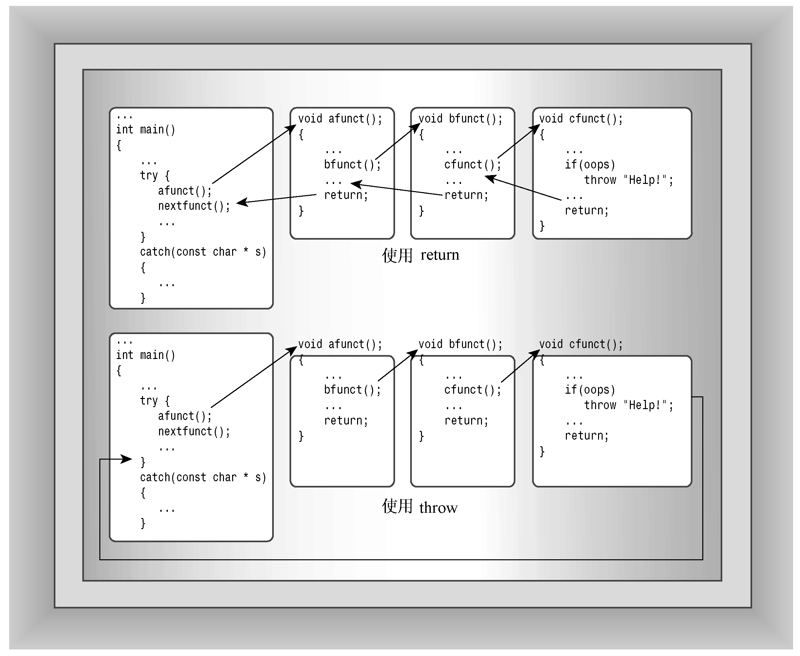

### 15.3.6　栈解退

假设try块没有直接调用引发异常的函数，而是调用了对引发异常的函数进行调用的函数，则程序流程将从引发异常的函数跳到包含try块和处理程序的函数。这涉及到栈解退（unwinding the stack），下面进行介绍。

首先来看一看C++通常是如何处理函数调用和返回的。C++通常通过将信息放在栈（参见第9章）中来处理函数调用。具体地说，程序将调用函数的指令的地址（返回地址）放到栈中。当被调用的函数执行完毕后，程序将使用该地址来确定从哪里开始继续执行。另外，函数调用将函数参数放到栈中。在栈中，这些函数参数被视为自动变量。如果被调用的函数创建了新的自动变量，则这些变量也将被添加到栈中。如果被调用的函数调用了另一个函数，则后者的信息将被添加到栈中，依此类推。当函数结束时，程序流程将跳到该函数被调用时存储的地址处，同时栈顶的元素被释放。因此，函数通常都返回到调用它的函数，依此类推，同时每个函数都在结束时释放其自动变量。如果自动变量是类对象，则类的析构函数（如果有的话）将被调用。

现在假设函数由于出现异常（而不是由于返回）而终止，则程序也将释放栈中的内存，但不会在释放栈的第一个返回地址后停止，而是继续释放栈，直到找到一个位于try块（参见图15.3）中的返回地址。随后，控制权将转到块尾的异常处理程序，而不是函数调用后面的第一条语句。这个过程被称为栈解退。引发机制的一个非常重要的特性是，和函数返回一样，对于栈中的自动类对象，类的析构函数将被调用。然而，函数返回仅仅处理该函数放在栈中的对象，而throw语句则处理try块和throw之间整个函数调用序列放在栈中的对象。如果没有栈解退这种特性，则引发异常后，对于中间函数调用放在栈中的自动类对象，其析构函数将不会被调用。


<center class="my_markdown"><b class="my_markdown">图15.3　throw与return</b></center>

程序清单15.12是一个栈解退的示例。其中，main()调用了means()，而means()又调用了hmean()和gmean()。函数means()计算算术平均数、调和平均数和几何平均数。main()和means()都创建demo类型的对象（demo是一个喋喋不休的类，指出什么时候构造函数和析构函数被调用），以便您知道发生异常时这些对象将被如何处理。函数main()中的try块能够捕获bad_hmean和badgmean异常，而函数means()中的try块只能捕获bad_hmean异常。catch块的代码如下：

```css
catch (bad_hmean & bg) // start of catch block
{
    bg.mesg();
    std::cout << "Caught in means()\n";
    throw;              // rethrows the exception
}
```

上述代码显示消息后，重新引发异常，这将向上把异常发送给main()函数。一般而言，重新引发的异常将由下一个捕获这种异常的try-catch块组合进行处理，如果没有找到这样的处理程序，默认情况下程序将异常终止。程序清单15.12使用的头文件与程序清单15.11使用的相同（程序清单15.10所示的exc_mean.h）。

程序清单15.12　error5.cpp

```css
//error5.cpp -- unwinding the stack
#include <iostream>
#include <cmath> // or math.h, unix users may need -lm flag
#include <string>
#include "exc_mean.h"
class demo
{
private:
    std::string word;
public:
    demo (const std::string & str)
    {
        word = str;
        std::cout << "demo " << word << " created\n";
    }
    ~demo()
    {
        std::cout << "demo " << word << " destroyed\n";
    }
    void show() const
    {
        std::cout << "demo " << word << " lives!\n";
    }
};
// function prototypes
double hmean(double a, double b);
double gmean(double a, double b);
double means(double a, double b);
int main()
{
    using std::cout;
    using std::cin;
    using std::endl;
    double x, y, z;
    {
        demo d1("found in block in main()");
        cout << "Enter two numbers: ";
        while (cin >> x >> y)
        {
               try {  // start of try block
                   z = means(x,y);
                   cout << "The mean mean of " << x << " and " << y
                           << " is " << z << endl;
                   cout << "Enter next pair: ";
               } // end of try block
               catch (bad_hmean & bg) // start of catch block
               {
                   bg.mesg();
                   cout << "Try again.\n";
                   continue;
               }
               catch (bad_gmean & hg)
               {
                   cout << hg.mesg();
                   cout << "Values used: " << hg.v1 << ", "
                           << hg.v2 << endl;
                   cout << "Sorry, you don't get to play any more.\n";
                   break;
               } // end of catch block
        }
        d1.show();
    }
    cout << "Bye!\n";
    cin.get();
    cin.get();
    return 0;
}
double hmean(double a, double b)
{
    if (a == -b)
        throw bad_hmean(a,b);
    return 2.0 * a * b / (a + b);
}
double gmean(double a, double b)
{
    if (a < 0 || b < 0)
        throw bad_gmean(a,b);
    return std::sqrt(a * b);
}
double means(double a, double b)
{
    double am, hm, gm;
    demo d2("found in means()");
    am = (a + b) / 2.0; // arithmetic mean
    try
    {
        hm = hmean(a,b);
        gm = gmean(a,b);
    }
    catch (bad_hmean & bg) // start of catch block
    {
        bg.mesg();
        std::cout << "Caught in means()\n";
        throw; // rethrows the exception
    }
    d2.show();
    return (am + hm + gm) / 3.0;
}
```

下面是程序清单15.10和程序清单15.12组成的程序的运行情况：

```css
demo found in block in main() created
Enter two numbers: 6 12
demo found in means() created
demo found in means() lives!
demo found in means() destroyed
The mean mean of 6 and 12 is 8.49509
6 -6
demo found in means() created
hmean(6, -6): invalid arguments: a = -b
Caught in means()
demo found in means() destroyed
hmean(6, -6): invalid arguments: a = -b
Try again.
6 -8
demo found in means() created
demo found in means() destroyed
gmean() arguments should be >= 0
Values used: 6, -8
Sorry, you don't get to play any more.
demo found in block in main() lives!
demo found in block in main() destroyed
Bye!
```

**程序说明**

来看看该程序的运行过程。首先，正如demo类的构造函数指出的，在main()函数中创建了一个demo对象。接下来，调用了函数means()，它创建了另一个demo对象。函数means()使用6和2来调用函数hmean()和gmean()，它们将结果返回给means()，后者计算一个结果并将其返回。返回结果前，means()调用了d2.show()；返回结果后，函数means()执行完毕，因此自动为d2调用析构函数：

```css
demo found in means() lives!
demo found in means() destroyed
```

接下来的输入循环将值6和−6发送给函数means()，然后means()创建一个新的demo对象，并将值传递给hmean()。函数hmean()引发bad_hmean异常，该异常被means()中的catch块捕获，下面的输出指出了这一点：

```css
hmean(6, -6): invalid arguments: a = -b
Caught in means()
```

该catch块中的throw语句导致函数means()终止执行，并将异常传递给main()函数。语句d2.show()没有被执行表明means()函数被提前终止。但需要指出的是，还是为d2调用了析构函数：

```css
demo found in means() destroyed
```

这演示了异常极其重要的一点：程序进行栈解退以回到能够捕获异常的地方时，将释放栈中的自动存储型变量。如果变量是类对象，将为该对象调用析构函数。

与此同时，重新引发的异常被传递给main()，在该函数中，合适的catch块将捕获它并对其进行处理：

```css
hmean(6, -6): invalid arguments: a = -b
Try again.
```

接下来开始了第三次输入循环：6和−8被发送给函数means()。同样，means()创建一个新的demo对象，然后将6和−8传递给hmean()，后者在处理它们时没有出现问题。然而，means()将6和−8传递给gmean()，后者引发了bad_gmean异常。由于means()不能捕获bad_gmean异常，因此异常被传递给main()，同时不再执行means()中的其他代码。同样，当程序进行栈解退时，将释放局部的动态变量，因此为d2调用了析构函数：

```css
demo found in means() destroyed
```

最后，main()中的bad_gmean异常处理程序捕获了该异常，循环结束：

```css
gmean() arguments should be >= 0
Values used: 6, -8
Sorry, you don't get to play any more.
```

然后程序正常终止：显示一些消息并自动为d1调用析构函数。如果catch块使用的是exit(EXIT_FAIL URE)而不是break，则程序将立刻终止，用户将看不到下述消息：

```css
demo found in main() lives!
Bye!
```

但仍能够看到如下消息：

```css
demo found in main() destroyed
```

同样，异常机制将负责释放栈中的自动变量。

