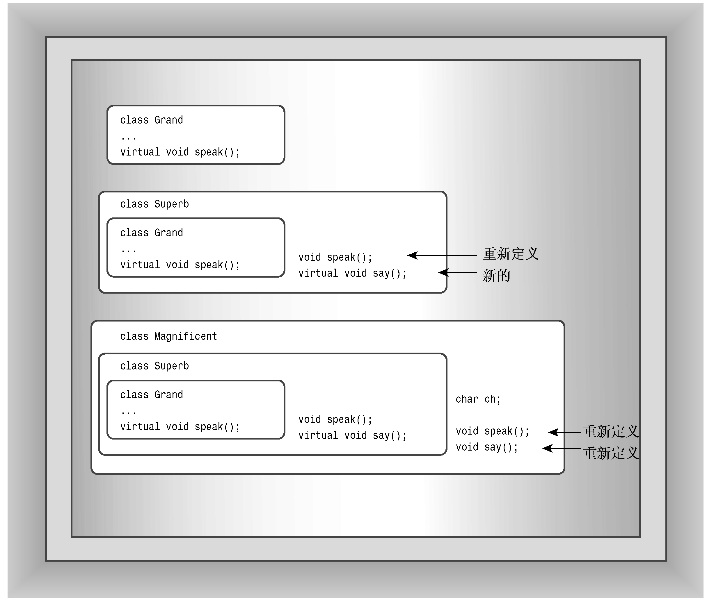

### 15.4.2　RTTI的工作原理

C++有3个支持RTTI的元素。

+ 如果可能的话，dynamic_cast运算符将使用一个指向基类的指针来生成一个指向派生类的指针；否则，该运算符返回0——空指针。
+ typeid运算符返回一个指出对象的类型的值。
+ type_info结构存储了有关特定类型的信息。

只能将RTTI用于包含虚函数的类层次结构，原因在于只有对于这种类层次结构，才应该将派生对象的地址赋给基类指针。

> **警告：**
> RTTI只适用于包含虚函数的类。

下面详细介绍RTTI的这3个元素。

#### 1．dynamic_cast运算符

dynamic_cast运算符是最常用的RTTI组件，它不能回答“指针指向的是哪类对象”这样的问题，但能够回答“是否可以安全地将对象的地址赋给特定类型的指针”这样的问题。我们来看一看这意味着什么。假设有下面这样的类层次结构：

```css
class Grand { // has virtual methods};
class Superb : public Grand { ... };
class Magnificent : public Superb { ... };
```

接下来假设有下面的指针：

```css
Grand * pg = new Grand;
Grand * ps = new Superb;
Grand * pm = new Magnificent;
```

最后，对于下面的类型转换：

```css
Magnificent * p1 = (Magnificent *) pm; // #1
Magnificent * p2 = (Magnificent *) pg; // #2
Superb * p3 = (Magnificent *) pm;      // #3
```

哪些是安全的？根据类声明，它们可能全都是安全的，但只有那些指针类型与对象的类型（或对象的直接或间接基类的类型）相同的类型转换才一定是安全的。例如，类型转换#1就是安全的，因为它将Magificent类型的指针指向类型为Magnificent的对象。类型转换#2就是不安全的，因为它将基数对象（Grand）的地址赋给派生类（Magnificent）指针。因此，程序将期望基类对象有派生类的特征，而通常这是不可能的。例如，Magnificent对象可能包含一些Grand对象没有的数据成员。然而，类型转换#3是安全的，因为它将派生对象的地址赋给基类指针。即公有派生确保Magnificent对象同时也是一个Superb对象（直接基类）和一个Grand对象（间接基类）。因此，将它的地址赋给这3种类型的指针都是安全的。虚函数确保了将这3种指针中的任何一种指向Magnificent对象时，都将调用Magnificent方法。

注意，与问题“指针指向的是哪种类型的对象”相比，问题“类型转换是否安全”更通用，也更有用。通常想知道类型的原因在于：知道类型后，就可以知道调用特定的方法是否安全。要调用方法，类型并不一定要完全匹配，而可以是定义了方法的虚拟版本的基类类型。下面的例子说明了这一点。

然而，先来看一下dynamic_cast的语法。该运算符的用法如下，其中pg指向一个对象：

```css
Superb * pm = dynamic_cast<Superb *>(pg);
```

这提出了这样的问题：指针pg的类型是否可被安全地转换为Superb *？如果可以，运算符将返回对象的地址，否则返回一个空指针。

> **注意：**
> 通常，如果指向的对象（*pt）的类型为Type或者是从Type直接或间接派生而来的类型，则下面的表达式将指针pt转换为Type类型的指针：

```css
dynamic_cast<Type *>(pt)
```

> 否则，结果为0，即空指针。

程序清单15.17演示了这种处理。首先，它定义了3个类，名称为Grand、Superb和Magnificent。Grand类定义了一个虚函数Speak()，而其他类都重新定义了该虚函数。Superb类定义了一个虚函数Say()，而Manificent也重新定义了它（参见图15.4）。程序定义了GetOne()函数，该函数随机创建这3种类中某种类的对象，并对其进行初始化，然后将地址作为Grand*指针返回（GetOne()函数模拟用户做出决定）。循环将该指针赋给Grand *变量pg，然后使用pg调用Speak()函数。因为这个函数是虚拟的，所以代码能够正确地调用指向的对象的Speak()版本。

```css
for (int i = 0; i < 5; i++)
{
    pg = GetOne();
    pg->Speak();
    ...
}
```

然而，不能用相同的方式（即使用指向Grand的指针）来调用Say()函数，因为Grand类没有定义它。然而，可以使用dynamic_cast运算符来检查是否可将pg的类型安全地转换为Superb指针。如果对象的类型为Superb或Magnificent，则可以安全转换。在这两种情况下，都可以安全地调用Say()函数：

```css
if (ps = dynamic_cast<Superb *>(pg))
    ps->Say();
```

赋值表达式的值是它左边的值，因此if条件的值为ps。如果类型转换成功，则ps的值为非零（true）；如果类型转换失败，即pg指向的是一个Grand对象，ps的值将为0（false）。程序清单15.17列出了所有的代码。顺便说一句，有些编译器可能会对无目的赋值（在if条件语句中，通常使用= =运算符）提出警告。


<center class="my_markdown"><b class="my_markdown">图15.4　Grand类系列</b></center>

程序清单15.17　rtti1.cpp

```css
// rtti1.cpp -- using the RTTI dynamic_cast operator
#include <iostream>
#include <cstdlib>
#include <ctime>
using std::cout;
class Grand
{
private:
    int hold;
public:
    Grand(int h = 0) : hold(h) {}
    virtual void Speak() const { cout << "I am a grand class!\n";}
    virtual int Value() const { return hold; }
};
class Superb : public Grand
{
public:
    Superb(int h = 0) : Grand(h) {}
    void Speak() const {cout << "I am a superb class!!\n"; }
    virtual void Say() const
        { cout << "I hold the superb value of " << Value() << "!\n";}
};
class Magnificent : public Superb
{
private:
    char ch;
public:
    Magnificent(int h = 0, char c = 'A') : Superb(h), ch(c) {}
    void Speak() const {cout << "I am a magnificent class!!!\n";}
    void Say() const {cout << "I hold the character " << ch <<
               " and the integer " << Value() << "!\n"; }
};
Grand * GetOne();
int main()
{
    std::srand(std::time(0));
    Grand * pg;
    Superb * ps;
    for (int i = 0; i < 5; i++)
    {
        pg = GetOne();
        pg->Speak();
        if( ps = dynamic_cast<Superb *>(pg))
            ps->Say();
    }
    return 0;
}
Grand * GetOne() // generate one of three kinds of objects randomly
{
    Grand * p;
    switch( std::rand() % 3)
    {
        case 0: p = new Grand(std::rand() % 100);
                    break;
        case 1: p = new Superb(std::rand() % 100);
                    break;
        case 2: p = new Magnificent(std::rand() % 100,
                              'A' + std::rand() % 26);
                    break;
    }
    return p;
}
```

> **注意：**
> 即使编译器支持RTTI，在默认情况下，它也可能关闭该特性。如果该特性被关闭，程序可能仍能够通过编译，但将出现运行阶段错误。在这种情况下，您应查看文档或菜单选项。

程序清单15.17中程序说明了重要的一点，即应尽可能使用虚函数，而只在必要时使用RTTI。下面是该程序的输出：

```css
I am a superb class!!
I hold the superb value of 68!
I am a magnificent class!!!
I hold the character R and the integer 68!
I am a magnificent class!!!
I hold the character D and the integer 12!
I am a magnificent class!!!
I hold the character V and the integer 59!
I am a grand class!
```

正如您看到的，只为Superb和Magnificent类调用了Say()方法（每次运行时输出都可能不同，因为该程序使用rand()来选择对象类型）。

也可以将dynamic_cast用于引用，其用法稍微有点不同：没有与空指针对应的引用值，因此无法使用特殊的引用值来指示失败。当请求不正确时，dynamic_cast将引发类型为bad_cast的异常，这种异常是从exception类派生而来的，它是在头文件typeinfo中定义的。因此，可以像下面这样使用该运算符，其中rg是对Grand对象的引用：

```css
#include <typeinfo> // for bad_cast
...
try {
    Superb & rs = dynamic_cast<Superb &>(rg);
    ...
}
catch(bad_cast &){
    ...
};
```

#### 2．typeid运算符和type_info类

typeid运算符使得能够确定两个对象是否为同种类型。它与sizeof有些相像，可以接受两种参数：

+ 类名；
+ 结果为对象的表达式。

typeid运算符返回一个对type_info对象的引用，其中，type_info是在头文件typeinfo（以前为typeinfo.h）中定义的一个类。type_info类重载了= =和!=运算符，以便可以使用这些运算符来对类型进行比较。例如，如果pg指向的是一个Magnificent对象，则下述表达式的结果为bool值true，否则为false：

```css
typeid(Magnificent) == typeid(*pg)
```

如果pg是一个空指针，程序将引发bad_typeid异常。该异常类型是从exception类派生而来的，是在头文件typeinfo中声明的。

type_info类的实现随厂商而异，但包含一个name()成员，该函数返回一个随实现而异的字符串：通常（但并非一定）是类的名称。例如，下面的语句显示指针pg指向的对象所属的类定义的字符串：

```css
cout << "Now processing type " << typeid(*pg).name() << ".\n";
```

程序清单15.18对程序清单15.17作了修改，以使用typeid运算符和name()成员函数。注意，它们都适用于dynamic_cast和virtual函数不能处理的情况。typeid测试用来选择一种操作，因为操作不是类的方法，所以不能通过类指针调用它。name()方法语句演示了如何将方法用于调试。注意，程序包含了头文件typeinfo。

程序清单15.18　rtti2.cpp

```css
// rtti2.cpp -- using dynamic_cast, typeid, and type_info
#include <iostream>
#include <cstdlib>
#include <ctime>
#include <typeinfo>
using namespace std;
class Grand
{
private:
    int hold;
public:
    Grand(int h = 0) : hold(h) {}
    virtual void Speak() const { cout << "I am a grand class!\n";}
    virtual int Value() const { return hold; }
};
class Superb : public Grand
{
public:
    Superb(int h = 0) : Grand(h) {}
    void Speak() const {cout << "I am a superb class!!\n"; }
    virtual void Say() const
        { cout << "I hold the superb value of " << Value() << "!\n";}
};
class Magnificent : public Superb
{
private:
    char ch;
public:
    Magnificent(int h = 0, char cv = 'A') : Superb(h), ch(cv) {}
    void Speak() const {cout << "I am a magnificent class!!!\n";}
    void Say() const {cout << "I hold the character " << ch <<
               " and the integer " << Value() << "!\n"; }
};
Grand * GetOne();
int main()
{
    srand(time(0));
    Grand * pg;
    Superb * ps;
    for (int i = 0; i < 5; i++)
    {
        pg = GetOne();
        cout << "Now processing type " << typeid(*pg).name() << ".\n";
        pg->Speak();
        if( ps = dynamic_cast<Superb *>(pg))
            ps->Say();
        if (typeid(Magnificent) == typeid(*pg))
            cout << "Yes, you're really magnificent.\n";
    }
    return 0;
}
Grand * GetOne()
{
    Grand * p;
    switch( rand() % 3)
    {
        case 0: p = new Grand(rand() % 100);
                    break;
        case 1: p = new Superb(rand() % 100);
                    break;
        case 2: p = new Magnificent(rand() % 100, 'A' + rand() % 26);
                    break;
    }
    return p;
}
```

程序清单15.18所示程序的运行情况如下：

```css
Now processing type Magnificent.
I am a magnificent class!!!
I hold the character P and the integer 52!
Yes, you're really magnificent.
Now processing type Superb.
I am a superb class!!
I hold the superb value of 37!
Now processing type Grand.
I am a grand class!
Now processing type Superb.
I am a superb class!!
I hold the superb value of 18!
Now processing type Grand.
I am a grand class!
```

与前一个程序的输出一样，每次运行该程序的输出都可能不同，因为它使用rand()来选择类型。另外，调用name()时，有些编译器可能提供不同的输出，如5Grand（而不是Grand）。

#### 3．误用RTTI的例子

C++界有很多人对RTTI口诛笔伐，他们认为RTTI是多余的，是导致程序效率低下和糟糕编程方式的罪魁祸首。这里不讨论对RTTI的争论，而介绍一下应避免的编程方式。

请看程序清单15.17的核心代码：

```css
Grand * pg;
Superb * ps;
for (int i = 0; i < 5; i++)
{
    pg = GetOne();
    pg->Speak();
    if( ps = dynamic_cast<Superb *>(pg))
         ps->Say();
}
```

通过放弃dynamic_cast和虚函数，而使用typeid，可以将上述代码重新编写为：

```css
Grand * pg;
Superb * ps;
Magnificent * pm;
for (int i = 0; i < 5; i++)
{
    pg = GetOne();
    if (typeid(Magnificent) == typeid(*pg))
    {
        pm = (Magnificent *) pg;
        pm->Speak();
        pm->Say();
    }
    else if (typeid(Superb) == typeid(*pg))
    {
        ps = (Superb *) pg;
        ps->Speak();
        ps->Say();
    }
    else
        pg->Speak();
}
```

上述代码不仅比原来的更难看、更长，而且显式地指定各个类存在严重的缺陷。例如，假设您发现必须从Magnificent类派生一个Insufferable类，而后者需要重新定义Speak()和Say()。使用typeid来显示地测试每个类型时，必须修改for循环的代码，添加一个else if，但无需修改原来的版本。下面的语句适用于所有从Grand派生而来的类：

```css
pg->Speak();
```

而下面的语句适用于所有从Superb派生而来的类：

```css
if( ps = dynamic_cast<Superb *>(pg))
      ps->Say();
```

> **提示：**
> 如果发现在扩展的if else语句系列中使用了typeid，则应考虑是否应该使用虚函数和dynamic_cast。

