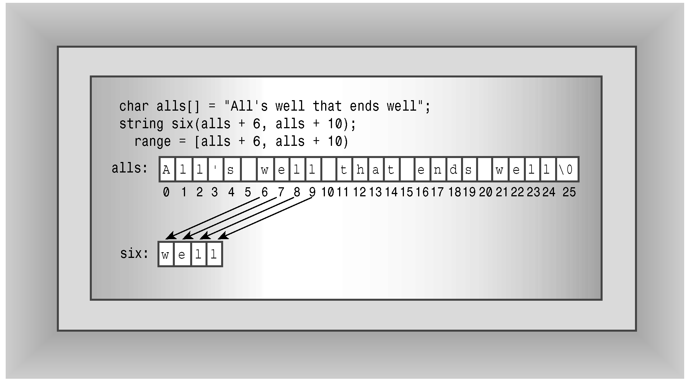

### 16.1.1　构造字符串

先来看string的构造函数。毕竟，对于类而言，最重要的内容之一是，有哪些方法可用于创建其对象。程序清单16.1使用了string的7个构造函数（用ctor标识，这是传统C++中构造函数的缩写）。表16.1简要地描述了这些构造函数，它首先使用顺序简要描述了程序清单16.1使用的7个构造函数，然后列出了C++11新增的两个构造函数。使用构造函数时都进行了简化，即隐藏了这样一个事实：string实际上是模板具体化basic_string<char>的一个typedef，同时省略了与内存管理相关的参数（这将在本章后面和附录F中讨论）。size_type是一个依赖于实现的整型，是在头文件string中定义的。string类将string::npos定义为字符串的最大长度，通常为unsigned int的最大值。另外，表格中使用缩写NBTS（null-terminated string）来表示以空字符结束的字符串——传统的C字符串。

<center class="my_markdown"><b class="my_markdown">表16.1　string类的构造函数</b></center>

| 构 造 函 数 | 描述 |
| :-----  | :-----  | :-----  | :-----  |
| string(const char * s) | 将string对象初始化为s指向的NBTS |
| string(size_type n, char c) | 创建一个包含n个元素的string对象，其中每个元素都被初始化为字符c |
| string(const string & str) | 将一个string对象初始化为string对象str（复制构造函数） |
| string() | 创建一个默认的string对象，长度为0（默认构造函数） |
| string(const char * s, size_type n) | 将string对象初始化为s指向的NBTS的前n个字符，即使超过了NBTS结尾 |
| template<class Iter> | string(Iter begin, Iter end) | 将string对象初始化为区间[begin, end)内的字符，其中begin和end的行为就像指针，用于指定位置，范围包括begin在内，但不包括end |
| string(const string & str, size_type pos = 0, size_type n = npos) | 将一个string对象初始化为对象str中从位置pos开始到结尾的字符，或从位置pos开始的n个字符 |
| string(string && str) noexcept | 这是C++11新增的，它将一个string对象初始化为string对象str，并可能修改str（移动构造函数） |
| string(initializer_list<char> il) | 这是C++11新增的，它将一个string对象初始化为初始化列表il中的字符 |

程序清单16.1　str1.cpp

```css
// str1.cpp -- introducing the string class
#include <iostream>
#include <string>
// using string constructors
int main()
{
    using namespace std;
    string one("Lottery Winner!"); // ctor #1
    cout << one << endl;           // overloaded <<
    string two(20, '$');           // ctor #2
    cout << two << endl;
    string three(one);             // ctor #3
    cout << three << endl;
    one += " Oops!";               // overloaded +=
    cout << one << endl;
    two = "Sorry! That was ";
    three[0] = 'P';
    string four;                   // ctor #4
    four = two + three;            // overloaded +, =
    cout << four << endl;
    char alls[] = "All's well that ends well";
    string five(alls,20);          // ctor #5
    cout << five << "!\n";
    string six(alls+6, alls + 10); // ctor #6
    cout << six << ", ";
    string seven(&five[6], &five[10]); // ctor #6 again
    cout << seven << "...\n";
    string eight(four, 7, 16);     // ctor #7
    cout << eight << " in motion!" << endl;
    return 0;
}
```

程序清单16.1中程序还使用了重载+=运算符，它将一个字符串附加到另一个字符串的后面；重载的=运算符用于将一个字符串赋给另一个字符串；重载的<<运算符用于显示string对象；重载的[ ]运算符用于访问字符串中的各个字符。

下面是程序清单16.1中程序的输出：

```css
Lottery Winner!
$$$$$$$$$$$$$$$$$$$$
Lottery Winner!
Lottery Winner! Oops!
Sorry! That was Pottery Winner!
All's well that ends!
well, well...
That was Pottery in motion!
```

#### 1．程序说明

程序清单16.1中的程序首先演示了可以将string对象初始化为常规的C-风格字符串，然后使用重载的<<运算符来显示它：

```css
string one("Lottery Winner!"); // ctor #1
cout << one << endl; // overloaded <<
```

接下来的构造函数将string对象two初始化为由20个$字符组成的字符串：

```css
string two(20, '$'); // ctor #2
```

复制构造函数将string对象three初始化为string对象one：

```css
string three(one); // ctor #3
```

重载的+=运算符将字符串“Oops!”附加到字符串one的后面：

```css
one += " Oops!"; // overloaded +=
```

这里是将一个C-风格字符串附加到一个string对象的后面。但+=运算符被多次重载，以便能够附加string对象和单个字符：

```css
one += two; // append a string object (not in program)
one += '!'; // append a type char value (not in program)
```

同样，=运算符也被重载，以便可以将string对象、C-风格字符串或char值赋给string对象：

```css
two = "Sorry! That was "; // assign a C-style string
two = one;                // assign a string object (not in program)
two = '?';                // assign a char value (not in program)
```

重载[ ]运算符（就像第12章的String示例那样）使得可以使用数组表示法来访问string对象中的各个字符：

```css
three[0] = 'P';
```

默认构造函数创建一个以后可对其进行赋值的空字符串：

```css
string four; // ctor #4
four = two + three; // overloaded +, =
```

第2行使用重载的+运算符创建了一个临时string对象，然后使用重载的=运算符将它赋给对象four。正如所预料的，+运算符将其两个操作数组合成一个string对象。该运算符被多次重载，以便第二个操作数可以是string对象、C-风格字符串或char值。

第5个构造函数将一个C-风格字符串和一个整数作为参数，其中的整数参数表示要复制多少个字符：

```css
char alls[] = "All's well that ends well";
string five(alls,20); // ctor #5
```

从输出可知，这里只使用了前20个字符（“All's well that ends”）来初始化five对象。正如表16.1指出的，如果字符数超过了C-风格字符串的长度，仍将复制请求数目的字符。所以在上面的例子中，如果用40代替20，将导致15个无用字符被复制到five的结尾处（即构造函数将内存中位于字符串“All's well that ends well”后面的内容作为字符）。

第6个构造函数有一个模板参数：

```css
template<class Iter> string(Iter begin, Iter end);
```

begin和end将像指针那样，指向内存中两个位置（通常，begin和end可以是迭代器——广泛用于STL中的广义化指针）。构造函数将使用begin和end指向的位置之间的值，对string对象进行初始化。[begin, end)来自数学中，意味着包括begin，但不包括end在内的区间。也就是说，end指向被使用的最后一个值后面的一个位置。请看下面的语句：

```css
string six(alls+6, alls + 10); // ctor #6
```

由于数组名相当于指针，所以alls + 6和alls +10的类型都是char *，因此使用模板时，将用类型char *替换Iter。第一个参数指向数组alls中的第一个w，第二个参数指向第一个well后面的空格。因此，six将被初始化为字符串“well”。图16.1说明了该构造函数的工作原理。

现在假设要用这个构造函数将对象初始化为另一个string对象（假设为five）的一部分内容，则下面的语句不管用：

```css
string seven(five + 6, five + 10);
```

原因在于，对象名（不同于数组名）不会被看作是对象的地址，因此five不是指针，所以five + 6是没有意义的。然而，five[6]是一个char值，所以&five[6]是一个地址，因此可被用作该构造函数的一个参数。

```css
string seven(&five[6], &five[10]);// ctor #6 again
```

第7个构造函数将一个string对象的部分内容复制到构造的对象中：

```css
string eight(four, 7, 16); // ctor #7
```

上述语句从four的第8个字符（位置7）开始，将16个字符复制到eight中。


<center class="my_markdown"><b class="my_markdown">图16.1　使用区间的string构造函数</b></center>

#### 2．C++11新增的构造函数

构造函数string（string && str）类似于复制构造函数，导致新创建的string为str的副本。但与复制构造函数不同的是，它不保证将str视为const。这种构造函数被称为移动构造函数（move constructor）。在有些情况下，编译器可使用它而不是复制构造函数，以优化性能。第18章的“移动语义和右值引用”一节将讨论这个主题。

构造函数string（initializer_list<char> il）让您能够将列表初始化语法用于string类。也就是说，它使得下面这样的声明是合法的：

```css
string piano_man = {'L', 'i', 's','z','t'};
string comp_lang {'L', 'i', 's', 'p'};
```

就string类而言，这可能用处不大，因为使用C-风格字符串更容易，但确实实现了让列表初始化语法普遍实用的意图。本章后面将更深入地讨论模板initializer_list。

