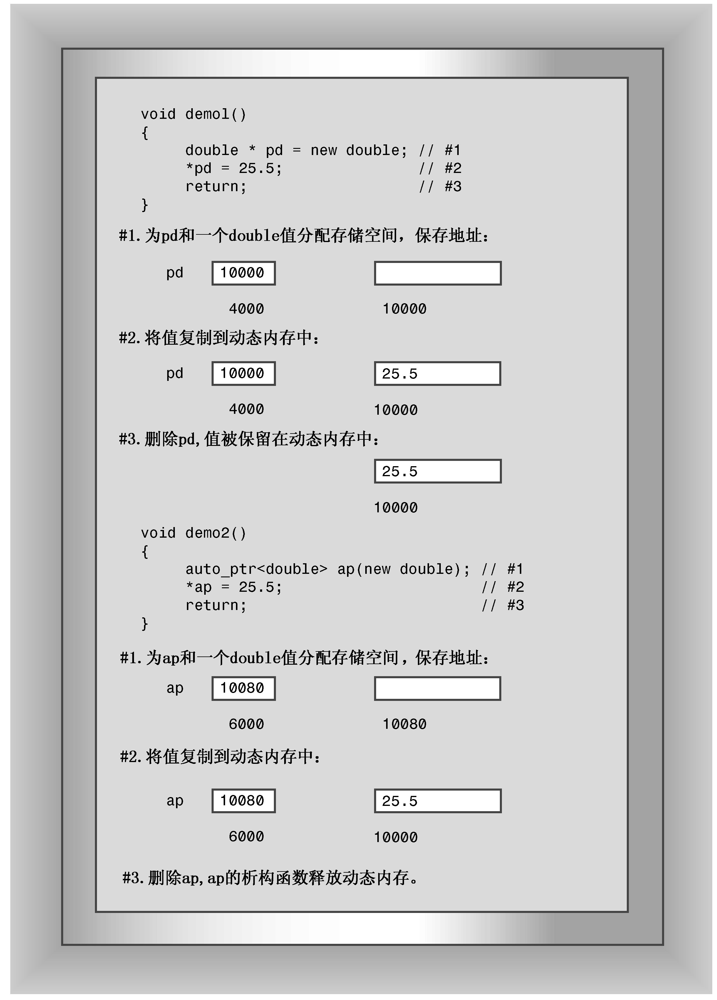

### 16.2.1　使用智能指针

这三个智能指针模板（auto_ptr、unique_ptr和shared_ptr）都定义了类似指针的对象，可以将new获得（直接或间接）的地址赋给这种对象。当智能指针过期时，其析构函数将使用delete来释放内存。因此，如果将new返回的地址赋给这些对象，将无需记住稍后释放这些内存：在智能指针过期时，这些内存将自动被释放。图16.2说明了auto_ptr和常规指针在行为方面的差别；share_ptr和unique_ptr的行为与auto_ptr相同。


<center class="my_markdown"><b class="my_markdown">图16.2　常规指针与auto_ptr</b></center>

要创建智能指针对象，必须包含头文件memory，该文件模板定义。然后使用通常的模板语法来实例化所需类型的指针。例如，模板auto_ptr包含如下构造函数：

```css
template<class X> class auto_ptr {
public:
    explicit auto_ptr(X* p =0) throw();
...};
```

本书前面说过，throw()意味着构造函数不会引发异常；与auto_ptr一样，throw()也被摒弃。因此，请求X类型的auto_ptr将获得一个指向X类型的auto_ptr：

```css
auto_ptr<double> pd(new double); // pd an auto_ptr to double
                                 // (use in place of double * pd)
auto_ptr<string> ps(new string); // ps an auto_ptr to string
                                 // (use in place of string * ps)
```

new double是new返回的指针，指向新分配的内存块。它是构造函数auto_ptr<double>的参数，即对应于原型中形参p的实参。同样，new string也是构造函数的实参。其他两种智能指针使用同样的语法：

```css
unique_ptr<double> pdu(new double); // pdu an unique_ptr to double
shared_ptr<string> pss(new string); // pss a shared_ptr to string
```

因此，要转换remodel()函数，应按下面3个步骤进行：

1．包含头文件memory；

2．将指向string的指针替换为指向string的智能指针对象；

3．删除delete语句。

下面是使用auto_ptr修改该函数的结果：

```css
#include <memory>
void remodel(std::string & str)
{
    std::auto_ptr<std::string> ps (new std::string(str));
    ...
    if (weird_thing())
        throw exception();
    str = *ps;
    // delete ps; NO LONGER NEEDED
    return;
}
```

注意到智能指针模板位于名称空间std中。程序清单16.5是一个简单的程序，演示了如何使用全部三种智能指针。要编译该程序，您的编译器必须支持C++11新增的类shared_ptr和unique_ptr。每个智能指针都放在一个代码块内，这样离开代码块时，指针将过期。Report类使用方法报告对象的创建和销毁。

程序清单16.5　smrtptrs.cpp

```css
// smrtptrs.cpp -- using three kinds of smart pointers
// requires support of C++11 shared_ptr and unique_ptr
#include <iostream>
#include <string>
#include <memory>
class Report
{
private:
    std::string str;
public:
    Report(const std::string s) : str(s)
            { std::cout << "Object created!\n"; }
    ~Report() { std::cout << "Object deleted!\n"; }
    void comment() const { std::cout << str << "\n"; }
};
int main()
{
    {
        std::auto_ptr<Report> ps (new Report("using auto_ptr"));
        ps->comment(); // use -> to invoke a member function
    }
    {
        std::shared_ptr<Report> ps (new Report("using shared_ptr"));
        ps->comment();
    }
    {
        std::unique_ptr<Report> ps (new Report("using unique_ptr"));
        ps->comment();
    }
    return 0;
}
```

该程序的输出如下：

```css
Object created!
using auto_ptr
Object deleted!
Object created!
using shared_ptr
Object deleted!
Object created!
using unique_ptr
Object deleted!
```

所有智能指针类都一个explicit构造函数，该构造函数将指针作为参数。因此不需要自动将指针转换为智能指针对象：

```css
shared_ptr<double> pd;
double *p_reg = new double;
pd = p_reg; // not allowed (implicit conversion)
pd = shared_ptr<double>(p_reg);     // allowed (explicit conversion
shared_ptr<double> pshared = p_reg; // not allowed (implicit conversion)
shared_ptr<double> pshared(p_reg);  // allowed (explicit conversion)
```

由于智能指针模板类的定义方式，智能指针对象的很多方面都类似于常规指针。例如，如果ps是一个智能指针对象，则可以对它执行解除引用操作（* ps）、用它来访问结构成员（ps->puffIndex）、将它赋给指向相同类型的常规指针。还可以将智能指针对象赋给另一个同类型的智能指针对象，但将引起一个问题，这将在下一节进行讨论。

但在此之前，先说说对全部三种智能指针都应避免的一点：

```css
string vacation("I wandered lonely as a cloud.");
shared_ptr<string> pvac(&vacation); // NO!
```

pvac过期时，程序将把delete运算符用于非堆内存，这是错误的。

就程序清单16.5演示的情况而言，三种智能指针都能满足要求，但情况并非总是这样简单。

