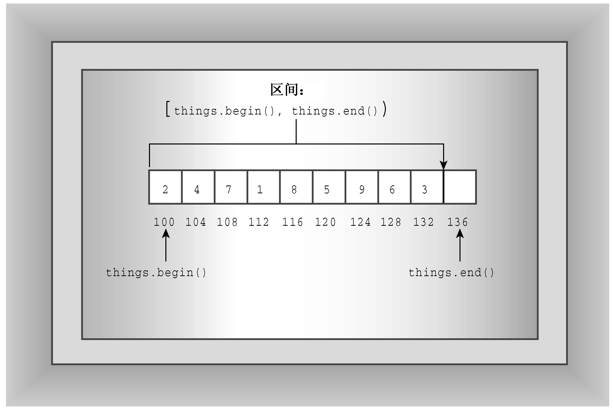

### 16.3.2　可对矢量执行的操作

除分配存储空间外，vector模板还可以完成哪些任务呢？所有的STL容器都提供了一些基本方法，其中包括size()——返回容器中元素数目、swap()——交换两个容器的内容、begin()——返回一个指向容器中第一个元素的迭代器、end()——返回一个表示超过容器尾的迭代器。

什么是迭代器？它是一个广义指针。事实上，它可以是指针，也可以是一个可对其执行类似指针的操作——如解除引用（如operator*()）和递增（如operator++()）——的对象。稍后将知道，通过将指针广义化为迭代器，让STL能够为各种不同的容器类（包括那些简单指针无法处理的类）提供统一的接口。每个容器类都定义了一个合适的迭代器，该迭代器的类型是一个名为iterator的typedef，其作用域为整个类。例如，要为vector的double类型规范声明一个迭代器，可以这样做：

```css
vector<double>::iterator pd; // pd an iterator
```

假设scores是一个vector<double>对象：

```css
vector<double> scores;
```

则可以使用迭代器pd执行这样的操作：

```css
pd = scores.begin(); // have pd point to the first element
*pd = 22.3;          // dereference pd and assign value to first element
++pd;                // make pd point to the next element
```

正如您看到的，迭代器的行为就像指针。顺便说一句，还有一个C++11自动类型推断很有用的地方。例如，可以不这样做：

```css
vector<double>::iterator pd = scores.begin();
```

而这样做：

```css
auto pd = scores.begin(); // C++11 automatic type deduction
```

回到前面的示例。什么是超过结尾（past-the-end）呢？它是一种迭代器，指向容器最后一个元素后面的那个元素。这与C-风格字符串最后一个字符后面的空字符类似，只是空字符是一个值，而“超过结尾”是一个指向元素的指针（迭代器）。end()成员函数标识超过结尾的位置。如果将迭代器设置为容器的第一个元素，并不断地递增，则最终它将到达容器结尾，从而遍历整个容器的内容。因此，如果scores和pd的定义与前面的示例中相同，则可以用下面的代码来显示容器的内容：

```css
for (pd = scores.begin(); pd != scores.end(); pd++)
    cout << *pd << endl;;
```

所有容器都包含刚才讨论的那些方法。vector模板类也包含一些只有某些STL容器才有的方法。push_back()是一个方便的方法，它将元素添加到矢量末尾。这样做时，它将负责内存管理，增加矢量的长度，使之能够容纳新的成员。这意味着可以编写这样的代码：

```css
vector<double> scores; // create an empty vector
double temp;
while (cin >> temp && temp >= 0)
    scores.push_back(temp);
cout << "You entered " << scores.size() << " scores.\n";
```

每次循环都给scores对象增加一个元素。在编写或运行程序时，无需了解元素的数目。只要能够取得足够的内存，程序就可以根据需要增加scores的长度。

erase()方法删除矢量中给定区间的元素。它接受两个迭代器参数，这些参数定义了要删除的区间。了解STL如何使用两个迭代器来定义区间至关重要。第一个迭代器指向区间的起始处，第二个迭代器位于区间终止处的后一个位置。例如，下述代码删除第一个和第二个元素，即删除begin()和begin()+1指向的元素（由于vector提供了随机访问功能，因此vector类迭代器定义了诸如begin()+2等操作）：

```css
scores.erase(scores.begin(), scores.begin() + 2);
```

如果it1和it2是迭代器，则STL文档使用[p1, p2)来表示从p1到p2（不包括p2）的区间。因此，区间[begin(), end()]将包括集合的所有内容（参见图16.3），而区间[p1, p1)为空。[ )表示法并不是C++的组成部分，因此不能在代码中使用，而只能出现在文档中。

> **注意：**
> 区间[it1, it2)由迭代器it1和it2指定，其范围为it1到it2（不包括it2）。

insert()方法的功能与erase()相反。它接受3个迭代器参数，第一个参数指定了新元素的插入位置，第二个和第三个迭代器参数定义了被插入区间，该区间通常是另一个容器对象的一部分。例如，下面的代码将矢量new_v中除第一个元素外的所有元素插入到old_v矢量的第一个元素前面：

```css
vector<int> old_v;
vector<int> new_v;
...
old_v.insert(old_v.begin(), new_v.begin() + 1, new_v.end());
```


<center class="my_markdown"><b class="my_markdown">图16.3　STL的区间概念</b></center>

顺便说一句，对于这种情况，拥有超尾元素是非常方便的，因为这使得在矢量尾部附加元素非常简单。下面的代码将新元素插入到old.end()前面，即矢量最后一个元素的后面。

```css
old_v.insert(old_v.end(), new_v.begin() + 1, new_v.end());
```

程序清单16.8演示了size()、begin()、end()、push_back()、erase()和insert()的用法。为简化数据处理，将程序清单16.7中的rating和title组合成了一个Review结构，并使用FillReview()和ShowReview()函数来输入和输出Review对象。

程序清单16.8　vect2.cpp

```css
// vect2.cpp -- methods and iterators
#include <iostream>
#include <string>
#include <vector>
struct Review {
    std::string title;
    int rating;
};
bool FillReview(Review & rr);
void ShowReview(const Review & rr);
int main()
{
    using std::cout;
    using std::vector;
    vector<Review> books;
    Review temp;
    while (FillReview(temp))
        books.push_back(temp);
    int num = books.size();
    if (num > 0)
    {
        cout << "Thank you. You entered the following:\n"
            << "Rating\tBook\n";
        for (int i = 0; i < num; i++)
            ShowReview(books[i]);
        cout << "Reprising:\n"
            << "Rating\tBook\n";
        vector<Review>::iterator pr;
        for (pr = books.begin(); pr != books.end(); pr++)
            ShowReview(*pr);
        vector <Review> oldlist(books); // copy constructor used
        if (num > 3)
        {
            // remove 2 items
            books.erase(books.begin() + 1, books.begin() + 3);
            cout << "After erasure:\n";
            for (pr = books.begin(); pr != books.end(); pr++)
                ShowReview(*pr);
            // insert 1 item
            books.insert(books.begin(), oldlist.begin() + 1,
                        oldlist.begin() + 2);
            cout << "After insertion:\n";
            for (pr = books.begin(); pr != books.end(); pr++)
                ShowReview(*pr);
        }
        books.swap(oldlist);
        cout << "Swapping oldlist with books:\n";
        for (pr = books.begin(); pr != books.end(); pr++)
            ShowReview(*pr);
    }
    else
        cout << "Nothing entered, nothing gained.\n";
    return 0;
}
bool FillReview(Review & rr)
{
    std::cout << "Enter book title (quit to quit): ";
    std::getline(std::cin,rr.title);
    if (rr.title == "quit")
        return false;
    std::cout << "Enter book rating: ";
    std::cin >> rr.rating;
    if (!std::cin)
        return false;
    // get rid of rest of input line
    while (std::cin.get() != '\n')
        continue;
    return true;
}
void ShowReview(const Review & rr)
{
    std::cout << rr.rating << "\t" << rr.title << std::endl;
}
```

程序清单16.8中程序的运行情况如下：

```css
Enter book title (quit to quit): The Cat Who Knew Vectors
Enter book rating: 5
Enter book title (quit to quit): Candid Canines
Enter book rating: 7
Enter book title (quit to quit): Warriors of Wonk
Enter book rating: 4
Enter book title (quit to quit): Quantum Manners
Enter book rating: 8
Enter book title (quit to quit): quit
Thank you. You entered the following:
Rating Book
5      The Cat Who Knew Vectors
7      Candid Canines
4      Warriors of Wonk
8      Quantum Manners
Reprising:
Rating Book
5      The Cat Who Knew Vectors
7      Candid Canines
4      Warriors of Wonk
8      Quantum Manners
After erasure:
5      The Cat Who Knew Vectors
8      Quantum Manners
After insertion:
7      Candid Canines
5      The Cat Who Knew Vectors
8      Quantum Manners
Swapping oldlist with books:
5      The Cat Who Knew Vectors
7      Candid Canines
4      Warriors of Wonk
8      Quantum Manners
```

