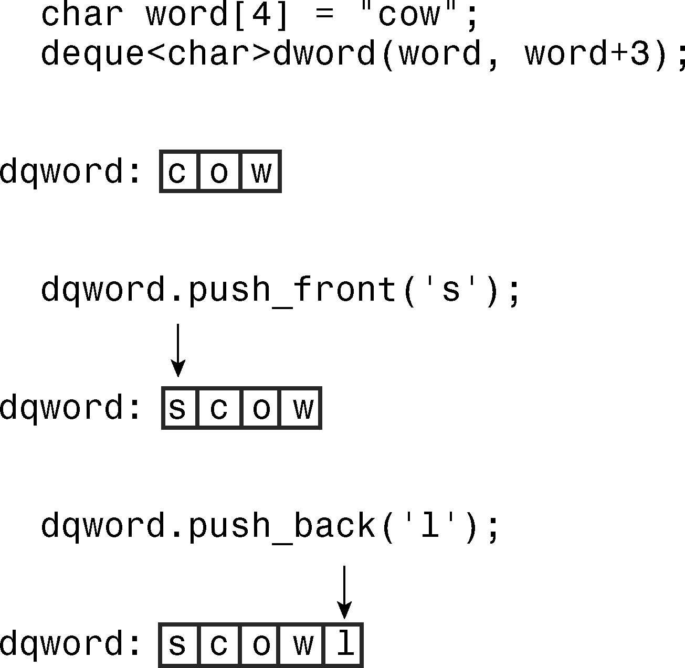

### 16.4.5　容器种类

STL具有容器概念和容器类型。概念是具有名称（如容器、序列容器、关联容器等）的通用类别；容器类型是可用于创建具体容器对象的模板。以前的11个容器类型分别是deque、list、queue、priority_queue、stack、vector、map、multimap、set、multiset和bitset（本章不讨论bitset，它是在比特级处理数据的容器）；C++11新增了forward_list、unordered_map、unordered_multimap、unordered_set和unordered_multiset，且不将bitset视为容器，而将其视为一种独立的类别。因为概念对类型进行了分类，下面先讨论它们。

#### 1．容器概念

没有与基本容器概念对应的类型，但概念描述了所有容器类都通用的元素。它是一个概念化的抽象基类——说它概念化，是因为容器类并不真正使用继承机制。换句话说，容器概念指定了所有STL容器类都必须满足的一系列要求。

容器是存储其他对象的对象。被存储的对象必须是同一种类型的，它们可以是OOP意义上的对象，也可以是内置类型值。存储在容器中的数据为容器所有，这意味着当容器过期时，存储在容器中的数据也将过期（然而，如果数据是指针的话，则它指向的数据并不一定过期）。

不能将任何类型的对象存储在容器中，具体地说，类型必须是可复制构造的和可赋值的。基本类型满足这些要求；只要类定义没有将复制构造函数和赋值运算符声明为私有或保护的，则也满足这种要求。C++11改进了这些概念，添加了术语可复制插入（CopyInsertable）和可移动插入（MoveInsertable），但这里只进行简单的概述。

基本容器不能保证其元素都按特定的顺序存储，也不能保证元素的顺序不变，但对概念进行改进后，则可以增加这样的保证。所有的容器都提供某些特征和操作。表16.5对一些通用特征进行了总结。其中，X表示容器类型，如vector；T表示存储在容器中的对象类型；a和b表示类型为X的值；r表示类型为X&的值；u表示类型为X的标识符（即如果X表示vector<int>，则u是一个vector<int>对象）。

<center class="my_markdown"><b class="my_markdown">表16.5　一些基本的容器特征</b></center>

| 表　达　式 | 返 回 类 型 | 说　明 | 复　杂　度 |
| :-----  | :-----  | :-----  | :-----  | :-----  | :-----  |
| X :: iterator | 指向T的迭代器类型 | 满足正向迭代器要求的任何迭代器 | 编译时间 |
| X :: value_type | T | T的类型 | 编译时间 |
| X u; |  | 创建一个名为u的空容器 | 固定 |
| X(); |  | 创建一个匿名的空容器 | 固定 |
| X u(a); |  | 调用复制构造函数后u == a | 线性 |
| X u = a; |  | 作用同X u(a); | 线性 |
| r = a; | X& | 调用赋值运算符后r == a | 线性 |
| (&a)->~X() | void | 对容器中每个元素应用析构函数 | 线性 |
| a.begin() | 迭代器 | 返回指向容器第一个元素的迭代器 | 固定 |
| a.end() | 迭代器 | 返回超尾值迭代器 | 固定 |
| a.size() | 无符号整型 | 返回元素个数，等价于a.end()– a.begin() | 固定 |
| a.swap(b) | void | 交换a和b的内容 | 固定 |
| a = = b | 可转换为bool | 如果a和b的长度相同，且a中每个元素都等于（= =为真）b中相应的元素，则为真 | 线性 |
| a != b | 可转换为bool | 返回!(a= =b) | 线性 |

表16.5中的“复杂度”一列描述了执行操作所需的时间。这个表列出了3种可能性，从快到慢依次为：

+ 编译时间；
+ 固定时间；
+ 线性时间。

如果复杂度为编译时间，则操作将在编译时执行，执行时间为0。固定复杂度意味着操作发生在运行阶段，但独立于对象中的元素数目。线性复杂度意味着时间与元素数目成正比。即如果a和b都是容器，则a = = b具有线性复杂度，因为= =操作必须用于容器中的每个元素。实际上，这是最糟糕的情况。如果两个容器的长度不同，则不需要作任何的单独比较。


**固定时间和线性时间复杂度**

假设有一个装满大包裹的狭长盒子，包裹一字排开，而盒子只有一端是打开的。假设任务是从打开的一端取出一个包裹，则这将是一项固定时间任务。不管在打开的一端后面有10个还是1000个包裹，都没有区别。

现在假设任务是取出盒子中没有打开的一端的那个包裹，则这将是线性时间任务。如果盒子里有10个包裹，则必须取出10个包裹才能拿到封口端的那个包裹；如果有100个包裹，则必须取出100个包裹。假设是一个不知疲倦的工人来做，每次只能取出1个包裹，则需要取10次或更多。

现在假设任务是取出任意一个包裹，则可能取出第一个包裹。然而，通常必须移动的包裹数目仍旧与容器中包裹的数目成正比，所以这种任务依然是线性时间复杂度。

如果盒子各边都可打开，而不是狭长的，则这种任务的复杂度将是固定时间的，因为可以直接取出想要的包裹，而不用移动其他的包裹。

时间复杂度概念描述了容器长度对执行时间的影响，而忽略了其他因素。如果超人从一端打开的盒子中取出包裹的速度比普通人快100倍，则他完成任务时，复杂度仍然是线性时间的。在这种情况下，他取出封闭盒子中包裹（一端打开，复杂度为线性时间）的速度将比普通人取出开放盒子中包裹（复杂度为固定时间）要快，条件是盒子里没有太多的包裹。


复杂度要求是STL特征，虽然实现细节可以隐藏，但性能规格应公开，以便程序员能够知道完成特定操作的计算成本。

#### 2．C++11新增的容器要求

表16.6列出了C++11新增的通用容器要求。在这个表中，rv表示类型为X的非常量右值，如函数的返回值。另外，在表16.5中，要求X::iterator满足正向迭代器的要求，而以前只要求它不是输出迭代器。

<center class="my_markdown"><b class="my_markdown">表16.6　C++11新增的基本容器要求</b></center>

| 表　达　式 | 返 回 类 型 | 说　明 | 复　杂　度 |
| :-----  | :-----  | :-----  | :-----  | :-----  | :-----  |
| X u(rv); |  | 调用移动构造函数后，u的值与rv的原始值相同 | 线性 |
| X u = rv; |  | 作用同X u(rv); |
| a = rv; | X& | 调用移动赋值运算符后，u的值与rv的原始值相同 | 线性 |
| a.cbegin() | const_iterator | 返回指向容器第一个元素的const迭代器 | 固定 |
| a.cend() | const_iterator | 返回超尾值const迭代器 | 固定 |

复制构造和复制赋值以及移动构造和移动赋值之间的差别在于，复制操作保留源对象，而移动操作可修改源对象，还可能转让所有权，而不做任何复制。如果源对象是临时的，移动操作的效率将高于常规复制。第18章将更详细地介绍移动语义。

#### 3．序列

可以通过添加要求来改进基本的容器概念。序列（sequence）是一种重要的改进，因为7种STL容器类型（deque、C++11新增的forward_list、list、queue、priority_queue、stack和vector）都是序列（本书前面说过，队列让您能够在队尾添加元素，在队首删除元素。deque表示的双端队列允许在两端添加和删除元素）。序列概念增加了迭代器至少是正向迭代器这样的要求，这保证了元素将按特定顺序排列，不会在两次迭代之间发生变化。array也被归类到序列容器，虽然它并不满足序列的所有要求。

序列还要求其元素按严格的线性顺序排列，即存在第一个元素、最后一个元素，除第一个元素和最后一个元素外，每个元素前后都分别有一个元素。数组和链表都是序列，但分支结构（其中每个节点都指向两个子节点）不是。

因为序列中的元素具有确定的顺序，因此可以执行诸如将值插入到特定位置、删除特定区间等操作。表16.7列出了这些操作以及序列必须完成的其他操作。该表格使用的表示法与表16.5相同，此外，t表示类型为T（存储在容器中的值的类型）的值，n表示整数，p、q、i和j表示迭代器。

<center class="my_markdown"><b class="my_markdown">表16.7　序列的要求</b></center>

| 表　达　式 | 返 回 类 型 | 说　明 |
| :-----  | :-----  | :-----  | :-----  | :-----  |
| X a(n, t); |  | 声明一个名为a的由n个t值组成的序列 |
| X(n, t) |  | 创建一个由n个t值组成的匿名序列 |
| X a(i, j) |  | 声明一个名为a的序列，并将其初始化为区间[i，j)的内容 |
| X(i, j) |  | 创建一个匿名序列，并将其初始化为区间[i，j)的内容 |
| a. insert(p, t) | 迭代器 | 将t插入到p的前面 |
| a.insert(p, n, t) | void | 将n个t插入到p的前面 |
| a.insert(p, i, j) | void | 将区间[i，j)中的元素插入到p的前面 |
| a.erase(p) | 迭代器 | 删除p指向的元素 |
| a.erase(p, q) | 迭代器 | 删除区间[p，q)中的元素 |
| a.clear() | void | 等价于erase(begin(), end()) |

因为模板类deque、list、queue、priority_queue、stack和vector都是序列概念的模型，所以它们都支持表16.7所示的运算符。除此之外，这6个模型中的一些还可使用其他操作。在允许的情况下，它们的复杂度为固定时间。表16.8列出了其他操作。

<center class="my_markdown"><b class="my_markdown">表16.8　序列的可选要求</b></center>

| 表　达　式 | 返 回 类 型 | 含　义 | 容　器 |
| :-----  | :-----  | :-----  | :-----  | :-----  | :-----  |
| a.front() | T& | *a.begin() | vector、list、deque |
| a.back() | T& | *- -a.end() | vector、list、deque |
| a.push_front(t) | void | a.insert(a.begin(), t) | list、deque |
| a.push_back(t) | void | a.insert(a.end(), t) | vector、list、deque |
| a.pop_front(t) | void | a.erase(a.begin()) | list、deque |
| a.pop_back(t) | void | a.erase(- -a.end()) | vector、list、deque |
| a[n] | T& | *(a.begin()+ n) | vector、deque |
| a.at(t) | T& | *(a.begin()+ n) | vector、deque |

表16.8有些需要说明的地方。首先，a[n]和a.at(n)都返回一个指向容器中第n个元素（从0开始编号）的引用。它们之间的差别在于，如果n落在容器的有效区间外，则a.at(n)将执行边界检查，并引发out_of_range异常。其次，可能有人会问，为何为list和deque定义了push_front()，而没有为vector定义？假设要将一个新值插入到包含100个元素的矢量的最前面。要腾出空间，必须将第99个元素移到位置100，然后把第98个元素移动到位置99，依此类推。这种操作的复杂度为线性时间，因为移动100个元素所需的时间为移动单个元素的100倍。但表16.8的操作被假设为仅当其复杂度为固定时间时才被实现。链表和双端队列的设计允许将元素添加到前端，而不用移动其他元素，所以它们可以以固定时间的复杂度来实现push_front()。图16.4说明了push_front()和push_back()。


<center class="my_markdown"><b class="my_markdown">图16.4　push_front()和push_back()</b></center>

下面详细介绍这7种序列容器类型。

（1）vector

前面介绍了多个使用vector模板的例子，该模板是在vector头文件中声明的。简单地说，vector是数组的一种类表示，它提供了自动内存管理功能，可以动态地改变vector对象的长度，并随着元素的添加和删除而增大和缩小。它提供了对元素的随机访问。在尾部添加和删除元素的时间是固定的，但在头部或中间插入和删除元素的复杂度为线性时间。

除序列外，vector还是可反转容器（reversible container）概念的模型。这增加了两个类方法：rbegin()和rend()，前者返回一个指向反转序列的第一个元素的迭代器，后者返回反转序列的超尾迭代器。因此，如果dice是一个vector<int>容器，而Show(int)是显示一个整数的函数，则下面的代码将首先正向显示dice的内容，然后反向显示：

```css
for_each(dice.begin(), dice.end(), Show);    // display in order
cout << endl;
for_each(dice.rbegin(), dice.rend(), Show); // display in reversed order
cout << endl;
```

这两种方法返回的迭代器都是类级类型reverse_iterator。对这样的迭代器进行递增，将导致它反向遍历可反转容器。

vector模板类是最简单的序列类型，除非其他类型的特殊优点能够更好地满足程序的要求，否则应默认使用这种类型。

（2）deque

deque模板类（在deque头文件中声明）表示双端队列（double-ended queue），通常被简称为deque。在STL中，其实现类似于vector容器，支持随机访问。主要区别在于，从deque对象的开始位置插入和删除元素的时间是固定的，而不像vector中那样是线性时间的。所以，如果多数操作发生在序列的起始和结尾处，则应考虑使用deque数据结构。

为实现在deque两端执行插入和删除操作的时间为固定的这一目的，deque对象的设计比vector对象更为复杂。因此，尽管二者都提供对元素的随机访问和在序列中部执行线性时间的插入和删除操作，但vector容器执行这些操作时速度要快些。

（3）list

list模板类（在list头文件中声明）表示双向链表。除了第一个和最后一个元素外，每个元素都与前后的元素相链接，这意味着可以双向遍历链表。list和vector之间关键的区别在于，list在链表中任一位置进行插入和删除的时间都是固定的（vector模板提供了除结尾处外的线性时间的插入和删除，在结尾处，它提供了固定时间的插入和删除）。因此，vector强调的是通过随机访问进行快速访问，而list强调的是元素的快速插入和删除。

与vector相似，list也是可反转容器。与vector不同的是，list不支持数组表示法和随机访问。与矢量迭代器不同，从容器中插入或删除元素之后，链表迭代器指向元素将不变。我们来解释一下这句话。例如，假设有一个指向vector容器第5个元素的迭代器，并在容器的起始处插入一个元素。此时，必须移动其他所有元素，以便腾出位置，因此插入后，第5个元素包含的值将是以前第4个元素的值。因此，迭代器指向的位置不变，但数据不同。然后，在链表中插入新元素并不会移动已有的元素，而只是修改链接信息。指向某个元素的迭代器仍然指向该元素，但它链接的元素可能与以前不同。

除序列和可反转容器的函数外，list模板类还包含了链表专用的成员函数。表16.9列出了其中一些（有关STL方法和函数的完整列表，请参见附录G）。通常不必担心Alloc模板参数，因为它有默认值。

<center class="my_markdown"><b class="my_markdown">表16.9　list成员函数</b></center>

| 函　数 | 说　明 |
| :-----  | :-----  | :-----  | :-----  |
| void merge(list<T, Alloc>& x) | 将链表x与调用链表合并。两个链表必须已经排序。合并后的经过排序的链表保存在调用链表中，x为空。这个函数的复杂度为线性时间 |
| void remove(const T & val) | 从链表中删除val的所有实例。这个函数的复杂度为线性时间 |
| void sort() | 使用<运算符对链表进行排序；N个元素的复杂度为NlogN |
| void splice(iterator pos, list<T, Alloc>x) | 将链表x的内容插入到pos的前面，x将为空。这个函数的的复杂度为固定时间 |
| void unique() | 将连续的相同元素压缩为单个元素。这个函数的复杂度为线性时间 |

程序清单16.12演示了这些方法和insert()方法（所有模拟序列的STL类都有这种方法）的用法。

程序清单16.12　list.cpp

```css
// list.cpp -- using a list
#include <iostream>
#include <list>
#include <iterator>
#include <algorithm>
void outint(int n) {std::cout << n << " ";}
int main()
{
    using namespace std;
    list<int> one(5, 2); // list of 5 2s
    int stuff[5] = {1,2,4,8, 6};
    list<int> two;
    two.insert(two.begin(),stuff, stuff + 5 );
    int more[6] = {6, 4, 2, 4, 6, 5};
    list<int> three(two);
    three.insert(three.end(), more, more + 6);
    cout << "List one: ";
    for_each(one.begin(),one.end(), outint);
    cout << endl << "List two: ";
    for_each(two.begin(), two.end(), outint);
    cout << endl << "List three: ";
    for_each(three.begin(), three.end(), outint);
    three.remove(2);
    cout << endl << "List three minus 2s: ";
    for_each(three.begin(), three.end(), outint);
    three.splice(three.begin(), one);
    cout << endl << "List three after splice: ";
    for_each(three.begin(), three.end(), outint);
    cout << endl << "List one: ";
    for_each(one.begin(), one.end(), outint);
    three.unique();
    cout << endl << "List three after unique: ";
    for_each(three.begin(), three.end(), outint);
    three.sort();
    three.unique();
    cout << endl << "List three after sort & unique: ";
    for_each(three.begin(), three.end(), outint);
    two.sort();
    three.merge(two);
    cout << endl << "Sorted two merged into three: ";
    for_each(three.begin(), three.end(), outint);
    cout << endl;
    return 0;
}
```

下面是程序清单16.12中程序的输出：

```css
List one: 2 2 2 2 2
List two: 1 2 4 8 6
List three: 1 2 4 8 6 6 4 2 4 6 5
List three minus 2s: 1 4 8 6 6 4 4 6 5
List three after splice: 2 2 2 2 2 1 4 8 6 6 4 4 6 5
List one:
List three after unique: 2 1 4 8 6 4 6 5
List three after sort & unique: 1 2 4 5 6 8
Sorted two merged into three: 1 1 2 2 4 4 5 6 6 8 8
```

（4）程序说明

程序清单16.12中程序使用了for_each()算法和outint()函数来显示列表。在C++11中，也可使用基于范围的for循环：

```css
for (auto x : three) cout << x << " ";
```

insert()和splice()之间的主要区别在于：insert()将原始区间的副本插入目标地址，而splice()则将原始区间移到目标地址。因此，在one的内容与three合并后，one为空。（splice()方法还有其他原型，用于移动单个元素和元素区间）。splice()方法执行后，迭代器仍有效。也就是说，如果将迭代器设置为指向one中的元素，则在splice()将它重新定位到元素three后，该迭代器仍然指向相同的元素。

注意，unique()只能将相邻的相同值压缩为单个值。程序执行three.unique()后，three中仍包含不相邻的两个4和两个6。但应用sort()后再应用unique()时，每个值将只占一个位置。

还有非成员sort()函数（程序清单16.9），但它需要随机访问迭代器。因为快速插入的代价是放弃随机访问功能，所以不能将非成员函数sort()用于链表。因此，这个类中包括了一个只能在类中使用的成员版本。

（5）list工具箱

list方法组成了一个方便的工具箱。例如，假设有两个邮件列表要整理，则可以对每个列表进行排序，合并它们，然后使用unique()来删除重复的元素。

sort()、merge()和unique()方法还各自拥有接受另一个参数的版本，该参数用于指定用来比较元素的函数。同样，remove()方法也有一个接受另一个参数的版本，该参数用于指定用来确定是否删除元素的函数。这些参数都是谓词函数，将稍后介绍。

（6）forward_list（C++11）

C++11新增了容器类forward_list，它实现了单链表。在这种链表中，每个节点都只链接到下一个节点，而没有链接到前一个节点。因此forward_list只需要正向迭代器，而不需要双向迭代器。因此，不同于vector和list，forward_list是不可反转的容器。相比于list，forward_list更简单、更紧凑，但功能也更少。

（7）queue

queue模板类（在头文件queue（以前为queue.h）中声明）是一个适配器类。由前所述，ostream_iterator模板就是一个适配器，让输出流能够使用迭代器接口。同样，queue模板让底层类（默认为deque）展示典型的队列接口。

queue模板的限制比deque更多。它不仅不允许随机访问队列元素，甚至不允许遍历队列。它把使用限制在定义队列的基本操作上，可以将元素添加到队尾、从队首删除元素、查看队首和队尾的值、检查元素数目和测试队列是否为空。表16.10列出了这些操作。

<center class="my_markdown"><b class="my_markdown">表16.10　queue的操作</b></center>

| 方法 | 说　明 |
| :-----  | :-----  | :-----  | :-----  |
| bool empty()const | 如果队列为空，则返回true；否则返回false |
| size_type size()const | 返回队列中元素的数目 |
| T& front() | 返回指向队首元素的引用 |
| T& back() | 返回指向队尾元素的引用 |
| void push(const T& x) | 在队尾插入x |
| void pop() | 删除队首元素 |

注意，pop()是一个删除数据的方法，而不是检索数据的方法。如果要使用队列中的值，应首先使用front()来检索这个值，然后使用pop()将它从队列中删除。

（8）priority_queue

priority_queue模板类（在queue头文件中声明）是另一个适配器类，它支持的操作与queue相同。两者之间的主要区别在于，在priority_queue中，最大的元素被移到队首（生活不总是公平的，队列也一样）。内部区别在于，默认的底层类是vector。可以修改用于确定哪个元素放到队首的比较方式，方法是提供一个可选的构造函数参数：

```css
priority_queue<int> pq1;               // default version
priority_queue<int> pq2(greater<int>); // use greater<int> to order
```

greater< >()函数是一个预定义的函数对象，本章稍后将讨论它。

（9）stack

与queue相似，stack（在头文件stack——以前为stack.h——中声明）也是一个适配器类，它给底层类（默认情况下为vector）提供了典型的栈接口。

stack模板的限制比vector更多。它不仅不允许随机访问栈元素，甚至不允许遍历栈。它把使用限制在定义栈的基本操作上，即可以将压入推到栈顶、从栈顶弹出元素、查看栈顶的值、检查元素数目和测试栈是否为空。表16.11列出了这些操作。

<center class="my_markdown"><b class="my_markdown">表16.11　stack的操作</b></center>

| 方法 | 说　明 |
| :-----  | :-----  | :-----  | :-----  |
| bool empty()const | 如果栈为空，则返回true；否则返回false |
| size_type size()const | 返回栈中的元素数目 |
| T& top() | 返回指向栈顶元素的引用 |
| void push(const T& x) | 在栈顶部插入x |
| void pop() | 删除栈顶元素 |

与queue相似，如果要使用栈中的值，必须首先使用top()来检索这个值，然后使用pop()将它从栈中删除。

（10）array（C++11）

第4章介绍过，模板类array是否头文件array中定义的，它并非STL容器，因为其长度是固定的。因此，array没有定义调整容器大小的操作，如push_back()和insert()，但定义了对它来说有意义的成员函数，如operator [] ()和at()。可将很多标准STL算法用于array对象，如copy()和for_each()。

