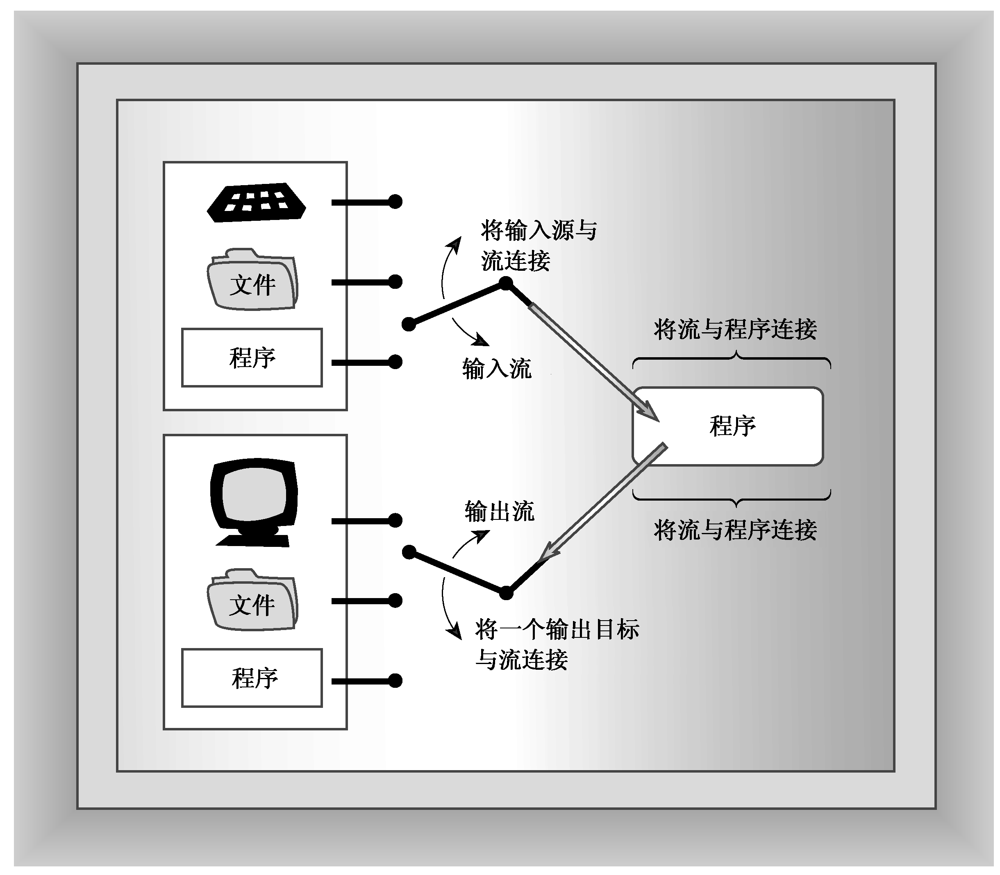
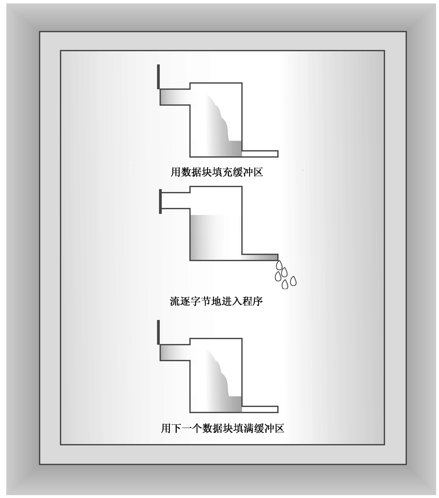

### 17.1.1　流和缓冲区

C++程序把输入和输出看作字节流。输入时，程序从输入流中抽取字节；输出时，程序将字节插入到输出流中。对于面向文本的程序，每个字节代表一个字符，更通俗地说，字节可以构成字符或数值数据的二进制表示。输入流中的字节可能来自键盘，也可能来自存储设备（如硬盘）或其他程序。同样，输出流中的字节可以流向屏幕、打印机、存储设备或其他程序。流充当了程序和流源或流目标之间的桥梁。这使得C++程序可以以相同的方式对待来自键盘的输入和来自文件的输入。C++程序只是检查字节流，而不需要知道字节来自何方。同理，通过使用流，C++程序处理输出的方式将独立于其去向。因此管理输入包含两步：

+ 将流与输入去向的程序关联起来。
+ 将流与文件连接起来。

换句话说，输入流需要两个连接，每端各一个。文件端部连接提供了流的来源，程序端连接将流的流出部分转储到程序中（文件端连接可以是文件，也可以是设备，如键盘）。同样，对输出的管理包括将输出流连接到程序以及将输出目标与流关联起来。这就像将字节（而不是水）引入到水管中（参见图17.1）。

<b class="my_markdown">图17.1　C++输入和输出</b>

通常，通过使用缓冲区可以更高效地处理输入和输出。缓冲区是用作中介的内存块，它是将信息从设备传输到程序或从程序传输给设备的临时存储工具。通常，像磁盘驱动器这样的设备以512字节（或更多）的块为单位来传输信息，而程序通常每次只能处理一个字节的信息。缓冲区帮助匹配这两种不同的信息传输速率。例如，假设程序要计算记录在硬盘文件中的金额。程序可以从文件中读取一个字符，处理它，再从文件中读取下一个字符，再处理，依此类推。从磁盘文件中每次读取一个字符需要大量的硬件活动，速度非常慢。缓冲方法则从磁盘上读取大量信息，将这些信息存储在缓冲区中，然后每次从缓冲区里读取一个字节。因为从内存中读取单个字节的速度比从硬盘上读取快很多，所以这种方法更快，也更方便。当然，到达缓冲区尾部后，程序将从磁盘上读取另一块数据。这种原理与水库在暴风雨中收集几兆加仑流量的水，然后以比较文明的速度给您家里供水是一样的（见图17.2）。输出时，程序首先填满缓冲区，然后把整块数据传输给硬盘，并清空缓冲区，以备下一批输出使用。这被称为刷新缓冲区（flushing the buffer）。

<b class="my_markdown">图17.2　有缓冲区的流</b>

键盘输入每次提供一个字符，因此在这种情况下，程序无需缓冲区来帮助匹配不同的数据传输速率。然而，对键盘输入进行缓冲可以让用户在将输入传输给程序之前返回并更正。C++程序通常在用户按下回车键时刷新输入缓冲区。这是为什么本书的例子没有一开始就处理输入，而是等到用户按下回车键后再处理的原因。对于屏幕输出，C++程序通常在用户发送换行符时刷新输出缓冲区。程序也可能会在其他情况下刷新输入，例如输入即将到来时，这取决于实现。也就是说，当程序到达输入语句时，它将刷新输出缓冲区中当前所有的输出。与ANSI C一致的C++实现是这样工作的。

