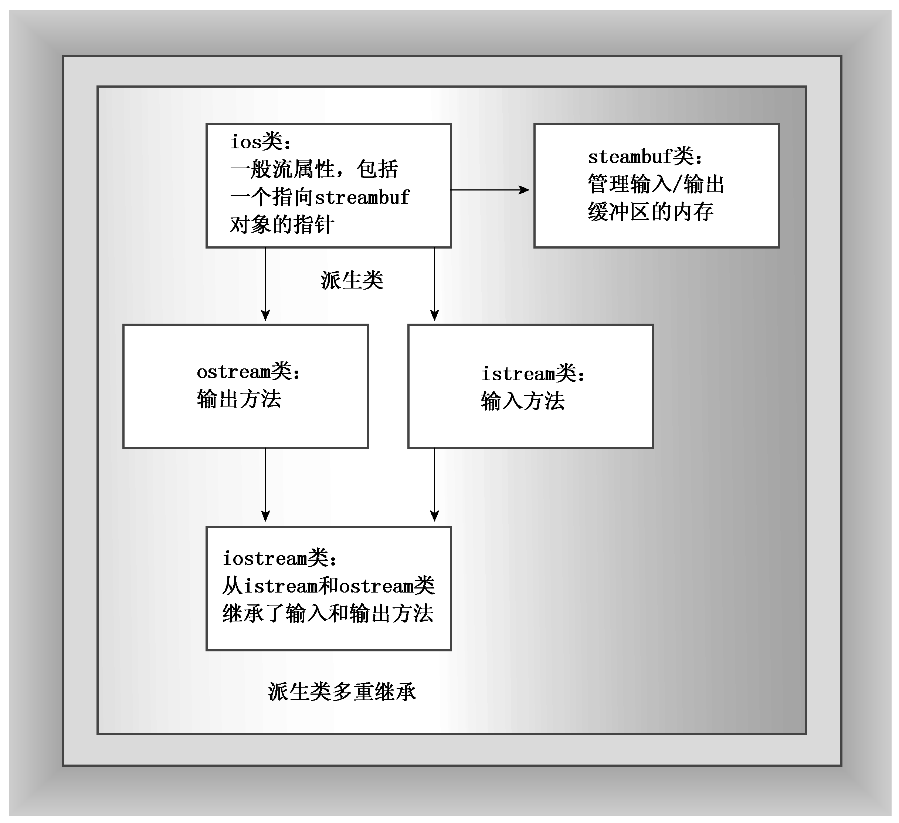

### 17.1.2　流、缓冲区和iostream文件

管理流和缓冲区的工作有点复杂，但iostream（以前为iostream.h）文件中包含一些专门设计用来实现、管理流和缓冲区的类。C++98版本C++ I/O定义了一些类模板，以支持char和wchar_t数据；C++11添加了char16_t和char32_t具体化。通过使用typedef工具，C++使得这些模板char具体化能够模仿传统的非模板I/O实现。下面是其中的一些类（见图17.3）：


<center class="my_markdown"><b class="my_markdown">图17.3　一些I/O类</b></center>

+ streambuf类为缓冲区提供了内存，并提供了用于填充缓冲区、访问缓冲区内容、刷新缓冲区和管理缓冲区内存的类方法；
+ ios_base类表示流的一般特征，如是否可读取、是二进制流还是文本流等；
+ ios类基于ios_base，其中包括了一个指向streambuf对象的指针成员；
+ ostream类是从ios类派生而来的，提供了输出方法；
+ istream类也是从ios类派生而来的，提供了输入方法；
+ iostream类是基于istream和ostream类的，因此继承了输入方法和输出方法。

要使用这些工具，必须使用适当的类对象。例如，使用ostream对象（如cout）来处理输出。创建这样的对象将打开一个流，自动创建缓冲区，并将其与流关联起来，同时使得能够使用类成员函数。


**重定义I/O**

ISO/ANSI标准C++98对I/O作了两方面的修订。首先是从ostream.h到ostream的变化，用ostream将类放到std名称空间中。其次，I/O类被重新编写。为成为国际语言，C++必须能够处理需要16位的国际字符集或更宽的字符类型。因此，该语言在传统的8位char（“窄”）类型的基础上添加了wchar_t（“宽”）字符类型；而C++11添加了类型char16_t和char32_t。每种类型都需要有自己的I/O工具。标准委员会并没有开发两套（现在为4套）独立的类，而是开发了1套I/O类模板，其中包括basic_istream<charT，traits<charT>>和basic_ostream<charT，traits<charT>>。traits<charT>模板是一个模板类，为字符类型定义了具体特性，如如何比较字符是否相等以及字符的EOF值等。该C++11标准提供了I/O的char和wchar_t具体化。例如，istream和ostream都是char具体化的typedef。同样，wistream和wostream都是wchar_t具体化。例如，wcout对象用于输出宽字符流。头文件ostream中包含了这些定义。

ios基类中的一些独立于类型的信息被移动到新的ios_base类中，这包括各种格式化常量，例如ios::fixed（现在为ios_base::fixed）。另外，ios_base还包含了一些老式ios中没有的选项。


C++的iostream类库管理了很多细节。例如，在程序中包含iostream文件将自动创建8个流对象（4个用于窄字符流，4个用于宽字符流）。

+ cin对象对应于标准输入流。在默认情况下，这个流被关联到标准输入设备（通常为键盘）。wcin对象与此类似，但处理的是wchar_t类型。
+ cout对象与标准输出流相对应。在默认情况下，这个流被关联到标准输出设备（通常为显示器）。wcout对象与此类似，但处理的是wchar_t类型。
+ cerr对象与标准错误流相对应，可用于显示错误消息。在默认情况下，这个流被关联到标准输出设备（通常为显示器）。这个流没有被缓冲，这意味着信息将被直接发送给屏幕，而不会等到缓冲区填满或新的换行符。wcerr对象与此类似，但处理的是wchar_t类型。
+ clog对象也对应着标准错误流。在默认情况下，这个流被关联到标准输出设备（通常为显示器）。这个流被缓冲。wclog对象与此类似，但处理的是wchar_t类型。
+ 对象代表流——这意味着什么呢？当iostream文件为程序声明一个cout对象时，该对象将包含存储了与输出有关的信息的数据成员，如显示数据时使用的字段宽度、小数位数、显示整数时采用的计数方法以及描述用来处理输出流的缓冲区的streambuf对象的地址。下面的语句通过指向的streambuf对象将字符串“Bjarna free”中的字符放到cout管理的缓冲区中：

```css
cout << "Bjarne free";
```

ostream类定义了上述语句中使用的operator<<()函数，ostream类还支持cout数据成员以及其他大量的类方法（如本章稍后将讨论的那些方法）。另外，C++注意到，来自缓冲区的输出被导引到标准输出（通常是显示器，由操作系统提供）。总之，流的一端与程序相连，另一端与标准输出相连，cout对象凭借streambuf对象的帮助，管理着流中的字节流。

