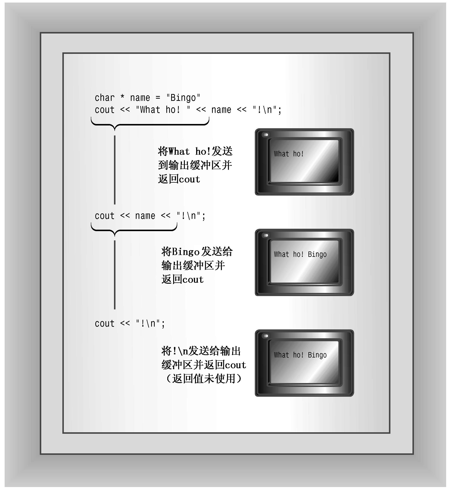

### 17.2.2　其他ostream方法

除了各种operator<<()函数外，ostream类还提供了put()方法和write()方法，前者用于显示字符，后者用于显示字符串。

最初，put()方法的原型如下：

```css
ostream & put(char);
```

当前标准与此相同，但被模板化，以适用于wchar_t。可以用类方法表示法来调用它：

```css
cout.put('W'); // display the W character
```

其中，cout是调用方法的对象，put()是类成员函数。和<<运算符函数一样，该函数也返回一个指向调用对象的引用，因此可以用它将拼接输出：

```css
cout.put('I').put('t'); // displaying It with two put() calls
```

函数调用cout.put('I')返回cout，cout然后被用作put('t')调用的调用对象。

在原型合适的情况下，可以将数值型参数（如int）用于put()，让函数原型自动将参数转换为正确char值。例如，可以这样做：

```css
cout.put(65);    // display the A character
cout.put(66.3);  // display the B character
```


<center class="my_markdown"><b class="my_markdown">图17.4　拼接输出</b></center>

第一条语句将int值65转换为一个char值，然后显示ASCII码为65的字符。同样，第二条语句将double值66.3转换为char值66，并显示对应的字符。

这种行为在C++ 2.0之前可派上用场。在这些版本中，C++语言用int值表示字符常量。因此，下面的语句将'W'解释为一个int值，因此将其作为整数87（即该字符的ASCII值）显示出来：

```css
cout << 'W';
```

然而，下面这条语句能够正常工作：

```css
cout.put('W');
```

因为当前的C++将char常量表示为char类型，因此现在可以使用上述任何一种方法。

一些老式编译器错误地为char、unsigned char和signed char 3种参数类型重载了put()。这使得将int参数用于put()时具有二义性，因为int可被转换为这3种类型中的任何一种。

write()方法显示整个字符串，其模板原型如下：

```css
basic_ostream<charT,traits>& write(const char_type* s, streamsize n);
```

write()的第一个参数提供了要显示的字符串的地址，第二个参数指出要显示多少个字符。使用cout调用write()时，将调用char具体化，因此返回类型为ostream &。程序清单17.1演示了write()方法是如何工作的。

程序清单17.1　write.cpp

```css
// write.cpp -- using cout.write()
#include <iostream>
#include <cstring> // or else string.h
int main()
{
    using std::cout;
    using std::endl;
    const char * state1 = "Florida";
    const char * state2 = "Kansas";
    const char * state3 = "Euphoria";
    int len = std::strlen(state2);
    cout << "Increasing loop index:\n";
    int i;
    for (i = 1; i <= len; i++)
    {
        cout.write(state2,i);
        cout << endl;
    }
// concatenate output
    cout << "Decreasing loop index:\n";
    for (i = len; i > 0; i--)
        cout.write(state2,i) << endl;
// exceed string length
    cout << "Exceeding string length:\n";
    cout.write(state2, len + 5) << endl;
    return 0;
}
```

有些编译器可能指出该程序定义了数组state1和state3但没有使用它们。这不是什么问题，因为这两个数组只是用于提供数组state2前面和后面的数据，以便您知道程序错误地存取state2时发生的情况。下面是程序清单17.1中程序的输出：

```css
Increasing loop index:
K
Ka
Kan
Kans
Kansa
Kansas
Decreasing loop index:
Kansas
Kansa
Kans
Kan
Ka
K
Exceeding string length:
Kansas Euph
```

注意，cout.write()调用返回cout对象。这是因为write()方法返回一个指向调用它的对象的引用，这里调用它的对象是cout。

这使得可以将输出拼接起来，因为cout.write()将被其返回值cout替换：

```css
cout.write(state2,i) << endl;
```

还需要注意的是，write()方法并不会在遇到空字符时自动停止打印字符，而只是打印指定数目的字符，即使超出了字符串的边界！在这个例子中，在字符串“Kansas”的前后声明了另外两个字符串，以便相邻的内存包含数据。编译器在内存中存储数据的顺序以及调整内存的方式各不相同。例如，“Kansas”占用6个字节，而该编译器使用4个字节的倍数调整字符串，因此“Kansas”被填充成占用8个字节。由于编译器之间的差别，因此输出的最后一行可能不同。

write()方法也可用于数值数据，您可以将数字的地址强制转换为char *，然后传递给它：

```css
long val = 560031841;
cout.write( (char *) &val, sizeof (long));
```

这不会将数字转换为相应的字符，而是传输内存中存储的位表示。例如，4字节的long值（如560031841）将作为4个独立的字节被传输。输出设备（如显示器）将把每个字节作为ASCII码进行解释。因此在屏幕上，560031841将被显示为4个字符的组合，这很可能是乱码（也可能不是，请试试看）。然而，write()确实为将数值数据存储在文件中提供了一种简洁、准确的方式，这将在本章后面进行介绍。

