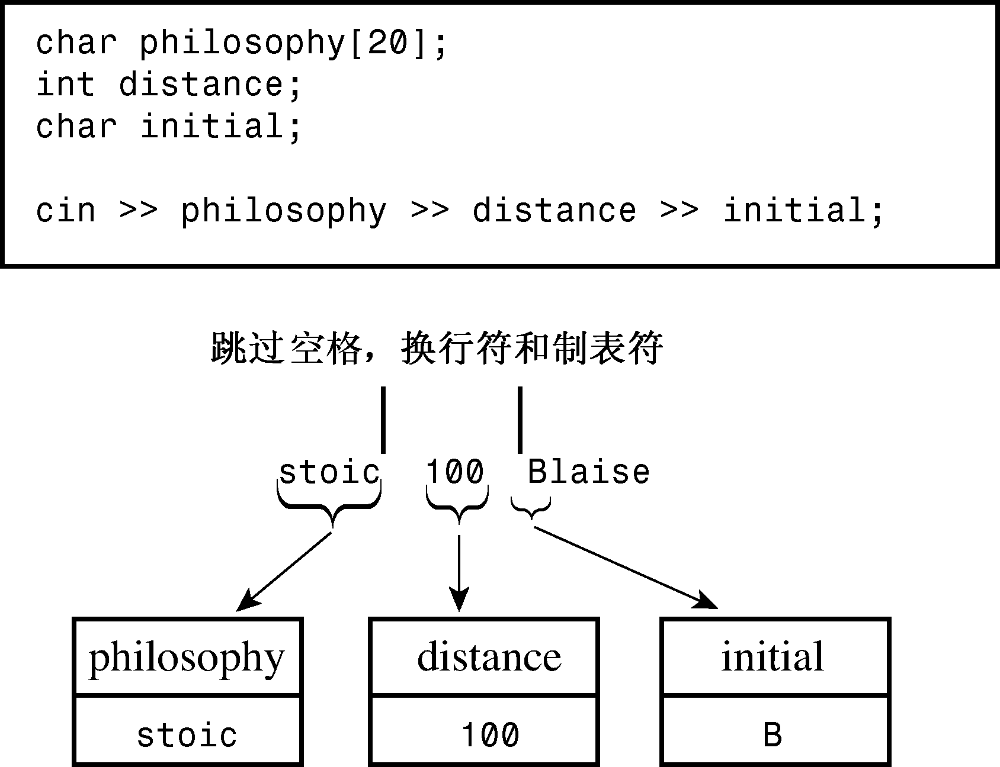

### 17.3.1　cin>>如何检查输入

不同版本的抽取运算符查看输入流的方法是相同的。它们跳过空白（空格、换行符和制表符），直到遇到非空白字符。即使对于单字符模式（参数类型为char、unsigned char或signed char），情况也是如此，但对于C语言的字符输入函数，情况并非如此（参见图17.5）。在单字符模式下，>>运算符将读取该字符，将它放置到指定的位置。在其他模式下，>>运算符将读取一个指定类型的数据。也就是说，它读取从非空白字符开始，到与目标类型不匹配的第一个字符之间的全部内容。


<center class="my_markdown"><b class="my_markdown">图17.5　cin>>跳过空白</b></center>

例如，对于下面的代码：

```css
int elevation;
cin >> elevation;
```

假设键入下面的字符：

```css
-123Z
```

运算符将读取字符−、1、2和3，因为它们都是整数的有效部分。但Z字符不是有效字符，因此输入中最后一个可接受的字符是3。Z将留在输入流中，下一个cin语句将从这里开始读取。与此同时，运算符将字符序列−123转换为一个整数值，并将它赋给elevation。

输入有时可能没有满足程序的期望。例如，假设输入的是Zcar，而不是−123Z。在这种情况下，抽取运算符将不会修改elevation的值，并返回0（如果istream对象的错误状态被设置，if或while语句将判定该对象为false，这将在本章后面做更详细的介绍）。返回值false让程序能够检查输入是否满足要求，如程序清单17.11所示。

程序清单17.11　check_it.cpp

```css
// check_it.cpp -- checking for valid input
#include <iostream>
int main()
{
    using namespace std;
    cout << "Enter numbers: ";
    int sum = 0;
    int input;
    while (cin >> input)
    {
        sum += input;
    }
    cout << "Last value entered = " << input << endl;
    cout << "Sum = " << sum << endl;
    return 0;
}
```

下面是输入流中包含不适当输入（−123Z）时程序清单17.11中程序的输出：

```css
Enter numbers: 200
10 -50 -123Z 60
Last value entered = -123
Sum = 37
```

由于输入被缓冲。因此通过键盘输入的第二行在用户按下回车键之前，不会被发送给程序。然而，循环在字符Z处停止了对输入的处理，因此它不与任何一种浮点格式匹配。输入与预期格式不匹配反过来将导致表达式cin>>input的结果为false，因此while循环被终止。

