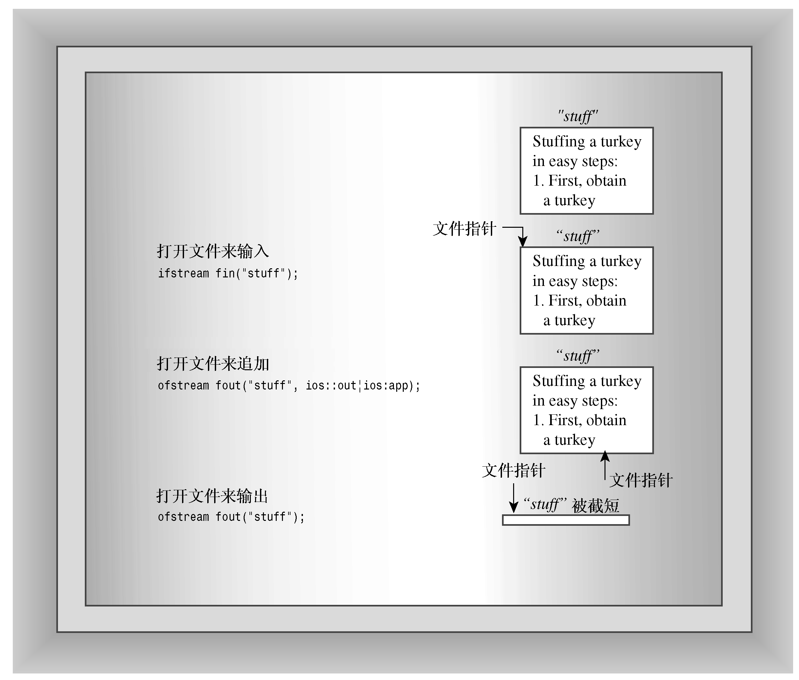
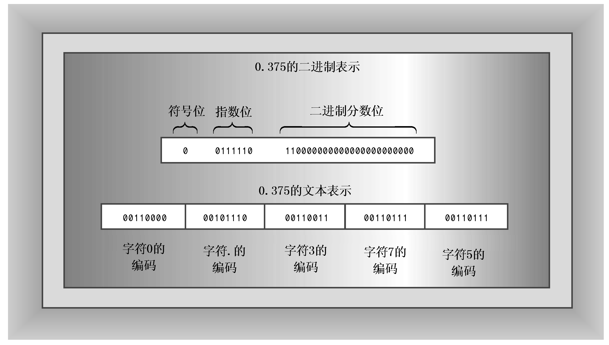

### 17.4.5　文件模式

文件模式描述的是文件将被如何使用：读、写、追加等。将流与文件关联时（无论是使用文件名初始化文件流对象，还是使用open()方法），都可以提供指定文件模式的第二个参数：

```css
ifstream fin("banjo", mode1); // constructor with mode argument
ofstream fout();
fout.open("harp", mode2);     // open() with mode arguments
```

ios_base类定义了一个openmode类型，用于表示模式；与fmtflags和iostate类型一样，它也是一种bitmask类型（以前，其类型为int）。可以选择ios_base类中定义的多个常量来指定模式，表17.7列出了这些常量及其含义。C++文件I/O作了一些改动，以便与ANSI C文件I/O兼容。

<center class="my_markdown"><b class="my_markdown">表17.7　文件模式常量</b></center>

| 常　量 | 含　义 |
| :-----  | :-----  | :-----  | :-----  |
| ios_base::in | 打开文件，以便读取 |
| ios_base::out | 打开文件，以便写入 |
| ios_base::ate | 打开文件，并移到文件尾 |
| ios_base::app | 追加到文件尾 |
| ios_base::trunc | 如果文件存在，则截短文件 |
| ios_base::binary | 二进制文件 |

如果ifstream和ofstream构造函数以及open()方法都接受两个参数，为什么前面的例子只使用一个参数就可以调用它们呢？您可能猜到了，这些类成员函数的原型为第二个参数（文件模式参数）提供了默认值。例如，ifstream open()方法和构造函数用ios_base::in（打开文件以读取）作为模式参数的默认值，而ofstream open()方法和构造函数用ios_base::out | ios_base::trunc（打开文件，以读取并截短文件）作为默认值。位运算符OR（1）用于将两个位值合并成一个可用于设置两个位的值。fstream类不提供默认的模式值，因此在创建这种类的对象时，必须显式地提供模式。

注意，ios_base::trunc标记意味着打开已有的文件，以接收程序输出时将被截短；也就是说，其以前的内容将被删除。虽然这种行为极大地降低了耗尽磁盘空间的危险，但您也许能够想象到这样的情形，即不希望打开文件时将其内容删除。当然，C++提供了其他的选择。例如，如果要保留文件内容，并在文件尾添加（追加）新信息，则可以使用ios_base::app模式：

```css
ofstream fout("bagels", ios_base::out | ios_base::app);
```

上述代码也使用|运算符来合并模式，因此ios_base::out | ios_base::app意味着启用模式out和app（参见图17.6）。

老式C++实现之间可能有一些差异。例如，有些实现允许省略前一例子中的ios_base::out，有些则不允许。如果不使用默认模式，则最安全的方法是显式地提供所有的模式元素。有些编译器不支持表17.6中的所有选项，有些则提供了表中没有列出的其他选项。这些差异导致的后果之一是，可能必须对后面的例子作一些修改，使之能够在所用的系统中运行。好在C++标准提供了更高的统一性。


<center class="my_markdown"><b class="my_markdown">图17.6　一些文件打开模式</b></center>

标准C++根据ANSI C标准I/O定义了部分文件I/O。实现像下面这样的C++语句时：

```css
ifstream fin(filename, c++mode);
```

就像它使用了C的fopen()函数一样：

```css
fopen(filename, cmode);
```

其中，c++mode是一个openmode值，如ios_base::in；而cmode是相应的C模式字符串，如“r”。表17.8列出了C++模式和C模式的对应关系。注意，ios_base::out本身将导致文件被截短，但与ios_base::in一起使用时，不会导致文件被截短。没有列出的组合，如ios_base::in [vn] ios_base::trunc，将禁止文件被打开。is_open()方法用于检测这种故障。

<center class="my_markdown"><b class="my_markdown">表17.8　C++和C的文件打开模式</b></center>

| C++模式 | C模式 | 含　义 |
| :-----  | :-----  | :-----  | :-----  | :-----  |
| ios_base :: in | "r" | 打开以读取 |
| ios_base :: out | "w" | 等价于ios_base :: out | ios_base :: trunc |
| ios_base :: out | ios_base :: trunc | "w" | 打开以写入，如果已经存在，则截短文件 |
| ios_base :: out | ios_base :: app | "a" | 打开以写入，只追加 |
| ios_base :: in | ios_base :: out | "r+" | 打开以读写，在文件允许的位置写入 |
| ios_base :: in | ios_base :: out | ios_base::trunc | "w+" | 打开以读写，如果已经存在，则首先截短文件 |
| c++mode | ios_base :: binary | "cmodeb" | 以C++mode（或相应的cmode）和二进制模式打开；例如，ios_base :: in | ios_base :: binary成为“rb” |
| c++mode | ios_base :: ate | "cmode" | 以指定的模式打开，并移到文件尾。C使用一个独立的函数调用，而不是模式编码。例如，ios_base :: in | ios_base :: ate被转换为“r”模式和C函数调用fseek(file, 0, SEEK_END) |

注意，ios_base::ate和ios_base::app都将文件指针指向打开的文件尾。二者的区别在于，ios_base::app模式只允许将数据添加到文件尾，而ios_base::ate模式将指针放到文件尾。

显然，各种模式的组合很多，我们将介绍几种有代表性的组合。

#### 1．追加文件

来看一个在文件尾追加数据的程序。该程序维护一个存储来客清单的文件。该程序首先显示文件当前的内容（如果有话）。在尝试打开文件后，它使用is_open()方法来检查该文件是否存在。接下来，程序以ios_base::app模式打开文件，进行输出。然后，它请求用户从键盘输入，并将其添加到文件中。最后，程序显示修订后的文件内容。程序清单17.18演示了如何实现这些目标。请注意程序是如何使用is_open()方法来检测文件是否被成功打开的。

> **注意：**
> 在早期，文件I/O可能是C++最不标准的部分，很多老式编译器都不遵守当前的标准。例如，有些编译器使用诸如nocreate等模式，而这些模式不是当前标准的组成部分。另外，只有一部分编译器要求在第二次打开同一个文件进行读取之前调用fin.clear()。

程序清单17.18　append.cpp

```css
// append.cpp -- appending information to a file
#include <iostream>
#include <fstream>
#include <string>
#include <cstdlib> // (for exit()
const char * file = "guests.txt";
int main()
{
    using namespace std;
    char ch;
// show initial contents
    ifstream fin;
    fin.open(file);
    if (fin.is_open())
    {
        cout << "Here are the current contents of the "
             << file << " file:\n";
        while (fin.get(ch))
            cout << ch;
        fin.close();
    }
// add new names
    ofstream fout(file, ios::out | ios::app);
    if (!fout.is_open())
    {
        cerr << "Can't open " << file << " file for output.\n";
        exit(EXIT_FAILURE);
    }
    cout << "Enter guest names (enter a blank line to quit):\n";
    string name;
    while (getline(cin,name) && name.size() > 0)
    {
        fout << name << endl;
    }
    fout.close();
// show revised file
    fin.clear(); // not necessary for some compilers
    fin.open(file);
    if (fin.is_open())
    {
        cout << "Here are the new contents of the "
             << file << " file:\n";
        while (fin.get(ch))
            cout << ch;
        fin.close();
    }
    cout << "Done.\n";
    return 0;
}
```

下面是第一次运行程序清单17.18中程序的情况：

```css
Enter guest names (enter a blank line to quit):
Genghis Kant
Hank Attila
Charles Bigg
Here are the new contents of the guests.txt file:
Genghis Kant
Hank Attila
Charles Bigg
Done.
```

此时，guests.txt文件还没有创建，因此程序不能预览该文件。

但第二次运行该程序时，guests.txt文件已经存在，因此程序将预览该文件。另外，新数据被追加到旧文件的后面，而不是取代它们。

```css
Here are the current contents of the guests.txt file:
Genghis Kant
Hank Attila
Charles Bigg
Enter guest names (enter a blank line to quit):
Greta Greppo
LaDonna Mobile
Fannie Mae
Here are the new contents of the guests.txt file:
Ghengis Kant
Hank Attila
Charles Bigg
Greta Greppo
LaDonna Mobile
Fannie Mae
Done.
```

可以用任何文本编辑器来读取guest.txt的内容，包括用来编写源代码的编辑器。

#### 2．二进制文件

将数据存储在文件中时，可以将其存储为文本格式或二进制格式。文本格式指的是将所有内容（甚至数字）都存储为文本。例如，以文本格式存储值−2.324216e+07时，将存储该数字包含的13个字符。这需要将浮点数的计算机内部表示转换为字符格式，这正是<<插入运算符完成的工作。另一方面，二进制格式指的是存储值的计算机内部表示。也就是说，计算机不是存储字符，而是存储这个值的64位double表示。对于字符来说，二进制表示与文本表示是一样的，即字符的ASCII码的二进制表示。对于数字来说，二进制表示与文本表示有很大的差别（参见图17.7）。


<center class="my_markdown"><b class="my_markdown">图17.7　浮点数的二进值表示和文本表示</b></center>

每种格式都有自己的优点。文本格式便于读取，可以使用编辑器或字处理器来读取和编辑文本文件，可以很方便地将文本文件从一个计算机系统传输到另一个计算机系统。二进制格式对于数字来说比较精确，因为它存储的是值的内部表示，因此不会有转换误差或舍入误差。以二进制格式保存数据的速度更快，因为不需要转换，并可以大块地存储数据。二进制格式通常占用的空间较小，这取决于数据的特征。然而，如果另一个系统使用另一种内部表示，则可能无法将数据传输给该系统。同一系统上不同的编译器也可能使用不同的内部结构布局表示。在这种情况下，则必须编写一个将一种数据转换成另一种的程序。

来看一个更具体的例子。考虑下面的结构定义和声明：

```css
const int LIM = 20;
struct planet
{
    char name[LIM];    // name of planet
    double population; // its population
    double g;          // its acceleration of gravity
};
planet pl;
```

要将结构pl的内容以文本格式保存，可以这样做：

```css
ofstream fout("planets.dat", ios_base:: out | ios_base::app);
fout << pl.name << " " << pl.population << " " << pl.g << "\n";
```

必须使用成员运算符显式地提供每个结构成员，还必须将相邻的数据分隔开，以便区分。如果结构有30个成员，则这项工作将很乏味。

要用二进制格式存储相同的信息，可以这样做：

```css
ofstream fout("planets.dat",
              ios_base:: out | ios_base::app | ios_base::binary);
fout.write( (char *) &pl, sizeof pl);
```

上述代码使用计算机的内部数据表示，将整个结构作为一个整体保存。不能将该文件作为文本读取，但与文本相比，信息的保存更为紧凑、精确。它确实更便于键入代码。这种方法做了两个修改：

+ 使用二进制文件模式；
+ 使用成员函数write()。

下面更详细的介绍这两项修改。

有些系统（如Windows）支持两种文件格式：文本格式和二进制格式。如果要用二进制格式保存数据，应使用二进制文件格式。在C++中，可以将文件模式设置为ios_base::binary常量来完成。要知道为什么在Windows系统上需要完成这样的任务，请参见后面的旁注“二进制文件和文本文件”。


**二进制文件和文本文件**

使用二进制文件模式时，程序将数据从内存传输给文件（反之亦然）时，将不会发生任何隐藏的转换，而默认的文本模式并非如此。例如，对于Windows文本文件，它们使用两个字符的组合（回车和换行）表示换行符；Macintosh文本文件使用回车来表示换行符；而UNIX和Linux文件使用换行（linefeed）来表示换行符。C++是从UNIX系统上发展而来的，因此也使用换行（linefeed）来表示换行符。为增加可移植性，Windows C++程序在写文本模式文件时，自动将C++换行符转换为回车和换行；Macintosh C++程序在写文件时，将换行符转换为回车。在读取文本文件时，这些程序将本地换行符转换为C++格式。对于二进制数据，文本格式会引起问题，因此double值中间的字节可能与换行符的ASCII码有相同的位模式。另外，在文件尾的检测方式也有区别。因此以二进制格式保存数据时，应使用二进制文件模式（UNIX系统只有一种文件模式，因此对于它来说，二进制模式和文本模式是一样的）。


要以二进制格式（而不是文本格式）存储数据，可以使用write()成员函数。前面说过，这种方法将内存中指定数目的字节复制到文件中。本章前面用它复制过文本，但它只逐字节地复制数据，而不进行任何转换。例如，如果将一个long变量的地址传递给它，并命令它复制4个字节，它将复制long值中的4个字节，而不会将它转换为文本。唯一不方便的地方是，必须将地址强制转换为指向char的指针。也可以用同样的方式来复制整个planet结构。要获得字节数，可以使用sizeof运算符：

```css
fout.write( (char *) &pl, sizeof pl);
```

这条语句导致程序前往pl结构的地址，并将开始的36个字节（sizeof pl表达式的值）复制到与fout相关联的文件中。

要使用文件恢复信息，请通过一个ifstream对象使用相应的read()方法：

```css
ifstream fin("planets.dat", ios_base::in | ios_base::binary);
fin.read((char *) &pl, sizeof pl);
```

这将从文件中复制sizeof pl个字节到pl结构中。同样的方法也适用于不使用虚函数的类。在这种情况下，只有数据成员被保存，而方法不会被保存。如果类有虚方法，则也将复制隐藏指针（该指针指向虚函数的指针表）。由于下一次运行程序时，虚函数表可能在不同的位置，因此将文件中的旧指针信息复制到对象中，将可能造成混乱（请参见“编程练习6”中的注意）。

> **提示：**
> read()和write()成员函数的功能是相反的。请用read()来恢复用write()写入的数据。

程序清单17.19使用这些方法来创建和读取二进制文件。从形式上看，该程序与程序清单17.18相似，但它使用的是write()和read()，而不是插入运算符和get()方法。另外，它还使用控制符来格式化屏幕输出。

> **注意：**
> 虽然二进制文件概念是ANSI C的组成部分，但一些C和C++实现并没有提供对二进制文件模式的支持。原因在于：有些系统只有一种文件类型，因此可以将二进制操作（如read()和write()）用于标准文件格式。因此，如果实现认为ios_base::binary是非法常量，只要删除它即可。如果实现不支持fixed和right控制符，则可以使用cout.setf（ios_base::fixed、ios_base::floatfield）和cout.setf（ios_base::right、ios_base::adjustfield）。另外，也可能必须用ios替换ios_base。其他编译器（特别是老式编译器）可能还有其他特征。

程序清单17.19　binary.cpp

```css
// binary.cpp -- binary file I/O
#include <iostream> // not required by most systems
#include <fstream>
#include <iomanip>
#include <cstdlib> // for exit()
inline void eatline() { while (std::cin.get() != '\n') continue; }
struct planet
{
    char name[20];     // name of planet
    double population; // its population
    double g;          // its acceleration of gravity
};
const char * file = "planets.dat";
int main()
{
    using namespace std;
    planet pl;
    cout << fixed << right;
// show initial contents
    ifstream fin;
    fin.open(file, ios_base::in |ios_base::binary); // binary file
    //NOTE: some systems don't accept the ios_base::binary mode
    if (fin.is_open())
    {
    cout << "Here are the current contents of the "
        << file << " file:\n";
    while (fin.read((char *) &pl, sizeof pl))
    {
        cout << setw(20) << pl.name << ": "
              << setprecision(0) << setw(12) << pl.population
              << setprecision(2) << setw(6) << pl.g << endl;
    }
    fin.close();
    }
// add new data
    ofstream fout(file,
             ios_base::out | ios_base::app | ios_base::binary);
    //NOTE: some systems don't accept the ios::binary mode
    if (!fout.is_open())
    {
        cerr << "Can't open " << file << " file for output:\n";
        exit(EXIT_FAILURE);
    }
    cout << "Enter planet name (enter a blank line to quit):\n";
    cin.get(pl.name, 20);
    while (pl.name[0] != '\0')
    {
        eatline();
        cout << "Enter planetary population: ";
        cin >> pl.population;
        cout << "Enter planet's acceleration of gravity: ";
        cin >> pl.g;
        eatline();
        fout.write((char *) &pl, sizeof pl);
        cout << "Enter planet name (enter a blank line "
                "to quit):\n";
        cin.get(pl.name, 20);
    }
    fout.close();
// show revised file
    fin.clear(); // not required for some implementations, but won't hurt
    fin.open(file, ios_base::in | ios_base::binary);
    if (fin.is_open())
    {
        cout << "Here are the new contents of the "
             << file << " file:\n";
        while (fin.read((char *) &pl, sizeof pl))
        {
            cout << setw(20) << pl.name << ": "
                 << setprecision(0) << setw(12) << pl.population
                 << setprecision(2) << setw(6) << pl.g << endl;
        }
        fin.close();
    }
    cout << "Done.\n";
    return 0;
}
```

下面是首次运行程序清单17.19中程序时的情况：

```css
Enter planet name (enter a blank line to quit):
Earth
Enter planetary population: 6928198253
Enter planet's acceleration of gravity: 9.81
Enter planet name (enter a blank line to quit):
Here are the new contents of the planets.dat file:
               Earth:   6928198253  9.81
Done.
```

下面是再次运行该程序时的情况：

```css
Here are the current contents of the planets.dat file:
               Earth:   6928198253  9.81
Enter planet name (enter a blank line to quit):
Jenny's World
Enter planetary population: 32155648
Enter planet's acceleration of gravity: 8.93
Enter planet name (enter a blank line to quit):
Here are the new contents of the planets.dat file:
               Earth:   6928198253  9.81
       Jenny's World:     32155648  8.93
Done.
```

看到该程序的主要特征后，下面再次讨论前面提到的几点。程序在读取行星的g值后，将使用下面的代码（以内嵌eatline()函数的形式）：

```css
while (std::cin.get() != '\n') continue;
```

这将读取并丢弃输入中换行符之前的内容。考虑循环中的下一条输入语句：

```css
cin.get(pl.name, 20);
```

如果保留换行符，该语句将换行符作为空行读取，然后终止循环。

您可能会问，如果该程序是否可以使用string对象而不是字符数组来表示planet结构的name成员？答案是否定的，至少在不对设计做重大修改的情况下是否定的。问题在于，string对象本身实际上并没有包含字符串，而是包含一个指向其中存储了字符串的内存单元的指针。因此，将结构复制到文件中时，复制的将不是字符串数据，而是字符串的存储地址。当您再次运行该程序时，该地址将毫无意义。

