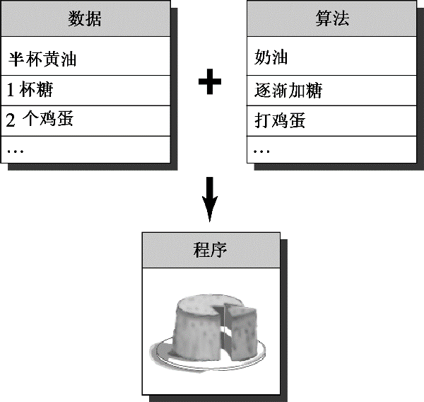

### 1.2.2　C语言编程原理

由于C++在C语言的基础上移植了新的编程理念，因此我们首先来看一看C所遵循的旧的理念。一般来说，计算机语言要处理两个概念——数据和算法。数据是程序使用和处理的信息，而算法是程序使用的方法（参见图1.1）。C语言与当前最主流的语言一样，在最初面世时也是过程性（procedural）语言，这意味着它强调的是编程的算法方面。从概念上说，过程化编程首先要确定计算机应采取的操作，然后使用编程语言来实现这些操作。程序命令计算机按一系列流程生成特定的结果，就像菜谱指定了厨师做蛋糕时应遵循的一系列步骤一样。

<b class="my_markdown">图1.1　数据+算法=程序</b>

随着程序规模的扩大，早期的程序语言（如FORTRAN和BASIC）都会遇到组织方面的问题。例如，程序经常使用分支语句，根据某种测试的结果，执行一组或另一组指令。很多旧式程序的执行路径很混乱（被称为“意大利面条式编程”），几乎不可能通过阅读程序来理解它，修改这种程序简直是一场灾难。为了解决这种问题，计算机科学家开发了一种更有序的编程方法——结构化编程（structured programming）。C语言具有使用这种方法的特性。例如，结构化编程将分支（决定接下来应执行哪个指令）限制为一小组行为良好的结构。C语言的词汇表中就包含了这些结构（for循环、while循环、do while循环和if else语句）。

另一个新原则是自顶向下（top-down）的设计。在C语言中，其理念是将大型程序分解成小型、便于管理的任务。如果其中的一项任务仍然过大，则将它分解为更小的任务。这一过程将一直持续下去，直到将程序划分为小型的、易于编写的模块（整理一下书房。先整理桌子、桌面、档案柜，然后整理书架。好，先从桌子开始，然后整理每个抽屉，从中间的那个抽屉开始整理。也许我都可以管理这项任务）。C语言的设计有助于使用这种方法，它鼓励程序员开发程序单元（函数）来表示各个任务模块。如上所述，结构化编程技术反映了过程性编程的思想，根据执行的操作来构思一个程序。

