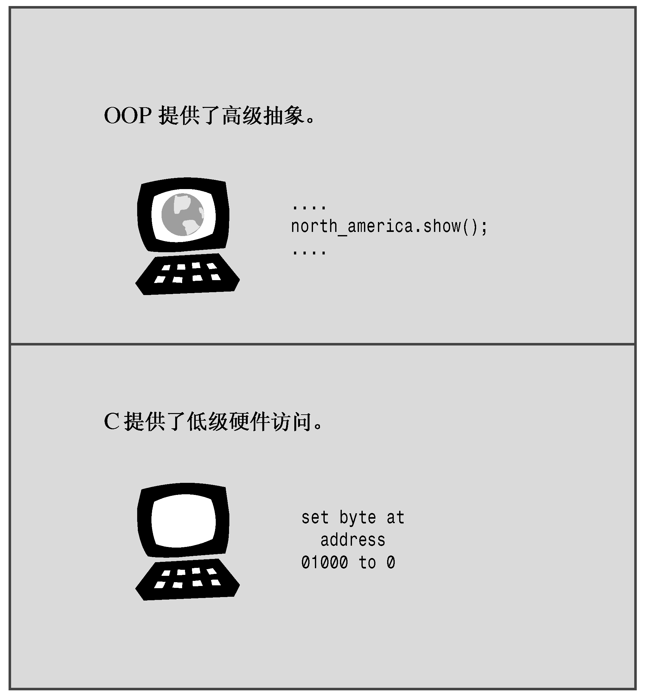

### 1.2.5　C++的起源

与C语言一样，C++也是在贝尔实验室诞生的，Bjarne Stroustrup于20世纪80年代在这里开发出了这种语言。用他自己的话来说，“C++主要是为了我的朋友和我不必再使用汇编语言、C语言或其他现代高级语言来编程而设计的。它的主要功能是可以更方便地编写出好程序，让每个程序员更加快乐”。

**Bjarne Stroustrup的主页**

Bjarne Stroustrup设计并实现了C++编程语言，他是权威参考手册《The C++ Programming Language》和《The design and Evolution of C++》的作者。读者应将他位于AT&T Labs Research上的个人网站作为首选的C++书签：

```css
http://www.research.att.com/-bs/
```

该网站包括了C++语言有趣的发展历史、Bjarne的传记材料和C++ FAQ。Bjarne被问得最多的问题是：Bjarne Stroustrup应该如何读。您可以访问Stroustrup的网站，阅读FAQ部分并下载.WAV文件，亲自听一听。

Stroustrup比较关心的是让C++更有用，而不是实施特定的编程原理或风格。在确定C++语言特性方面，真正的编程需要比纯粹的原理更重要。Stroustrup之所以在C的基础上创建C++，是因为C语言简洁、适合系统编程、使用广泛且与UNIX操作系统联系紧密。C++的OOP方面是受到了计算机模拟语言Simula67的启发。Stroustrup加入了OOP特性和对C的泛型编程支持，但并没有对C的组件作很大的改动。因此，C++是C语言的超集，这意味着任何有效的C程序都是有效的C++程序。它们之间有些细微的差异，但无足轻重。C++程序可以使用已有的C软件库。库是编程模块的集合，可以从程序中调用它们。库对很多常见的编程问题提供了可靠的解决方法，因此能节省程序员大量的时间和工作量。这也有助于C++的广泛传播。


<center class="my_markdown"><b class="my_markdown">图1.2　C++的二重性</b></center>

名称C++来自C语言中的递增运算符++，该运算符将变量加1。名称C++表明，它是C的扩充版本。

计算机程序将实际问题转换为计算机能够执行的一系列操作。OOP部分赋予了C++语言将问题所涉及的概念联系起来的能力，C部分则赋予了C++语言紧密联系硬件的能力（参见图1.2），这种能力上的结合成就了C++的广泛传播。从程序的一个方面转到另一个方面时，思维方式也要跟着转换（确实，有些OOP正统派把为C添加OOP特性看作是为猪插上翅膀，虽然这是头瘦骨嶙峋、非常能干的猪）。另外，C++是在C语言的基础上添加OOP特性，您可以忽略C++的面向对象特性，但将错过很多有用的东西。

在C++获得一定程度的成功后，Stroustrup才添加了模板，这使得进行泛型编程成为可能。在模板特性被使用和改进后，人们才逐渐认识到，它们和OOP同样重要——甚至比OOP还重要，但有些人不这么认为。C++融合了OOP、泛型编程和传统的过程性方法，这表明C++强调的是实用价值，而不是意识形态方法，这也是该语言获得成功的原因之一。

