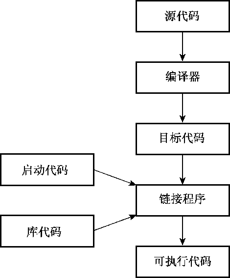

### 1.4　程序创建的技巧

假设您编写了一个C++程序。如何让它运行起来呢？具体的步骤取决于计算机环境和使用的C++编译器，但大体如下（参见图1.3）。


<center class="my_markdown"><b class="my_markdown">图1.3　编程步骤</b></center>

1．使用文本编辑器编写程序，并将其保存到文件中，这个文件就是程序的源代码。

2．编译源代码。这意味着运行一个程序，将源代码翻译为主机使用的内部语言——机器语言。包含了翻译后的程序的文件就是程序的目标代码（object code）。

3．将目标代码与其他代码链接起来。例如，C++程序通常使用库。C++库包含一系列计算机例程（被称为函数）的目标代码，这些函数可以执行诸如在屏幕上显示信息或计算平方根等任务。链接指的是将目标代码同使用的函数的目标代码以及一些标准的启动代码（startup code）组合起来，生成程序的运行阶段版本。包含该最终产品的文件被称为可执行代码。

本书将不断使用术语源代码，请记住该术语。

本书的程序都是通用的，可在任何支持C++98的系统中运行；但第18章的程序要求系统支持C++11。编写本书期间，有些编译器要求您使用特定的标记，让其支持部分C++11特性。例如，从4.3版起，g++要求您编译源代码文件时使用标记-std=c++0x：

```css
g++ -std=c++11 use_auto.cpp
```

创建程序的步骤可能各不相同，下面深入介绍这些步骤。

