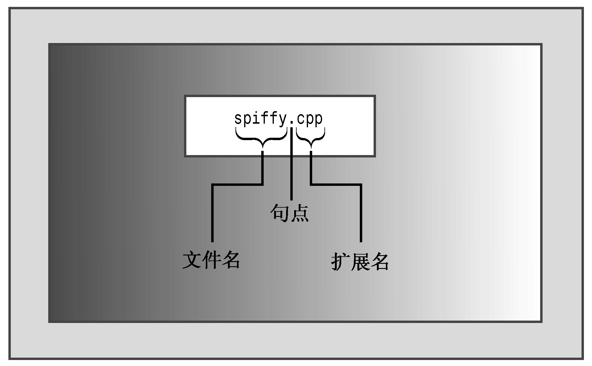

### 1.4.1　创建源代码文件

本书余下的篇幅讨论源代码文件中的内容；本节讨论创建源代码文件的技巧。有些C++实现（如Microsoft Visual C++、Embarcadero C++ Builder、Apple Xcode、Open Watcom C++、Digital Mars C++和Freescale CodeWarrior）提供了集成开发环境（integrated development environments，IDE），让您能够在主程序中管理程序开发的所有步骤，包括编辑。有些实现（如用于UNIX和Linux的GNU C++、用于AIX的IBM XL C/C++、Embarcadero分发的Borland 5.5免费版本以及Digital Mars编译器）只能处理编译和链接阶段，要求在系统命令行输入命令。在这种情况下，可以使用任何文本编辑器来创建和修改源代码。例如，在UNIX系统上，可以使用vi、ed、ex或emacs；在以命令提示符模式运行的Windows系统上，可以使用edlin、edit或任何程序编辑器。如果将文件保存为标准ASCII文本文件（而不是特殊的字处理器格式），甚至可以使用字处理器。另外，还可能有IDE选项，让您能够使用这些命令行编译器。

给源文件命名时，必须使用正确的后缀，将文件标识为C++文件。这不仅告诉您该文件是C++源代码，还将这种信息告知编译器（如果UNIX编译器显示信息“bad magic number”，则表明后缀不正确）。后缀由一个句点和一个或多个字符组成，这些字符被称作扩展名（参见图1.4）。

<b class="my_markdown">图1.4　源文件的扩展名</b>

使用什么扩展名取决于C++实现，表1.1列出了一些常用的扩展名。例如，spiffy.C是有效的UNIX C++源代码文件名。注意，UNIX区分大小写，这意味着应使用大写的C字符。实际上，小写c扩展名也有效，但标准C才使用小写的c。因此，为避免在UNIX系统上发生混淆，对于C程序应使用c，而对于C++程序则请使用C。如果不在乎多输入一两个字符，则对于某些UNIX系统，也可以使用扩展名cc和cxx。DOS比UNIX稍微简单一点，不区分大小写，因此DOS实现使用额外的字母（如表1.1所示）来区别C和C++程序。

<b class="my_markdown">表1.1　源代码文件的扩展名</b>

| C++实现 | 源代码文件的扩展名 |
| :-----  | :-----  | :-----  | :-----  |
| UNIX | C、cc、cxx、c |
| GNU C++ | C、cc、cxx、cpp、c++ |
| Digital Mars | cpp、cxx |
| Borland C++ | cpp |
| Watcom | cpp |
| Microsoft Visual C++ | cpp、cxx、cc |
| Freestyle CodeWarrior | cp、cpp、cc、cxx、c++ |

