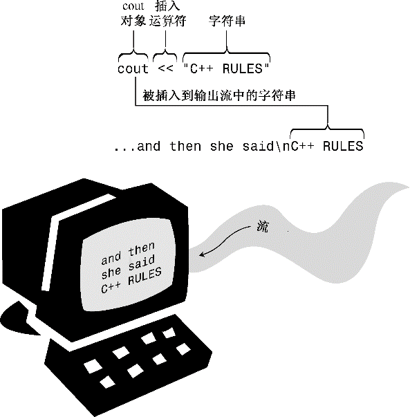

### 2.1.6　使用cout进行C++输出

现在来看一看如何显示消息。myfirst.cpp程序使用下面的C++语句：

```css
cout << "Come up and C++ me some time.";
```

双引号括起的部分是要打印的消息。在C++中，用双引号括起的一系列字符叫作字符串，因为它是由若干字符组合而成的。<<符号表示该语句将把这个字符串发送给cout；该符号指出了信息流动的路径。cout是什么呢？它是一个预定义的对象，知道如何显示字符串、数字和单个字符等（第1章介绍过，对象是类的特定实例，而类定义了数据的存储和使用方式）。

马上就使用对象可能有些困难，因为几章后才会介绍对象。实际上，这演示了对象的长处之一——不用了解对象的内部情况，就可以使用它。只需要知道它的接口，即如何使用它。cout对象有一个简单的接口，如果string是一个字符串，则下面的代码将显示该字符串：

```css
cout << string;
```

对于显示字符串而言，只需知道这些即可。然而，现在来看看C++从概念上如何解释这个过程。从概念上看，输出是一个流，即从程序流出的一系列字符。cout对象表示这种流，其属性是在iostream文件中定义的。cout的对象属性包括一个插入运算符（<<），它可以将其右侧的信息插入到流中。请看下面的语句（注意结尾的分号）：

```css
cout << "Come up and C++ me some time.";
```

它将字符串“Come up and C++ me some time.”插入到输出流中。因此，与其说程序显示了一条消息，不如说它将一个字符串插入到了输出流中。不知道为什么，后者听起来更好一点（参见图2.2）。


<center class="my_markdown"><b class="my_markdown">图2.2　使用cout显示字符串</b></center>


**初识运算符重载**

如果熟悉C后才开始学习C++，则可能注意到了，插入运算符（<<）看上去就像按位左移运算符（<<），这是一个运算符重载的例子，通过重载，同一个运算符将有不同的含义。编译器通过上下文来确定运算符的含义。C本身也有一些运算符重载的情况。例如，&符号既表示地址运算符，又表示按位AND运算符；* 既表示乘法，又表示对指针解除引用。这里重要的不是这些运算符的具体功能，而是同一个符号可以有多种含义，而编译器可以根据上下文来确定其含义（这和确定“sound card”中的“sound”与“sound financial basic”中的“sound”的含义是一样的）。C++扩展了运算符重载的概念，允许为用户定义的类型（类）重新定义运算符的含义。


#### 1．控制符endl

现在来看看程序清单2.1中第二个输出流中看起来有些古怪的符号：

```css
cout << endl;
```

endl是一个特殊的C++符号，表示一个重要的概念：重起一行。在输出流中插入endl将导致屏幕光标移到下一行开头。诸如endl等对于cout来说有特殊含义的特殊符号被称为控制符（manipulator）。和cout一样，endl也是在头文件iostream中定义的，且位于名称空间std中。

打印字符串时，cout不会自动移到下一行，因此在程序清单2.1中，第一条cout语句将光标留在输出字符串的后面。每条cout语句的输出从前一个输出的末尾开始，因此如果省略程序清单2.1中的endl，得到的输出将如下：

```css
Come up and C++ me some time.You won’t regret it!
```

从上述输出可知，Y紧跟在句点后面。下面来看另一个例子，假设有如下代码：

```css
cout << "The Good, the";
cout << "Bad, ";
cout << "and the Ukulele";
cout << endl;
```

其输出将如下：

```css
The Good, theBad, and the Ukulele
```

同样，每个字符串紧接在前一个字符串的后面。如果要在两个字符串之间留一个空格，必须将空格包含在字符串中。注意，要尝试上述输出示例，必须将代码放到完整的程序中，该程序包含一个main()函数头以及起始和结束花括号。

#### 2．换行符

C++还提供了另一种在输出中指示换行的旧式方法：C语言符号\n：

```css
cout << "What’s next?\n";       // \n means start a new line
```

\n被视为一个字符，名为换行符。

显示字符串时，在字符串中包含换行符，而不是在末尾加上endl，可减少输入量：

```css
cout << "Pluto is a dwarf planet.\n";       // show text, go to next line
cout << "Pluto is a dwarf planet." << endl; // show text, go to next line
```

另一方面，如果要生成一个空行，则两种方法的输入量相同，但对大多数人而言，输入endl更为方便：

```css
cout << "\n";   // start a new line
cout << endl;   // start a new line
```

本书中显示用引号括起的字符串时，通常使用换行符\n，在其他情况下则使用控制符endl。一个差别是，endl确保程序继续运行前刷新输出（将其立即显示在屏幕上）；而使用“\n”不能提供这样的保证，这意味着在有些系统中，有时可能在您输入信息后才会出现提示。

换行符是一种被称为“转义序列”的按键组合，转义序列将在第3章做更详细的讨论。

