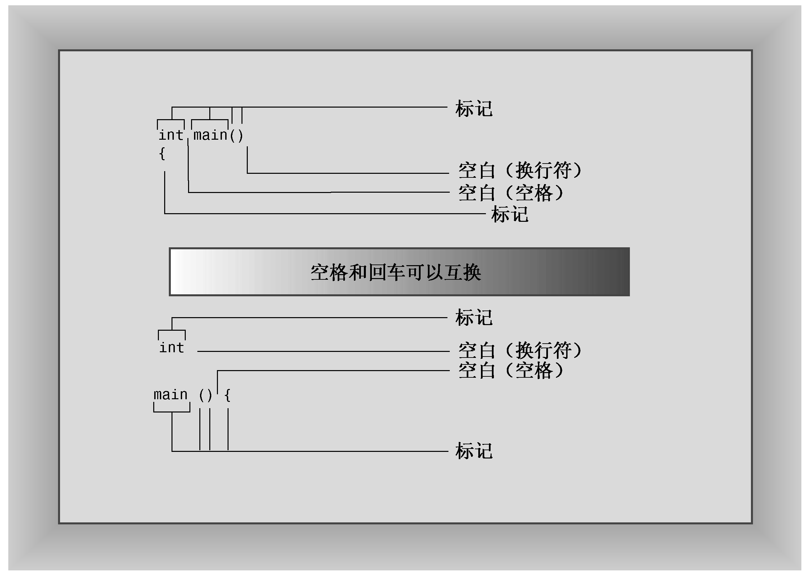

### 2.1.7　C++源代码的格式化

有些语言（如FORTRAN）是面向行的，即每条语句占一行。对于这些语言来说，回车的作用是将语句分开。然而，在C++中，分号标示了语句的结尾。因此，在C++中，回车的作用就和空格或制表符相同。也就是说，在C++中，通常可以在能够使用回车的地方使用空格，反之亦然。这说明既可以把一条语句放在几行上，也可以把几条语句放在同一行上。例如，可以将myfirst.cpp重新格式化为如下所示：

```css
#include <iostream>
    int
main
() {    using
    namespace
         std; cout
            <<
"Come up and C++ me some time."
;    cout <<
endl; cout <<
"You won’t regret it!" <<
endl;return 0; }
```

这样虽然不太好看，但仍然是合法的代码。必须遵守一些规则，具体地说，在C和C++中，不能把空格、制表符或回车放在元素（比如名称）中间，也不能把回车放在字符串中间。下面是一个不能这样做的例子：

```css
int ma in()     // INVALID -- space in name
re
turn 0;         // INVALID -- carriage return in word
cout << "Behold the Beans
 of Beauty!";  // INVALID -- carriage return in string
```

然而，C++11新增的原始（raw）字符串可包含回车，这将在第4章简要地讨论。

#### 1．源代码中的标记和空白

一行代码中不可分割的元素叫作标记（token，参见图2.3）。通常，必须用空格、制表符或回车将两个标记分开，空格、制表符和回车统称为空白（white space）。有些字符（如括号和逗号）是不需要用空白分开的标记。下面的一些示例说明了什么情况下可以使用空白，什么情况下可以省略：

```css
return0;     // INVALID, must be return 0;
return(0);   // VALID, white space omitted
return (0);  // VALID, white space used
intmain();   // INVALID, white space omitted
int main()   // VALID, white space omitted in ()
int main () // ALSO VALID, white space used in ()
```


<center class="my_markdown"><b class="my_markdown">图2.3　标记和空白</b></center>

#### 2．C++源代码风格

虽然C++在格式方面赋予了您很大的自由，但如果遵循合理的风格，程序将更便于阅读。有效但难看的代码不会令人满意。多数程序员都使用程序清单2.1所示的风格，它遵循了下述规则。

+ 每条语句占一行。
+ 每个函数都有一个开始花括号和一个结束花括号，这两个花括号各占一行。
+ 函数中的语句都相对于花括号进行缩进。
+ 与函数名称相关的圆括号周围没有空白。

前三条规则旨在确保代码清晰易读；第四条规则帮助区分函数和一些也使用圆括号的C++内置结构（如循环）。在涉及其他指导原则时，本书将提醒读者。

