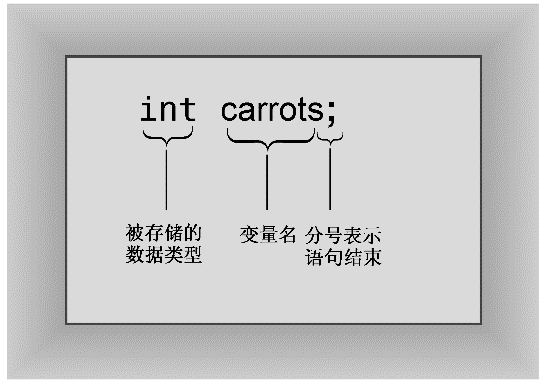

### 2.2.1　声明语句和变量

计算机是一种精确的、有条理的机器。要将信息项存储在计算机中，必须指出信息的存储位置和所需的内存空间。在C++中，完成这种任务的一种相对简便的方法，是使用声明语句来指出存储类型并提供位置标签。例如，程序清单2.2中包含这样一条声明语句（注意其中的分号）：

```css
int carrots;
```

这条语句提供了两项信息：需要的内存以及该内存单元的名称。具体地说，这条语句指出程序需要足够的存储空间来存储一个整数，在C++中用int表示整数。编译器负责分配和标记内存的细节。C++可以处理多种类型的数据，而int是最基本的数据类型。它表示整数——没有小数部分的数字。C++的int类型可以为正，也可以为负，但是大小范围取决于实现。第3章将详细介绍int和其他基本类型。

完成的第二项任务是给存储单元指定名称。在这里，该声明语句指出，此后程序将使用名称carrots来标识存储在该内存单元中的值。carrots被称为变量，因为它的值可以修改。在C++中，所有变量都必须声明。如果省略了carrots.cpp中的声明，则当程序试图使用carrots时，编译器将指出错误。事实上，程序员尝试省略声明，可能只是为了看看编译器的反应。这样，以后看到这样的反应时，便知道应检查是否省略了声明。


**为什么变量必须声明？**

有些语言（最典型的是BASIC）在使用新名称时创建新的变量，而不用显式地进行声明。这看上去对用户比较友好，事实上从短期上说确实如此。问题是，如果错误地拼写了变量名，将在不知情的情况下创建一个新的变量。在BASIC中，ss程序员可能编写如下语句：

```css
CastleDark = 34
...
CastleDank = CastleDark + MoreGhosts
...
PRINT CastleDark
```

由于CastleDank是拼写错误（将r拼成了n），因此所作的修改实际上并没有修改CastleDark。这种错误很难发现，因为它没有违反BASIC中的任何规则。然而，在C++中，将声明CastleDark，但不会声明被错误拼写的CastleDank，因此对应的C++代码将违反“使用变量前必须声明它”的规则，因此编译器将捕获这种错误，发现潜在的问题。


因此，声明通常指出了要存储的数据类型和程序对存储在这里的数据使用的名称。在这个例子中，程序将创建一个名为carrots的变量，它可以存储整数（参见图2.4）。


<center class="my_markdown"><b class="my_markdown">图2.4　变量声明</b></center>

程序中的声明语句叫作定义声明（defining declaration）语句，简称为定义（definition）。这意味着它将导致编译器为变量分配内存空间。在较为复杂的情况下，还可能有引用声明（reference declaration）。这些声明命令计算机使用在其他地方定义的变量。通常，声明不一定是定义，但在这个例子中，声明是定义。

如果您熟悉C语言或Pascal，就一定熟悉变量声明。不过C++中的变量声明也可能让人小吃一惊。在C和Pascal中，所有的变量声明通常都位于函数或过程的开始位置，但C++没有这种限制。实际上，C++通常的做法是，在首次使用变量前声明它。这样，就不必在程序中到处查找，以了解变量的类型。本章后面将有一个这样的例子。这种风格也有缺点，它没有把所有的变量名放在一起，因此无法对函数使用了哪些变量一目了然（C99标准使C声明规则与C++非常相似）。

> **提示：**
> 对于声明变量，C++的做法是尽可能在首次使用变量前声明它。

