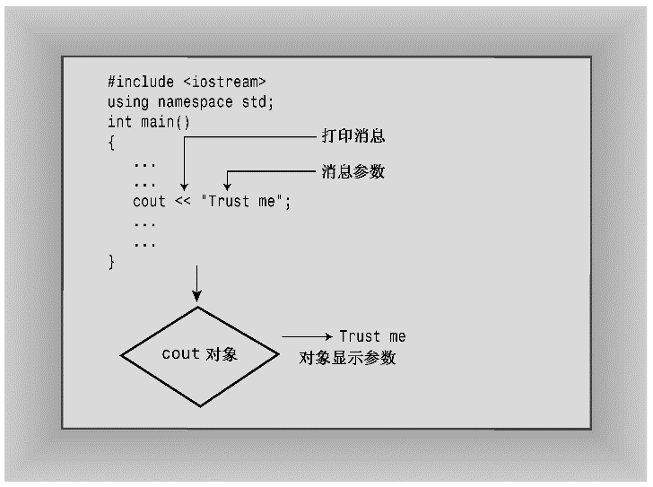

### 2.3.3　类简介

看了足够多的cin和cout示例后，可以学习有关对象的知识了。具体地说，本节将进一步介绍有关类的知识。正如第1章指出的，类是C++中面向对象编程（OOP）的核心概念之一。

类是用户定义的一种数据类型。要定义类，需要描述它能够表示什么信息和可对数据执行哪些操作。类之于对象就像类型之于变量。也就是说，类定义描述的是数据格式及其用法，而对象则是根据数据格式规范创建的实体。换句话说，如果说类就好比所有著名演员，则对象就好比某个著名的演员，如蛙人Kermit。我们来扩展这种类比，表示演员的类中包括该类可执行的操作的定义，如念某一角色的台词，表达悲伤、威胁恫吓，接受奖励等。如果了解其他OOP术语，就知道C++类对应于某些语言中的对象类型，而C++对象对应于对象实例或实例变量。

下面更具体一些。前文讲述过下面的变量声明：

```css
int carrots;
```

上面的代码将创建一个类型为int的变量（carrots）。也就是说，carrots可以存储整数，可以按特定的方式使用——例如，用于加和减。现在来看cout。它是一个ostream类对象。ostream类定义（iostream文件的另一个成员）描述了ostream对象表示的数据以及可以对它执行的操作，如将数字或字符串插入到输出流中。同样，cin是一个istream类对象，也是在iostream中定义的。

> **注意：**
> 类描述了一种数据类型的全部属性（包括可使用它执行的操作），对象是根据这些描述创建的实体。

知道类是用户定义的类型，但作为用户，并没有设计ostream和istream类。就像函数可以来自函数库一样，类也可以来自类库。ostream和istream类就属于这种情况。从技术上说，它们没有被内置到C++语言中，而是语言标准指定的类。这些类定义位于iostream文件中，没有被内置到编译器中。如果愿意，程序员甚至可以修改这些类定义，虽然这不是一个好主意（准确地说，这个主意很糟）。iostream系列类和相关的fstream（或文件I/O）系列类是早期所有的实现都自带的唯一两组类定义。然而，ANSI/ISO C++委员会在C++标准中添加了其他一些类库。另外，多数实现都在软件包中提供了其他类定义。事实上，C++当前之所以如此有吸引力，很大程度上是由于存在大量支持UNIX、Macintosh和Windows编程的类库。

类描述指定了可对类对象执行的所有操作。要对特定对象执行这些允许的操作，需要给该对象发送一条消息。例如，如果希望cout对象显示一个字符串，应向它发送一条消息，告诉它，“对象！显示这些内容！”C++提供了两种发送消息的方式：一种方式是使用类方法（本质上就是稍后将介绍的函数调用）；另一种方式是重新定义运算符，cin和cout采用的就是这种方式。因此，下面的语句使用重新定义的<<运算符将“显示消息”发送给cout：

```css
cout << "I am not a crook."
```

在这个例子中，消息带一个参数——要显示的字符串（参见图2.5）。


<center class="my_markdown"><b class="my_markdown">图2.5　向对象发送消息</b></center>

