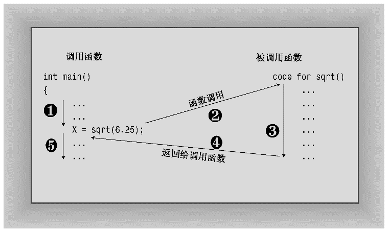
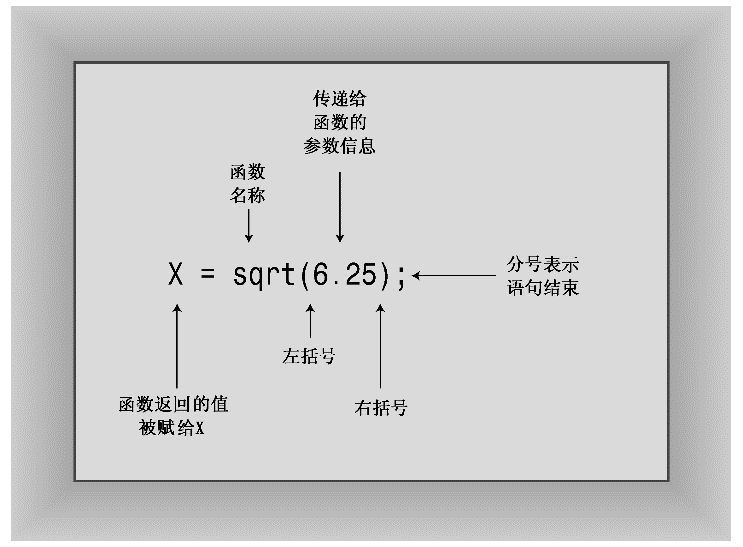

### 2.4.1　使用有返回值的函数

有返回值的函数将生成一个值，而这个值可赋给变量或在其他表达式中使用。例如，标准C/C++库包含一个名为sqrt()的函数，它返回平方根。假设要计算6.25的平方根，并将这个值赋给变量x，则可以在程序中使用下面的语句：

```css
x = sqrt(6.25); // returns the value 2.5 and assigns it to x
```

表达式sqrt(6.25)将调用sqrt()函数。表达式sqrt(6.25)被称为函数调用，被调用的函数叫作被调用函数（called function），包含函数调用的函数叫作调用函数（calling function，参见图2.6）。


<center class="my_markdown"><b class="my_markdown">图2.6　调用函数</b></center>

圆括号中的值（这里为6.25）是发送给函数的信息，这被称为传递给函数。以这种方式发送给函数的值叫作参数。（参见图2.7。）函数sqrt()得到的结果为2.5，并将这个值发送给调用函数；发送回去的值叫作函数的返回值（return value）。可以这么认为，函数执行完毕后，语句中的函数调用部分将被替换为返回的值。因此，这个例子将返回值赋给变量x。简而言之，参数是发送给函数的信息，返回值是从函数中发送回去的值。


<center class="my_markdown"><b class="my_markdown">图2.7　函数调用的句法</b></center>

情况基本上就是这样，只是在使用函数之前，C++编译器必须知道函数的参数类型和返回值类型。也就是说，函数是返回整数、字符、小数、布尔型还是别的什么东西？如果缺少这些信息，编译器将不知道如何解释返回值。C++提供这种信息的方式是使用函数原型语句。

> **注意：**
> C++程序应当为程序中使用的每个函数提供原型。

函数原型之于函数就像变量声明之于变量——指出涉及的类型。例如，C++库将sqrt()函数定义成将一个（可能）带小数部分的数字（如6.25）作为参数，并返回一个相同类型的数字。有些语言将这种数字称为实数，但是C++将这种类型称为double（将在第3章介绍）。sqrt()的函数原型像这样：

```css
double sqrt(double);    // function prototype
```

第一个double意味着sqrt()将返回一个double值。括号中的double意味着sqrt()需要一个double参数。因此该原型对sqrt()的描述和下面代码中使用的函数相同：

```css
double x;       // declare x as a type double variable
x = sqrt(6.25);
```

原型结尾的分号表明它是一条语句，这使得它是一个原型，而不是函数头。如果省略分号，编译器将把这行代码解释为一个函数头，并要求接着提供定义该函数的函数体。

在程序中使用sqrt()时，也必须提供原型。可以用两种方法来实现：

+ 在源代码文件中输入函数原型；
+ 包含头文件cmath（老系统为math.h），其中定义了原型。

第二种方法更好，因为头文件更有可能使原型正确。对于C++库中的每个函数，都在一个或多个头文件中提供了其原型。请通过手册或在线帮助查看函数描述来确定应使用哪个头文件。例如，sqrt()函数的说明将指出，应使用cmath头文件（同样，可能必须使用老式的头文件math.h，它可用于C和C++程序中）。

不要混淆函数原型和函数定义。可以看出，原型只描述函数接口。也就是说，它描述的是发送给函数的信息和返回的信息。而定义中包含了函数的代码，如计算平方根的代码。C和C++将库函数的这两项特性（原型和定义）分开了。库文件中包含了函数的编译代码，而头文件中则包含了原型。

应在首次使用函数之前提供其原型。通常的做法是把原型放到main()函数定义的前面。程序清单2.4演示了库函数sqrt()的用法，它通过包含cmath文件来提供该函数的原型：

程序清单2.4　sqrt.cpp

```css
// sqrt.cpp -- using the sqrt() function
#include <iostream>
#include <cmath> // or math.h
int main()
{
    using namespace std;
    double area;
    cout << "Enter the floor area, in square feet, of your home: ";
    cin >> area;
    double side;
    side = sqrt(area);
    cout << "That’s the equivalent of a square " << side
         << " feet to the side." << endl;
    cout << "How fascinating!" << endl;
    return 0;
}
```

> **注意：**
> 如果使用的是老式编译器，则必须在程序清单2.4中使用#include <math.h>，而不是#include<cmath>。


**使用库函数**

C++库函数存储在库文件中。编译器编译程序时，它必须在库文件搜索您使用的函数。至于自动搜索哪些库文件，将因编译器而异。如果运行程序清单2.4时，得到一条消息，指出_sqrt是一个没有定义的外部函数（似乎应当避免），则很可能是由于编译器不能自动搜索数学库（编译器倾向于给函数名添加下划线前缀——提示它们对程序具有最后的发言权）。如果在UNIX实现中遇到这样的消息，可能需要在命令行结尾使用-lm选项：

```css
CC sqrt.C -lm
```

在Linux系统中，有些版本的Gnu编译器与此类似：

```css
g++ sqrt.C –lm
```

只包含cmath头文件可以提供原型，但不一定会导致编译器搜索正确的库文件。


下面是该程序的运行情况：

```css
Enter the floor area, in square feet, of your home: 1536
That’s the equivalent of a square 39.1918 feet to the side.
How fascinating!
```

由于sqrt()处理的是double值，因此这里将变量声明为这种类型。声明double变量的句法与声明int变量相同：

```css
type-name variable-name;
```

double类型使得变量area和side能够存储带小数的值，如1 536.0和39.191 8。将看起来是整数（如1536）的值赋给double变量时，将以实数形式存储它，其中的小数部分为.0。在第3章将指出，double类型覆盖的范围要比int类型大得多。

C++允许在程序的任何地方声明新变量，因此sqrt.cpp在要使用side时才声明它。C++还允许在创建变量时对它进行赋值，因此也可以这样做：

```css
double side = sqrt(area);
```

这个过程叫作初始化（initialization），将在第3章更详细地介绍。

cin知道如何将输入流中的信息转换为double类型，cout知道如何将double类型插入到输出流中。前面讲过，这些对象都很智能化。

