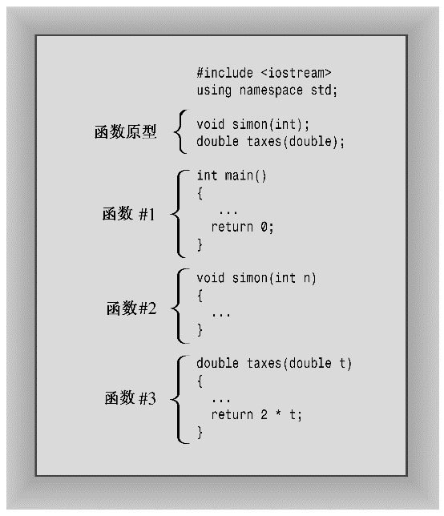

### 2.4.3　用户定义的函数

标准C库提供了140多个预定义的函数。如果其中的函数能满足要求，则应使用它们。但用户经常需要编写自己的函数，尤其是在设计类的时候。无论如何，设计自己的函数很有意思，下面来介绍这一过程。前面已经使用过好几个用户定义的函数，它们都叫main()。每个C++程序都必须有一个main()函数，用户必须对它进行定义。假设需要添加另一个用户定义的函数。和库函数一样，也可以通过函数名来调用用户定义的函数。对于库函数，在使用之前必须提供其原型，通常把原型放到main()定义之前。但现在您必须提供新函数的源代码。最简单的方法是，将代码放在main()的后面。程序清单2.5演示了这些元素。

程序清单2.5　ourfunc.cpp

```css
// ourfunc.cpp -- defining your own function
#include <iostream>
void simon(int);     // function prototype for simon()
int main()
{
    using namespace std;
    simon(3);       // call the simon() function
    cout << "Pick an integer: ";
    int count;
    cin >> count;
    simon(count);   // call it again
    cout << "Done!" << endl;
    return 0;
}
void simon(int n)   // define the simon() function
{
    using namespace std;
    cout << "Simon says touch your toes " << n << " times." << endl;
}                  // void functions don’t need return statements
```

main()函数两次调用simon()函数，一次的参数为3，另一次的参数为变量count。在这两次调用之间，用户输入一个整数，用来设置count的值。这个例子没有在cout提示消息中使用换行符。这样将导致用户输入与提示出现在同一行中。下面是运行情况：

```css
Simon says touch your toes 3 times.
Pick an integer: 512
Simon says touch your toes 512 times.
Done!
```

#### 1．函数格式

在程序清单2.5中，simon()函数的定义与main()的定义采用的格式相同。首先，有一个函数头；然后是花括号中的函数体。可以把函数的格式统一为如下的情形：

```css
type functionname(argumentlist)
{
 statements
}
```

注意，定义simon()的源代码位于main()的后面。和C一样（但不同于Pascal），C++不允许将函数定义嵌套在另一个函数定义中。每个函数定义都是独立的，所有函数的创建都是平等的（参见图2.8）。


<center class="my_markdown"><b class="my_markdown">图2.8　函数定义在文件中依次出现</b></center>

#### 2．函数头

在程序清单2.5中，simon()函数的函数头如下：

```css
void simon(int n)
```

开头的void表明simon()没有返回值，因此调用simon()不会生成可在main()中将其赋给变量的数字。因此，第一个函数调用方式如下：

```css
simon(3);             // ok for void functions
```

由于simon()没有返回值，因此不能这样使用它：

```css
simple = simon(3);    // not allowed for void functions
```

括号中的int n表明，使用simon()时，应提供一个int参数。n是一个新的变量，函数调用时传递的值将被赋给它。因此，下面的函数调用将3赋给simon()函数头中定义的变量n：

```css
simon(3);
```

当函数体中的cout语句使用n时，将使用函数调用时传递的值。这就是为什么simon（3）在输出中显示3的原因所在。在示例运行中，函数调用simon(count)导致函数显示512，因为这正是赋给count的值。简而言之，simon()的函数头表明，该函数接受一个int参数，不返回任何值。

下面复习一下main()的函数头：

```css
int main()
```

开头的int表明，main()返回一个整数值；空括号（其中可以包含void）表明，main()没有参数。对于有返回值的函数，应使用关键字return来提供返回值，并结束函数。这就是要在main()结尾使用下述语句的原因：

```css
return 0;
```

这在逻辑上是一致的：main()返回一个int值，而程序员要求它返回整数0。但可能会产生疑问，将这个值返回到哪里了呢？毕竟，程序中没有哪个地方可以看出对main()的调用：

```css
squeeze = main(); // absent from our programs
```

答案是，可以将计算机操作系统（如UNIX或Windows）看作调用程序。因此，main()的返回值并不是返回给程序的其他部分，而是返回给操作系统。很多操作系统都可以使用程序的返回值。例如，UNIX外壳脚本和Windows命令行批处理文件都被设计成运行程序，并测试它们的返回值（通常叫作退出值）。通常的约定是，退出值为0则意味着程序运行成功，为非零则意味着存在问题。因此，如果C++程序无法打开文件，可以将它设计为返回一个非零值。然后，便可以设计一个外壳脚本或批处理文件来运行该程序，如果该程序发出指示失败的消息，则采取其他措施。


**关键字**

关键字是计算机语言中的词汇。本章使用了4个C++关键字：int、void、return和double。由于这些关键字都是C++专用的，因此不能用作他用。也就是说，不能将return用作变量名，也不能把double用作函数名。不过可以把它们用作名称的一部分，如painter（其中包含int）或return_aces。附录B提供了C++关键字的完整列表。另外，main不是关键字，由于它不是语言的组成部分。然而，它是一个必不可少的函数的名称。可以把main用作变量名（在一些很神秘的以至于无法在这里介绍的情况中，将main用作变量名会引发错误，由于它在任何情况下都是容易混淆的，因此最好不要这样做）。同样，其他函数名和对象名也都不能是关键字。然而，在程序中将同一个名称（比如cout）用作对象名和变量名会把编译器搞糊涂。也就是说，在不使用cout对象进行输出的函数中，可以将cout用作变量名，但不能在同一个函数中同时将cout用作对象名和变量名。


