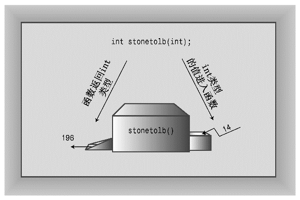

### 2.4.4　用户定义的有返回值的函数

我们再深入一步，编写一个使用返回语句的函数。main()函数已经揭示了有返回值的函数的格式：在函数头中指出返回类型，在函数体结尾处使用return。可以用这种形式为在英国观光的人解决重量的问题。在英国，很多浴室中的体重称都以英石（stone）为单位，不像美国以磅或公斤为单位。一英石等于14磅，程序清单2.6使用一个函数来完成这样的转换。

程序清单2.6　convert.cpp

```css
// convert.cpp -- converts stone to pounds
#include <iostream>
int stonetolb(int);     // function prototype
int main()
{
    using namespace std;
    int stone;
    cout << "Enter the weight in stone: ";
    cin >> stone;
    int pounds = stonetolb(stone);
    cout << stone << " stone = ";
    cout << pounds << " pounds." << endl;
    return 0;
}
int stonetolb(int sts)
{
    return 14 * sts;
}
```

下面是该程序的运行情况：

```css
Enter the weight in stone: 15
15 stone = 210 pounds.
```

在main()中，程序使用cin来给整型变量stone提供一个值。这个值被作为参数传递给stonetolb()函数，在该函数中，这个值被赋给变量sts。然后，stonetolb()用关键字return将14*sts返回给main()。这表明return后面并非一定得跟一个简单的数字。这里通过使用较为复杂的表达式，避免了创建一个新变量，将结果赋给该变量，然后将它返回。程序将计算表达式的值（这里为210），并将其返回。如果返回表达式的值很麻烦，可以采取更复杂的方式：

```css
int stonetolb(int sts)
{
      int pounds = 14 * sts;
      return pounds;
}
```

这两个版本返回的结果相同，但第二个版本更容易理解和修改，因为它将计算和返回分开了。

通常，在可以使用一个简单常量的地方，都可以使用一个返回值类型与该常量相同的函数。例如，stonetolb()返回一个int值，这意味着可以以下面的方式使用该函数：

```css
int aunt = stonetolb(20);
int aunts = aunt + stonetolb(10);
cout << "Ferdie weighs " << stonetolb(16) << " pounds." << endl;
```

在上述任何一种情况下，程序都将计算返回值，然后在语句中使用这个值。

这些例子表明，函数原型描述了函数接口，即函数如何与程序的其他部分交互。参数列表指出了何种信息将被传递给函数，函数类型指出了返回值的类型。程序员有时将函数比作一个由出入它们的信息所指定的黑盒子（black boxes）（电工用语）。函数原型将这种观点诠释得淋漓尽致（参见图2.9）。


<center class="my_markdown"><b class="my_markdown">图2.9　函数原型和作为黑盒的函数</b></center>

函数stonetolb()短小、简单，但包含了全部的函数特性：

+ 有函数头和函数体；
+ 接受一个参数；
+ 返回一个值；
+ 需要一个原型。

可以把stonetolb()看作函数设计的标准格式。第7章和第8章将更详细地介绍函数。而本章的内容让读者能够很好地了解函数的工作方式及其如何与C++匹配。

