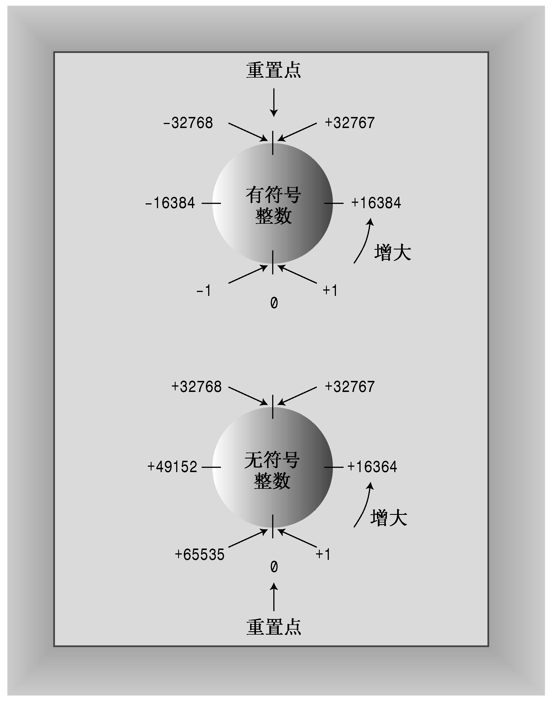

### 3.1.4　无符号类型

前面介绍的4种整型都有一种不能存储负数值的无符号变体，其优点是可以增大变量能够存储的最大值。例如，如果short表示的范围为−32768到+32767，则无符号版本的表示范围为0-65535。当然，仅当数值不会为负时才应使用无符号类型，如人口、粒数等。要创建无符号版本的基本整型，只需使用关键字unsigned来修改声明即可：

```css
unsigned short change;         // unsigned short type
unsigned int rovert;           // unsigned int type
unsigned quarterback;          // also unsigned int
unsigned long gone;            // unsigned long type
unsigned long long lang_lang;  // unsigned long long type
```

注意，unsigned本身是unsigned int的缩写。

程序清单3.2演示了如何使用无符号类型，并说明了程序试图超越整型的限制时将产生的后果。最后，再看一看预处理器语句#define。

程序清单3.2　exceed.cpp

```css
// exceed.cpp -- exceeding some integer limits
#include <iostream>
#define ZERO 0      // makes ZERO symbol for 0 value
#include <climits>  // defines INT_MAX as largest int value
int main()
{
    using namespace std;
    short sam = SHRT_MAX;    // initialize a variable to max value
    unsigned short sue = sam;// okay if variable sam already defined
    cout << "Sam has " << sam << " dollars and Sue has " << sue;
    cout << " dollars deposited." << endl
         << "Add $1 to each account." << endl << "Now ";
    sam = sam + 1;
    sue = sue + 1;
    cout << "Sam has " << sam << " dollars and Sue has " << sue;
    cout << " dollars deposited.\nPoor Sam!" << endl;
    sam = ZERO;
    sue = ZERO;
    cout << "Sam has " << sam << " dollars and Sue has " << sue;
    cout << " dollars deposited." << endl;
    cout << "Take $1 from each account." << endl << "Now ";
    sam = sam - 1;
    sue = sue - 1;
    cout << "Sam has " << sam << " dollars and Sue has " << sue;
    cout << " dollars deposited." << endl << "Lucky Sue!" << endl;
    return 0;
}
```

下面是该程序的输出：

```css
Sam has 32767 dollars and Sue has 32767 dollars deposited.
Add $1 to each account.
Now Sam has -32768 dollars and Sue has 32768 dollars deposited.
Poor Sam!
Sam has 0 dollars and Sue has 0 dollars deposited.
Take $1 from each account.
Now Sam has -1 dollars and Sue has 65535 dollars deposited.
Lucky Sue!
```

该程序将一个short变量（sam）和一个unsigned short变量（sue）分别设置为最大的short值，在我们的系统上，是32767。然后，将这些变量的值都加1。这对于sue来说没有什么问题，因为新值仍比无符号整数的最大值小得多；但sam的值从32767变成了−32768！同样，对于sam，将其设置为0并减去1，也不会有问题；但对于无符号变量sue，将其设置为0并减去后，它变成了65535。可以看出，这些整型变量的行为就像里程表。如果超越了限制，其值将为范围另一端的取值（参见图3.1）。C++确保了无符号类型的这种行为；但C++并不保证符号整型超越限制（上溢和下溢）时不出错，而这正是当前实现中最为常见的行为。


<center class="my_markdown"><b class="my_markdown">图3.1 典型的整型溢出行为</b></center>

