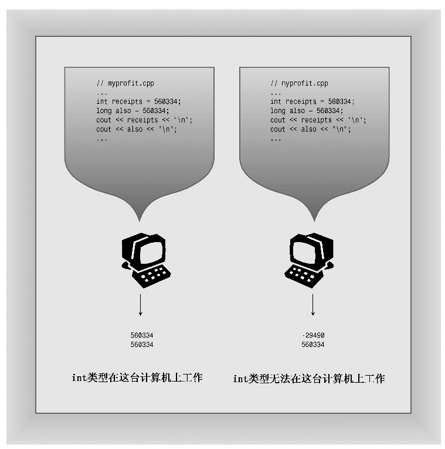

### 3.1.5　选择整型类型

C++提供了大量的整型，应使用哪种类型呢？通常，int被设置为对目标计算机而言最为“自然”的长度。自然长度（natural size）指的是计算机处理起来效率最高的长度。如果没有非常有说服力的理由来选择其他类型，则应使用int。

现在来看看可能使用其他类型的原因。如果变量表示的值不可能为负，如文档中的字数，则可以使用无符号类型，这样变量可以表示更大的值。

如果知道变量可能表示的整数值大于16位整数的最大可能值，则使用long。即使系统上int为32位，也应这样做。这样，将程序移植到16位系统时，就不会突然无法正常工作（参见图3.2）。如果要存储的值超过20亿，可使用long long。

由于short比int小，使用short可以节省内存。通常，仅当有大型整型数组时，才有必要使用short。（数组是一种数据结构，在内存中连续存储同类型的多个值。）如果节省内存很重要，则应使用short而不是使用int，即使它们的长度是一样的。例如，假设要将程序从int为16位的系统移到int为32位的系统，则用于存储int数组的内存量将加倍，但short数组不受影响。请记住，节省一点就是赢得一点。

如果只需要一个字节，可使用char，这将稍后介绍。

<b class="my_markdown">图3.2　为提高可移植性，请使用long</b>

