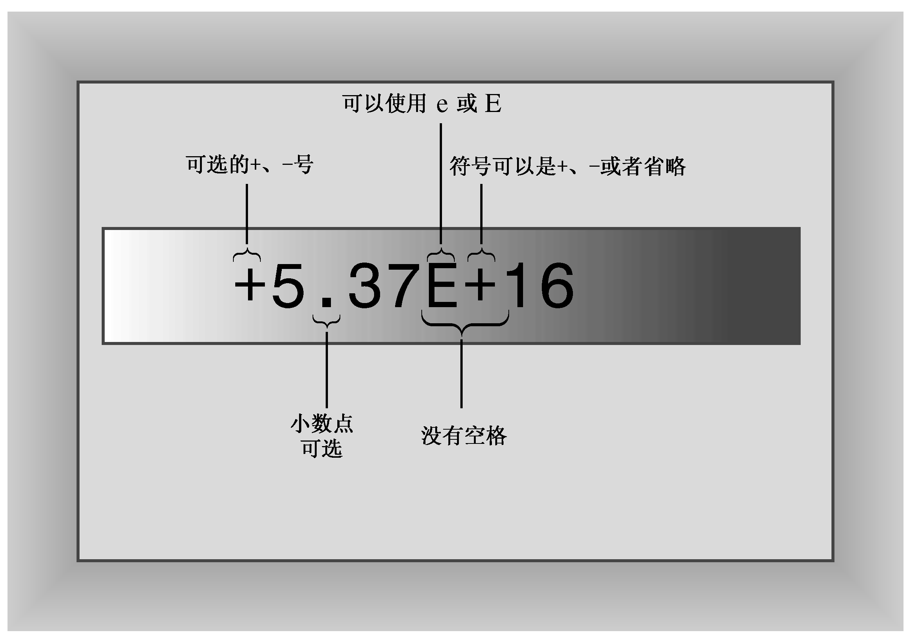

### 3.3.1　书写浮点数

C++有两种书写浮点数的方式。第一种是使用常用的标准小数点表示法：

```css
12.34      // floating-point
939001.32  // floating-point
0.00023    // floating-point
8.0        // still floating-point
```

即使小数部分为0（如8.0），小数点也将确保该数字以浮点格式（而不是整数格式）表示。（C++标准允许实现表示不同的区域；例如，提供了使用欧洲方法的机制，即将逗号而不是句点用作小数点。然而，这些选项控制的是数字在输入和输出中的外观，而不是数字在代码中的外观。）

第二种表示浮点值的方法叫作E表示法，其外观是像这样的：3.45E6，这指的是3.45与1000000相乘的结果；E6指的是10的6次方，即1后面6个0。因此，3.45E6表示的是3450000，6被称为指数，3.45被称为尾数。下面是一些例子：

```css
2.52e+8    // can use E or e, + is optional
8.33E-4    // exponent can be negative
7E5        // same as 7.0E+05
-18.32e13  // can have + or - sign in front
1.69e12    // 2010 Brazilian public debt in reais
5.98E24    // mass of earth in kilograms
9.11e-31   // mass of an electron in kilograms
```

读者可能注意到了，E表示法最适合于非常大和非常小的数。

E表示法确保数字以浮点格式存储，即使没有小数点。注意，既可以使用E也可以使用e，指数可以是正数也可以是负数（参见图3.3）。然而，数字中不能有空格，因此7.2 E6是非法的。


<center class="my_markdown"><b class="my_markdown">图3.3 E表示法</b></center>

指数为负数意味着除以10的乘方，而不是乘以10的乘方。因此，8.33E-4表示8.33/10<sup class="my_markdown">4</sup>，即0.000833。同样，电子质量9.11e-31 kg表示0.000000000000000000000000000000911 kg。可以按照自己喜欢的方式表示数字（911在美国是报警电话，而电话信息通过电子传输，这是巧合还是科学阴谋呢？读者可以自己作出评判）。注意，−8.33E4指的是−83300。前面的符号用于数值，而指数的符号用于缩放。

> **记住：**
> d.dddE+n指的是将小数点向右移n位，而d.dddE-n指的是将小数点向左移n位。之所以称为“浮点”，就是因为小数点可移动。

